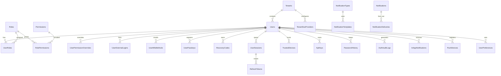

# Modulith Backend: Template Blueprint

> A production-ready, modular ASP.NET Core backend template for fast project delivery and for learning system architecture and design patterns.

**Author:** Modulith contributors
**Status:** Draft v1.0, amended by [docs/blueprint-review.md](docs/blueprint-review.md) (the review wins where they differ)
**Target runtime:** .NET 10 (LTS)

---

## Table of Contents

1. [How to Use This Document](#1-how-to-use-this-document)
2. [Vision, Goals and Non-Goals](#2-vision-goals-and-non-goals)
3. [Technology Stack](#3-technology-stack)
4. [Architecture Overview](#4-architecture-overview)
5. [Solution Structure](#5-solution-structure)
6. [Conventions and Standards](#6-conventions-and-standards)
7. [Core Baseline (Cross-Cutting Concerns)](#7-core-baseline-cross-cutting-concerns)
8. [Platform Modules](#8-platform-modules)
9. [Auth Module](#9-auth-module)
10. [Notification Module](#10-notification-module)
11. [Database Design](#11-database-design)
12. [Testing Strategy](#12-testing-strategy)
13. [CI/CD with GitHub Actions](#13-cicd-with-github-actions)
14. [Local Development Environment](#14-local-development-environment)
15. [Packaging as a `dotnet new` Template](#15-packaging-as-a-dotnet-new-template)
16. [Deployment](#16-deployment)
17. [Security Checklist](#17-security-checklist)
18. [Observability and Operations](#18-observability-and-operations)
19. [Learning Track: Architecture Variants](#19-learning-track-architecture-variants)
20. [Implementation Roadmap](#20-implementation-roadmap)
21. [Definition of Done](#21-definition-of-done)
22. [Appendix: ADR Template](#22-appendix-adr-template)

---

## 1. How to Use This Document

This blueprint is the single source of truth for building the template. Use it in three ways:

- **As a build plan.** Follow the phases in [Section 20](#20-implementation-roadmap) in order. Each phase ends with a working, tested, deployable template.
- **As an AI-agent spec.** Give this file to Claude Code (or a similar agent) one phase at a time, for example: *"Implement Phase 2 of BACKEND_TEMPLATE_BLUEPRINT.md. Follow the conventions in Section 6."*
- **As living documentation.** When a decision changes, update this file and add an ADR under `docs/adr/`.

**Golden rule:** the production template stays lean. Every capability beyond the core baseline is an **opt-in module** behind an abstraction, enabled through configuration and removable at generation time.

---

## 2. Vision, Goals and Non-Goals

### Vision

Start any new backend project in minutes with authentication, notifications, caching, background jobs, testing and CI/CD already production-grade, so project time goes into business features instead of plumbing.

### Goals

- **Speed:** `dotnet new` produces a running, tested, deployable API with one command.
- **Quality:** secure defaults, consistent error handling, structured logging, high test coverage.
- **Modularity:** each capability is independently enabled, replaced or removed.
- **Learnability:** the same sample domain is implemented across several architecture styles for comparison.
- **Deployability:** works on Docker and on IIS.

### Non-Goals

- Not a framework. No custom abstractions over things ASP.NET Core already does well.
- Not a microservices platform by default. It starts as a modular monolith and can be split later.
- Not a frontend. React and Flutter clients consume it but live in separate repositories.

---

## 3. Technology Stack

| Concern | Choice | Notes |
|---|---|---|
| Runtime | .NET 10, C# latest | Pin SDK in `global.json` |
| Web | ASP.NET Core Minimal APIs (endpoint groups) | Controllers acceptable if team prefers |
| ORM | EF Core 10 | Writes and most reads |
| Micro-ORM | Dapper | Reporting queries, stored procedures, UDFs |
| Database | SQL Server (default), PostgreSQL (option) | |
| Identity | ASP.NET Core Identity (incl. passkeys) | Wrapped by the Auth module |
| OAuth/OIDC server | OpenIddict (opt-in) | Only when the app must issue tokens to other apps |
| Validation | FluentValidation | |
| CQRS dispatch | Custom lightweight dispatcher | Avoids MediatR licensing; good learning exercise |
| Caching | HybridCache + Redis | L1 memory + L2 Redis |
| Background jobs | Hangfire | Dashboard protected by admin policy |
| Messaging | In-process event bus; RabbitMQ via MassTransit (opt-in) | |
| Resilience | Microsoft.Extensions.Http.Resilience (Polly) | |
| Logging | Serilog → Seq / console (JSON) | |
| Tracing and metrics | OpenTelemetry | Exported to Aspire Dashboard / Jaeger / OTLP |
| API docs | Microsoft.AspNetCore.OpenApi + Scalar UI | |
| Templating (notifications) | Scriban | |
| Exports | ClosedXML (Excel), QuestPDF (PDF) | Check QuestPDF licence terms for commercial use |
| Feature flags | Microsoft.FeatureManagement | |
| Testing | xUnit, FluentAssertions or Shouldly, NSubstitute, Testcontainers, NetArchTest, Bogus, k6 | |
| CI/CD | GitHub Actions, GHCR, Dependabot, CodeQL | |
| Local infra | Docker Compose (optionally .NET Aspire AppHost) | |

> Check licences of every third-party package before commercial use and record the result in `docs/adr/`.

---

## 4. Architecture Overview

### Chosen style for the production template

**Modular monolith**, with **Clean Architecture layering inside each module** and **vertical-slice feature folders** inside the Application layer.

```
┌──────────────────────────────────────────────────────────┐
│                     TemplateName.Api (Host)              │
│   Composition root: registers modules, middleware, auth  │
└───────────────┬───────────────────────┬──────────────────┘
                │                       │
     ┌──────────▼─────────┐   ┌─────────▼──────────┐   ...more modules
     │    Auth Module     │   │ Notifications Mod. │
     │ ┌────────────────┐ │   │ ┌────────────────┐ │
     │ │ Api (endpoints)│ │   │ │ Api            │ │
     │ │ Application    │ │   │ │ Application    │ │
     │ │ Domain         │ │   │ │ Domain         │ │
     │ │ Infrastructure │ │   │ │ Infrastructure │ │
     │ └────────────────┘ │   │ └────────────────┘ │
     └─────────┬──────────┘   └─────────┬──────────┘
               │  public contracts /    │
               │  integration events    │
     ┌─────────▼────────────────────────▼──────────┐
     │  Building Blocks (SharedKernel, Abstractions,│
     │  Infrastructure.Common, Web.Common)          │
     └──────────────────────────────────────────────┘
     ┌──────────────────────────────────────────────┐
     │  Platform (Caching, Jobs, Messaging, Files,  │
     │  Exports, Tenancy, Observability, Resilience)│
     └──────────────────────────────────────────────┘
```

### Module rules

1. A module owns its **own database schema** and its own `DbContext`. No module reads another module's tables.
2. Modules communicate only through **public contracts** (`TemplateName.Modules.X.Contracts`) or **integration events**.
3. Dependencies inside a module point inward: `Api → Application → Domain`, `Infrastructure → Application`.
4. The Domain layer has **no** references to EF Core, ASP.NET Core or any infrastructure package.
5. These rules are enforced by architecture tests ([Section 12](#12-testing-strategy)).

### Why this style

- Fast to develop and deploy (one process, one pipeline).
- Strong boundaries make a later split into services cheap.
- Lets you practise DDD, CQRS, domain events, outbox and module boundaries in one codebase.

---

## 5. Solution Structure

```
TemplateName/
├─ .github/
│  ├─ workflows/
│  │  ├─ ci.yml
│  │  ├─ cd.yml
│  │  ├─ codeql.yml
│  │  ├─ load-test.yml
│  │  └─ _reusable-dotnet-build.yml
│  ├─ dependabot.yml
│  └─ pull_request_template.md
├─ .template.config/
│  └─ template.json
├─ build/
│  ├─ docker/Dockerfile
│  └─ scripts/ (deploy-iis.ps1, migrate.sh)
├─ docs/
│  ├─ adr/
│  ├─ architecture/
│  └─ modules/ (one README per module)
├─ src/
│  ├─ BuildingBlocks/
│  │  ├─ TemplateName.SharedKernel/
│  │  ├─ TemplateName.Application.Abstractions/
│  │  ├─ TemplateName.Infrastructure.Common/
│  │  └─ TemplateName.Web.Common/
│  ├─ Platform/
│  │  ├─ TemplateName.Platform.Caching/
│  │  ├─ TemplateName.Platform.BackgroundJobs/
│  │  ├─ TemplateName.Platform.Messaging/
│  │  ├─ TemplateName.Platform.Resilience/
│  │  ├─ TemplateName.Platform.FileStorage/
│  │  ├─ TemplateName.Platform.Exports/
│  │  ├─ TemplateName.Platform.FeatureFlags/
│  │  ├─ TemplateName.Platform.MultiTenancy/
│  │  └─ TemplateName.Platform.Observability/
│  ├─ Modules/
│  │  ├─ Auth/
│  │  │  ├─ TemplateName.Modules.Auth.Domain/
│  │  │  ├─ TemplateName.Modules.Auth.Application/
│  │  │  ├─ TemplateName.Modules.Auth.Infrastructure/
│  │  │  ├─ TemplateName.Modules.Auth.Api/
│  │  │  └─ TemplateName.Modules.Auth.Contracts/
│  │  ├─ Notifications/   (same five projects)
│  │  ├─ Audit/           (same five projects)
│  │  └─ Sample/          (Leave Management demo domain)
│  └─ Host/
│     ├─ TemplateName.Api/
│     └─ TemplateName.Worker/      (optional separate job runner)
├─ tests/
│  ├─ TemplateName.UnitTests/
│  ├─ TemplateName.IntegrationTests/
│  ├─ TemplateName.ArchitectureTests/
│  └─ load/ (k6 scripts)
├─ .editorconfig
├─ .gitignore
├─ Directory.Build.props
├─ Directory.Packages.props        (Central Package Management)
├─ global.json
├─ docker-compose.yml
├─ docker-compose.override.yml
├─ TemplateName.slnx
└─ README.md
```

### Inside a module (example: Auth)

```
TemplateName.Modules.Auth.Application/
├─ Features/
│  ├─ Login/
│  │  ├─ LoginCommand.cs
│  │  ├─ LoginCommandHandler.cs
│  │  ├─ LoginCommandValidator.cs
│  │  └─ LoginResponse.cs
│  ├─ VerifyMfa/
│  ├─ RefreshToken/
│  └─ ...
├─ Abstractions/ (ITokenService, IOtpService, ...)
└─ DependencyInjection.cs
```

Each module exposes exactly one registration entry point:

```csharp
public static class AuthModule
{
    public static IServiceCollection AddAuthModule(this IServiceCollection services, IConfiguration config) { ... }
    public static IEndpointRouteBuilder MapAuthEndpoints(this IEndpointRouteBuilder app) { ... }
}
```

---

## 6. Conventions and Standards

### Code

- Nullable reference types enabled; warnings as errors in Release.
- `Directory.Build.props` sets `LangVersion`, `Nullable`, `ImplicitUsings`, `TreatWarningsAsErrors`, analyzers.
- Central Package Management (`Directory.Packages.props`) for all versions.
- `.editorconfig` enforced by `dotnet format` in CI.
- File-scoped namespaces, `sealed` classes by default, `record` for DTOs, commands, queries and events.
- Async all the way; every async method accepts a `CancellationToken`.
- No static mutable state; time via `TimeProvider`, never `DateTime.Now`.

### Naming

| Item | Convention | Example |
|---|---|---|
| Command | `VerbNounCommand` | `ApproveLeaveCommand` |
| Query | `GetNounQuery` | `GetLeaveByIdQuery` |
| Domain event | Past tense | `LeaveApprovedDomainEvent` |
| Integration event | Past tense + `IntegrationEvent` | `UserRegisteredIntegrationEvent` |
| Permission code | `module.resource.action` | `leave.request.approve` |
| DB schema | module name, lower case | `auth`, `notify` |
| DB table | PascalCase plural | `RefreshTokens` |

### Error handling: Result pattern

- **Expected failures** (validation, not found, conflict, forbidden) return `Result` / `Result<T>` with a typed `Error`.
- **Unexpected failures** throw and are caught by global exception handling.

```csharp
public sealed record Error(string Code, string Message, ErrorType Type);
public enum ErrorType { Validation, NotFound, Conflict, Unauthorized, Forbidden, Failure }
```

Errors map to RFC 9457 ProblemDetails:

| ErrorType | HTTP |
|---|---|
| Validation | 400 (with `errors` dictionary) |
| Unauthorized | 401 |
| Forbidden | 403 |
| NotFound | 404 |
| Conflict | 409 |
| Failure | 500 |

Every ProblemDetails includes `traceId` and a stable `code` (for example `auth.invalid_credentials`) the frontend can localise.

### API conventions

- Base route `/api/v{version}/{module}/...`, URL-segment versioning.
- Plural nouns, kebab-case: `/api/v1/leave/requests/{id}/approve`.
- Pagination: `?page=1&pageSize=20` (max 100), response envelope:

```json
{ "items": [], "page": 1, "pageSize": 20, "totalCount": 0, "totalPages": 0 }
```

- Filtering `?status=Pending`, sorting `?sort=-createdAt,name`.
- Dates in ISO 8601 UTC. Store UTC, convert in clients.
- `Idempotency-Key` header supported on all non-idempotent POSTs (see 7.9).
- `ETag` / `If-Match` for optimistic concurrency on updates where needed.

### Git

- Trunk-based with short-lived branches: `feature/*`, `fix/*`, `chore/*`.
- Conventional Commits (`feat:`, `fix:`, `chore:`, `docs:`, `refactor:`, `test:`), used for automatic versioning and release notes.
- Branch protection on `main`: PR required, CI green, one approval, no force push.

---

## 7. Core Baseline (Cross-Cutting Concerns)

These are always present in every generated project.

### 7.1 Configuration

- Options pattern with `ValidateDataAnnotations()` + `ValidateOnStart()` so bad config fails at boot.
- Layering: `appsettings.json` → `appsettings.{Environment}.json` → user secrets (dev) → environment variables → key vault (prod).
- **No secrets in `appsettings*.json`, ever.**

### 7.2 Logging

- Serilog, JSON output in non-dev environments, Seq sink in dev.
- Enrichers: `TraceId`, `SpanId`, `UserId`, `TenantId`, `CorrelationId`, `Environment`, `Application`.
- Request logging middleware (method, path, status, elapsed), excluding health checks.
- Sensitive-data rule: never log passwords, tokens, OTPs, secrets or full card or ID numbers. Add a destructuring policy that masks known sensitive property names.

### 7.3 Tracing and metrics

- OpenTelemetry for ASP.NET Core, HttpClient, EF Core, Redis and Hangfire.
- Custom `ActivitySource` per module and custom meters (logins, failed logins, notifications sent).
- OTLP exporter, configured by environment.

### 7.4 Global exception handling

- `IExceptionHandler` implementation returning ProblemDetails.
- Dev: include exception detail. Prod: generic message + `traceId` only.

### 7.5 CQRS dispatcher and pipeline behaviours

```csharp
public interface ICommand : IBaseCommand;
public interface ICommand<TResponse> : IBaseCommand;
public interface IQuery<TResponse>;

public interface ICommandHandler<in TCommand> where TCommand : ICommand
{ Task<Result> Handle(TCommand command, CancellationToken ct); }

public interface ICommandHandler<in TCommand, TResponse> where TCommand : ICommand<TResponse>
{ Task<Result<TResponse>> Handle(TCommand command, CancellationToken ct); }

public interface IQueryHandler<in TQuery, TResponse> where TQuery : IQuery<TResponse>
{ Task<Result<TResponse>> Handle(TQuery query, CancellationToken ct); }
```

Pipeline behaviours implemented as **decorators** (registered with Scrutor), applied in this order:

1. `LoggingDecorator` — logs start, end, duration, failure
2. `ValidationDecorator` — runs FluentValidation, returns `ErrorType.Validation`
3. `AuthorizationDecorator` — checks `[RequiresPermission]` on commands/queries (defence in depth)
4. `TransactionDecorator` — commands only; wraps in a transaction and saves the unit of work
5. `CachingDecorator` — queries implementing `ICachedQuery` only

### 7.6 Persistence

- One `DbContext` per module, each with its own schema and migrations history table.
- EF Core interceptors:
  - `AuditableEntityInterceptor` — sets `CreatedAt/By`, `UpdatedAt/By`
  - `SoftDeleteInterceptor` — converts delete into `IsDeleted = 1`, `DeletedAt/By`
  - `DomainEventsToOutboxInterceptor` — converts domain events into outbox messages in the same transaction
  - `AuditTrailInterceptor` — writes field-level change history (Audit module)
- Global query filters for soft delete and tenant.
- `IDbConnectionFactory` for Dapper read models and stored procedure / UDF calls.
- Migrations shipped as **EF migration bundles** (`efbundle`) in CD; never `Database.Migrate()` on app start in production.

### 7.7 Base entity types (SharedKernel)

```csharp
public abstract class Entity<TId> { public TId Id { get; protected set; } }

public abstract class AggregateRoot<TId> : Entity<TId>
{
    private readonly List<IDomainEvent> _domainEvents = [];
    public IReadOnlyList<IDomainEvent> DomainEvents => _domainEvents;
    protected void Raise(IDomainEvent e) => _domainEvents.Add(e);
    public void ClearDomainEvents() => _domainEvents.Clear();
}

public interface IAuditable { DateTime CreatedAt { get; } Guid? CreatedBy { get; } DateTime? UpdatedAt { get; } Guid? UpdatedBy { get; } }
public interface ISoftDeletable { bool IsDeleted { get; } DateTime? DeletedAt { get; } Guid? DeletedBy { get; } }
public interface ITenantScoped { Guid TenantId { get; } }
```

IDs: `Guid` generated with `Guid.CreateVersion7()` (time-ordered, index-friendly).

### 7.8 Outbox and inbox

- **Outbox:** domain/integration events and notifications are written to `platform.OutboxMessages` inside the business transaction. A background processor publishes them with retries. Guarantees no lost events and no "saved but never notified".
- **Inbox:** consumers record processed message IDs in `platform.InboxMessages` so duplicate deliveries are ignored (idempotent consumers).

### 7.9 Idempotency

- Middleware/endpoint filter reads `Idempotency-Key` on POST.
- Stores key + request hash + response in `platform.IdempotencyKeys` (TTL 24h).
- Same key + same body → replay stored response. Same key + different body → 422.

### 7.10 Rate limiting

Built-in ASP.NET Core rate limiter, Redis-backed when scaled out:

| Policy | Applies to | Default |
|---|---|---|
| `global` | all endpoints, per user or IP | 300 req/min |
| `auth-strict` | login, OTP send, password reset, register | 5 req/min per IP + per account |
| `otp-send` | OTP / magic link send | 1 per 60s per target, 5 per hour |
| `exports` | heavy report endpoints | 10 req/min per user |

### 7.11 Health checks

- `/health/live` — process is up (no dependencies).
- `/health/ready` — SQL Server, Redis, RabbitMQ (if enabled), disk.
- Health UI optional; endpoints excluded from request logging and auth.

### 7.12 API documentation

- OpenAPI document per version, Scalar UI in non-production only.
- Bearer auth scheme declared; ProblemDetails responses documented.

### 7.13 HTTP security

- HTTPS redirection + HSTS (prod).
- Security headers middleware: `X-Content-Type-Options`, `Referrer-Policy`, `X-Frame-Options`/CSP `frame-ancestors`, `Permissions-Policy`.
- CORS: explicit allowed origins from config; no `AllowAnyOrigin` with credentials.
- Request size limits; antiforgery for cookie-based (BFF) flows.

### 7.14 Localization

- `Accept-Language` support; error messages resolved from resource files by error `code`.
- Default `en`, add `ms` and `zh` as needed.

### 7.15 Current-user and time abstractions

- `ICurrentUser` (UserId, TenantId, Permissions, IsAuthenticated) resolved from claims.
- `TimeProvider` injected everywhere for testability.

---

## 8. Platform Modules

Every platform module follows the same shape: **interface → provider(s) → `AddX(config)` → config section → template switch**.

### 8.1 Caching (`Platform.Caching`)

- Built on **HybridCache**: L1 in-memory + L2 Redis, with stampede protection.
- Providers: `memory` (single instance), `redis` (scaled out), `none`.
- Features:
  - Tag-based invalidation (`employee:{id}`, `tenant:{id}`).
  - Key convention: `{app}:{tenant}:{module}:{entity}:{id}:v{schemaVersion}`.
  - Default TTLs from config; per-query override via `ICachedQuery`.
  - Output caching for public, read-heavy GET endpoints.
  - Graceful degradation: Redis failure falls back to L1 + database, logs a warning, never fails the request.
- Redis also provides: distributed locks (`IDistributedLock`), rate-limit counters, SignalR backplane.

```json
"Caching": {
  "Provider": "Redis",
  "Redis": { "ConnectionString": "", "InstanceName": "templatename:" },
  "DefaultExpiration": "00:10:00",
  "LocalExpiration": "00:01:00"
}
```

### 8.2 Background jobs (`Platform.BackgroundJobs`)

- Hangfire with SQL Server storage (separate `hangfire` schema).
- `IBackgroundJobScheduler` abstraction: `Enqueue`, `Schedule`, `AddOrUpdateRecurring`.
- Dashboard at `/jobs`, protected by `platform.jobs.view` permission; disabled in prod unless configured.
- Built-in recurring jobs:
  - Outbox processor (every 10s; or a `BackgroundService` loop)
  - Expired token / OTP / idempotency-key cleanup (hourly)
  - Notification digest sender (daily)
  - Audit log archiving (monthly)
- Can run in-process (API) or in `TemplateName.Worker` for heavier loads.

### 8.3 Messaging (`Platform.Messaging`)

- `IEventBus.PublishAsync<T>(T integrationEvent)`.
- Providers: `InProcess` (default, via outbox), `RabbitMq` (MassTransit, opt-in).
- Integration events live in each module's `Contracts` project.
- All consumers idempotent via the inbox table.

### 8.4 Resilience (`Platform.Resilience`)

- Standard resilience handler on every typed `HttpClient`: retry with exponential backoff + jitter, timeout, circuit breaker.
- Named pipelines: `external-default`, `external-critical` (more retries), `sms-provider`, `email-provider`.

### 8.5 File storage (`Platform.FileStorage`)

- `IFileStorage`: `UploadAsync`, `OpenReadAsync`, `DeleteAsync`, `GetSignedUrlAsync`.
- Providers: `Local` (dev / IIS), `AzureBlob`, `S3` (S3-compatible incl. MinIO).
- Metadata in `files.FileObjects` (owner, size, content type, checksum, scan status).
- Validation: allowed extensions + magic-number content-type check, max size, randomised storage names (never trust client file names).
- Optional antivirus scan hook (ClamAV) before a file becomes `Available`.

### 8.6 Exports (`Platform.Exports`)

- `IExcelExporter<T>` (ClosedXML) and `IPdfDocumentBuilder` (QuestPDF).
- Large exports run as background jobs; result stored via `IFileStorage`; user notified with a download link.

### 8.7 Feature flags (`Platform.FeatureFlags`)

- Microsoft.FeatureManagement with config-based flags, percentage rollout and tenant/user targeting.
- Endpoint filter: `.RequireFeature("NewLeaveFlow")`.

### 8.8 Multi-tenancy (`Platform.MultiTenancy`, opt-in)

- `ITenantContext` resolved by strategy chain: JWT claim → `X-Tenant` header → subdomain.
- Two isolation modes (choose per project, record in ADR):
  - **Shared database**, `TenantId` column + global query filter.
  - **Database per tenant**, connection string resolved from `tenancy.Tenants`.
- Cache keys, file paths, Hangfire jobs and logs all carry the tenant id.

### 8.9 Audit (`Modules.Audit`)

- Field-level change history written by `AuditTrailInterceptor`: entity, key, action, old/new values (JSON), user, tenant, trace id.
- Entities opt out with `[NotAudited]`; properties with `[AuditIgnore]` or `[AuditMask]`.
- Query API for admins with filters by entity, user and date range.

---

## 9. Auth Module

### 9.1 Scope

| Capability | Included | Template switch |
|---|---|---|
| Email/username + password | Yes | always |
| Email verification | Yes | always |
| Forgot / reset password | Yes | always |
| JWT access + rotating refresh tokens | Yes | always |
| Session and device management | Yes | always |
| Roles + permissions (RBAC) | Yes | always |
| TOTP MFA + recovery codes | Yes | always |
| Email OTP / SMS OTP (login and MFA) | Yes | `--otp` |
| Magic link login | Yes | `--otp` |
| Passkeys (WebAuthn) | Yes | `--passkeys` |
| Social login (Google, Microsoft, Apple, GitHub) | Yes | `--social` |
| Enterprise SSO per tenant (OIDC) | Yes | `--multiTenancy` |
| API keys | Yes | `--apiKeys` |
| Step-up authentication | Yes | always |
| Trusted devices | Yes | always |
| Admin impersonation | Yes | always |
| OAuth 2.0 / OIDC server (OpenIddict) | Opt-in | `--oauthServer` |
| BFF cookie mode for SPAs | Opt-in | `--bff` |

### 9.2 Building blocks

- ASP.NET Core Identity with `Guid` keys, mapped into the `auth` schema with custom table names.
- Password hashing via Identity's `PasswordHasher` (PBKDF2), or a custom Argon2id `IPasswordHasher<User>` (record choice in an ADR).
- JWT signing with asymmetric keys (ES256 or RS256); public keys exposed at `/.well-known/jwks.json`; key rotation with overlap period.
- ASP.NET Core Data Protection (keys persisted to DB or Redis) for encrypting TOTP secrets and SSO client secrets.

### 9.3 Token model

| Token | Lifetime | Storage | Notes |
|---|---|---|---|
| Access token (JWT) | 10 min | Client memory | Claims: `sub`, `sid`, `tid`, `sst` (security stamp), `amr`, `auth_time`; **no permissions list** |
| Refresh token | 14 days sliding, 90 days absolute | DB (SHA-256 hash only) | Rotated on every use; reuse revokes the whole family |
| MFA challenge token | 5 min | Signed, single purpose | Only usable on MFA endpoints |
| Step-up token / claim | 10 min | `auth_time` + `amr` | Required for sensitive actions |
| Email verify / reset / magic link | 15–60 min | DB (hash) | Single use |
| OTP code | 5 min | DB (hash) | 6 digits, max 5 attempts |

Permission resolution: on each request, permissions are loaded from cache key `perm:{userId}:{permissionsVersion}`; changing roles bumps `PermissionsVersion` so cache invalidates instantly.

Security stamp: validated on refresh (and optionally on sensitive requests); changing password, MFA or roles regenerates it and kills existing sessions as configured.

### 9.4 Client strategies

- **Mobile (Flutter):** Authorization Code + PKCE (when OpenIddict is enabled) or direct token endpoints; tokens in `flutter_secure_storage`.
- **SPA (React):** BFF mode recommended — the API sets `HttpOnly; Secure; SameSite=Strict` cookies, plus antiforgery tokens. Never store refresh tokens in `localStorage`.
- **Server-to-server:** API keys or OAuth client credentials.

### 9.5 Login flow (state machine)

```
             ┌────────────────────┐
             │  POST /auth/login  │
             └─────────┬──────────┘
                       │ password valid?
          no ──────────┼────────── yes
          │                        │
 increment failures,        account active & email verified?
 lockout if threshold              │
 generic 401              no → 403 auth.account_inactive / auth.email_not_verified
                                   │ yes
                          MFA required? (user enabled, role/tenant policy,
                                         untrusted device)
                       no ─────────┼───────── yes
                       │                       │
              issue access +           return 200 { mfaRequired: true,
              refresh tokens,                  challengeToken, methods[] }
              create session                   │
                                     POST /auth/mfa/verify
                                     (totp | email_otp | sms_otp | passkey | recovery)
                                               │ valid
                                     issue tokens, create session,
                                     optionally trust device
```

Every branch writes an `AuthAuditLogs` row. Successful login from a new device triggers a `NewDeviceLogin` security notification.

### 9.6 Refresh token rotation with reuse detection

1. Client sends refresh token.
2. Server hashes it and looks it up.
3. If not found or expired → 401.
4. If found but **already revoked/replaced** → token theft suspected: revoke entire `FamilyId`, revoke session, audit `RefreshTokenReuseDetected`, notify user → 401.
5. Otherwise issue a new refresh token in the same family, mark old one `ReplacedByTokenId`, issue new access token.

### 9.7 Endpoints

All under `/api/v1/auth`.

**Registration and account**

| Method | Route | Purpose |
|---|---|---|
| POST | `/register` | Create account (password or passwordless) |
| POST | `/email/confirm` | Confirm email with token |
| POST | `/email/resend-confirmation` | Resend (rate limited) |
| POST | `/phone/send-code` | Send phone verification OTP |
| POST | `/phone/confirm` | Confirm phone |
| GET | `/me` | Current user profile, roles, permissions |
| PUT | `/me` | Update profile |
| POST | `/me/email/change` | Request email change (step-up) |
| DELETE | `/me` | Request account deletion (step-up) |

**Password**

| Method | Route | Purpose |
|---|---|---|
| POST | `/login` | Username/email + password |
| POST | `/password/forgot` | Send reset link/OTP (always 202) |
| POST | `/password/reset` | Reset with token |
| POST | `/password/change` | Change (requires current password) |

**Passwordless**

| Method | Route | Purpose |
|---|---|---|
| POST | `/otp/send` | Send login OTP to email/SMS (always 202) |
| POST | `/otp/verify` | Verify OTP → tokens or MFA challenge |
| POST | `/magic-link/send` | Send magic link (always 202) |
| POST | `/magic-link/verify` | Exchange magic link token |

**MFA**

| Method | Route | Purpose |
|---|---|---|
| GET | `/mfa/methods` | List enrolled methods |
| POST | `/mfa/totp/setup` | Generate secret + QR URI (step-up) |
| POST | `/mfa/totp/confirm` | Confirm first code, enable, return recovery codes |
| POST | `/mfa/email/enable` / `/mfa/sms/enable` | Enable OTP-based factor |
| DELETE | `/mfa/methods/{id}` | Remove factor (step-up) |
| POST | `/mfa/challenge/send` | Send OTP for current MFA challenge |
| POST | `/mfa/verify` | Verify challenge → tokens |
| POST | `/mfa/recovery-codes/regenerate` | New codes, old ones invalidated (step-up) |
| POST | `/step-up` | Re-verify with password/MFA/passkey for sensitive actions |

**Passkeys**

| Method | Route | Purpose |
|---|---|---|
| POST | `/passkeys/register/options` | WebAuthn creation options |
| POST | `/passkeys/register` | Store credential |
| POST | `/passkeys/login/options` | WebAuthn request options |
| POST | `/passkeys/login` | Verify assertion → tokens |
| GET | `/passkeys` | List passkeys |
| DELETE | `/passkeys/{id}` | Remove passkey (step-up) |

**External login and SSO**

| Method | Route | Purpose |
|---|---|---|
| GET | `/external/{provider}/challenge` | Start OAuth flow (state + PKCE) |
| GET | `/external/{provider}/callback` | Handle callback, sign in or link |
| POST | `/external/link` | Link provider to current account (step-up) |
| DELETE | `/external/{provider}` | Unlink (must keep at least one login method) |
| GET | `/sso/discover?email=` | Find tenant SSO by email domain |

**Tokens and sessions**

| Method | Route | Purpose |
|---|---|---|
| POST | `/token/refresh` | Rotate refresh token |
| POST | `/logout` | Revoke current session |
| POST | `/logout-all` | Revoke all sessions |
| GET | `/sessions` | List active sessions/devices |
| DELETE | `/sessions/{id}` | Revoke one session |
| GET | `/trusted-devices` / DELETE `/trusted-devices/{id}` | Manage trusted devices |

**API keys**

| Method | Route | Purpose |
|---|---|---|
| GET | `/api-keys` | List (prefix only) |
| POST | `/api-keys` | Create — full key shown **once** (step-up) |
| DELETE | `/api-keys/{id}` | Revoke |

**Administration** (under `/api/v1/admin/auth`, permission-protected)

Users (list, create, lock, unlock, force password reset, reset MFA, revoke sessions), roles (CRUD), permissions (list, assign to role), user role assignment, impersonation start/stop, auth audit log query, tenant SSO configuration.

### 9.8 Authorization model

- Permissions are **code-defined** (static class per module) and **seeded** into `auth.Permissions` on startup.

```csharp
public static class LeavePermissions
{
    public const string View    = "leave.request.view";
    public const string Create  = "leave.request.create";
    public const string Approve = "leave.request.approve";
}
```

- Endpoints: `.RequirePermission(LeavePermissions.Approve)` (custom `IAuthorizationRequirement` + dynamic policy provider).
- Resource-based checks via `IAuthorizationService` with handlers (for example, "approver must be the requester's manager").
- System roles (`SuperAdmin`, `Admin`, `User`) seeded and protected from deletion.
- Effective permissions = role permissions ∪ user grants − user denials.

### 9.9 Security rules

| Area | Rule |
|---|---|
| Passwords | Min 12 chars (configurable), max 128, no forced composition rules, breached-password check (HIBP k-anonymity), no reuse of last 5 |
| Lockout | 5 failures → 15 min lockout, progressive; CAPTCHA after 3 failures (opt-in, e.g. Turnstile/reCAPTCHA) |
| Enumeration | Identical responses and similar timing for existing vs non-existing accounts on login, register, forgot password, OTP send |
| OTP | Cryptographically random, 6 digits, hashed, 5 min expiry, 5 attempts, single use, 60s resend cooldown, invalidates previous code for same purpose |
| TOTP | RFC 6238, 30s step, ±1 step tolerance, prevent code replay within window, secret encrypted |
| Recovery codes | 10 codes, 10+ chars, hashed, single use |
| Tokens | All persisted tokens/codes/keys stored as SHA-256 hashes; compare in constant time |
| JWT | Asymmetric signing, validate `iss`, `aud`, `exp`, `nbf`, algorithm allow-list, small clock skew (30s) |
| Sessions | Revoked on password reset, MFA reset, account lock; optional on role change |
| SMS | Not allowed as sole MFA for admin roles (policy) |
| Step-up | Required for: change email/password, MFA changes, API key creation, account deletion, unlinking logins |
| Impersonation | Admin only, reason required, banner claim `act`, full audit, cannot impersonate higher privilege |
| Notifications | Alerts on new device login, password change, MFA change, email change (sent to old address), refresh token reuse |

### 9.10 Configuration

```json
"Auth": {
  "Jwt": {
    "Issuer": "https://api.example.com",
    "Audience": "templatename-api",
    "AccessTokenLifetime": "00:10:00",
    "SigningKeyProvider": "Database"
  },
  "RefreshToken": { "SlidingLifetime": "14.00:00:00", "AbsoluteLifetime": "90.00:00:00" },
  "Password": { "MinLength": 12, "HistoryCount": 5, "CheckBreached": true },
  "Lockout": { "MaxFailedAttempts": 5, "Duration": "00:15:00" },
  "Otp": { "Length": 6, "Lifetime": "00:05:00", "MaxAttempts": 5, "ResendCooldown": "00:01:00" },
  "Mfa": { "Policy": "Optional", "RequiredForRoles": [ "SuperAdmin", "Admin" ], "TrustedDeviceLifetime": "30.00:00:00" },
  "StepUp": { "MaxAge": "00:10:00" },
  "External": {
    "Google":    { "Enabled": false, "ClientId": "", "ClientSecret": "" },
    "Microsoft": { "Enabled": false, "ClientId": "", "ClientSecret": "", "TenantId": "common" },
    "Apple":     { "Enabled": false },
    "GitHub":    { "Enabled": false }
  },
  "Passkeys": { "Enabled": true, "RelyingPartyId": "example.com", "RelyingPartyName": "TemplateName" }
}
```

### 9.11 OAuth 2.0 / OIDC server (opt-in, OpenIddict)

Enable only when other applications must authenticate against this system.

- Flows: Authorization Code + PKCE (web, mobile), Client Credentials (services), Refresh Token, Device Code (optional, for TVs/CLIs).
- Implicit and Resource Owner Password flows **disabled**.
- Endpoints: `/connect/authorize`, `/connect/token`, `/connect/userinfo`, `/connect/logout`, `/connect/introspect`, `/connect/revoke`, `/.well-known/openid-configuration`.
- Consent screen for third-party clients; first-party clients pre-approved.
- Adds OpenIddict's own tables (Applications, Authorizations, Scopes, Tokens) in the `auth` schema.

---

## 10. Notification Module

### 10.1 Scope

| Channel | Provider options | Notes |
|---|---|---|
| Email | SMTP (MailKit), SendGrid, Amazon SES, Azure Communication Services | Mailpit in dev |
| SMS | Twilio, Vonage, local gateway adapter | Rate limited, cost-tracked |
| Push | Firebase Cloud Messaging (Android, iOS, web) | Device tokens per user |
| In-app | SignalR hub + `notify.InAppNotifications` table | Read/unread, badge counts |
| Webhook | Outbound HTTP with HMAC signature | For integrations |
| Chat (optional) | Slack / Microsoft Teams webhooks | For ops alerts |

### 10.2 Architecture

```
 Business code                Notification module
 ─────────────                ───────────────────
 Raise domain event  ──►  Event handler maps event → NotificationRequest
 (LeaveApproved)              │
                              ▼
                     INotificationService.SendAsync(request)
                              │  resolve recipients, preferences,
                              │  quiet hours, template, language
                              ▼
                     notify.Notifications + notify.NotificationDeliveries
                     (one delivery row per recipient per channel, status = Queued)
                              │  committed in same transaction (outbox)
                              ▼
                     Delivery worker (background job)
                              │  render template → INotificationChannel.SendAsync
                              │  retry with backoff, dead-letter on permanent failure
                              ▼
                     Provider (SMTP / FCM / Twilio / SignalR / Webhook)
                              │
                              ▼
                     Status callbacks (delivered, bounced, opened) → update delivery
```

### 10.3 Key abstractions

```csharp
public sealed record NotificationRequest(
    string TypeCode,                       // e.g. "leave.approved"
    IReadOnlyList<Recipient> Recipients,
    IReadOnlyDictionary<string, object?> Data,
    NotificationPriority Priority = NotificationPriority.Normal,
    IReadOnlyList<NotificationChannel>? ForceChannels = null,
    DateTimeOffset? ScheduledAt = null,
    string? IdempotencyKey = null,
    string? CorrelationId = null);

public interface INotificationService
{
    Task<Result<Guid>> SendAsync(NotificationRequest request, CancellationToken ct);
    Task<Result> CancelAsync(Guid notificationId, CancellationToken ct);
}

public interface INotificationChannel
{
    NotificationChannel Channel { get; }
    Task<ChannelSendResult> SendAsync(RenderedMessage message, CancellationToken ct);
}
```

### 10.4 Features

- **Notification types** registered in code and seeded to `notify.NotificationTypes` (code, category, default channels, whether user can opt out — security alerts cannot).
- **Templates** per type × channel × language, Scriban syntax, versioned, with a shared email layout.
- **User preferences** per category/type and channel; global mute; **quiet hours** with user time zone (critical priority bypasses).
- **Priorities:** `Critical` (immediate, bypass quiet hours/digest), `High`, `Normal`, `Low` (eligible for digest).
- **Scheduling:** send at a future time; cancellable before dispatch.
- **Digest:** low-priority notifications batched into a daily/weekly summary per user.
- **Deduplication:** `IdempotencyKey` unique per notification.
- **Retries:** exponential backoff (1m, 5m, 15m, 1h, 6h), max 5 attempts; permanent errors (invalid address, unregistered device) go straight to `Failed` and may disable the address/device.
- **Fallback channels:** e.g. push fails → email.
- **Bulk/broadcast:** send to role, tenant or segment, processed in batches.
- **Attachments:** via `IFileStorage` references (email only).
- **Tracking:** status per delivery (`Queued`, `Sending`, `Sent`, `Delivered`, `Opened`, `Failed`, `Cancelled`, `Suppressed`), provider message id, error detail.
- **Suppression list:** hard-bounced emails / opted-out numbers.
- **Webhooks:** HMAC-SHA256 signature header, timestamp, retries, endpoint auto-disable after repeated failures.
- **Admin tools:** template editor with preview, test send, delivery log search, resend.

### 10.5 Endpoints (`/api/v1/notifications`)

| Method | Route | Purpose |
|---|---|---|
| GET | `/inbox` | In-app notifications (paged) |
| GET | `/inbox/unread-count` | Badge count |
| POST | `/inbox/{id}/read` / `/inbox/read-all` | Mark read |
| GET / PUT | `/preferences` | Get/update channel preferences and quiet hours |
| POST | `/devices` | Register push device token |
| DELETE | `/devices/{id}` | Unregister device |
| POST | `/webhooks/{provider}` | Provider status callbacks (signature-validated, anonymous) |
| — | `/hubs/notifications` | SignalR hub |

Admin (`/api/v1/admin/notifications`): types, templates (CRUD, preview, test send), deliveries (search, resend), webhook subscriptions, suppression list.

### 10.6 Built-in notification types

| Code | Category | Opt-out | Default channels |
|---|---|---|---|
| `auth.email_verification` | Security | No | Email |
| `auth.password_reset` | Security | No | Email |
| `auth.login_otp` | Security | No | Email / SMS |
| `auth.new_device_login` | Security | No | Email, Push |
| `auth.password_changed` | Security | No | Email |
| `auth.mfa_changed` | Security | No | Email |
| `auth.token_reuse_detected` | Security | No | Email |
| `exports.ready` | System | Yes | In-app, Email |
| `leave.submitted` / `leave.approved` / `leave.rejected` | Sample | Yes | In-app, Push, Email |

---

## 11. Database Design

### 11.1 Conventions

- One schema per module: `auth`, `notify`, `files`, `audit`, `tenancy`, `platform`, `hangfire`, `sample`.
- Primary keys: `UNIQUEIDENTIFIER` (UUID v7, generated in app). Use `BIGINT IDENTITY` only for very high-volume append-only logs.
- All timestamps `DATETIME2(3)` in UTC, suffixed `At`.
- Standard audit columns on business tables: `CreatedAt`, `CreatedBy`, `UpdatedAt`, `UpdatedBy`.
- Soft-delete columns where applicable: `IsDeleted`, `DeletedAt`, `DeletedBy` + filtered indexes `WHERE IsDeleted = 0`.
- Optimistic concurrency: `RowVersion ROWVERSION` on aggregates edited concurrently.
- `TenantId` on tenant-scoped tables (shared-DB tenancy mode).
- `NVARCHAR` for user-facing text; JSON stored in `NVARCHAR(MAX)` with `ISJSON` check constraints.
- Hash columns: `VARBINARY(32)` (SHA-256) or `CHAR(64)` hex — pick one consistently.
- Encrypted columns suffixed `Encrypted`.

### 11.2 Auth schema

**auth.Users**

| Column | Type | Notes |
|---|---|---|
| Id | UNIQUEIDENTIFIER PK | |
| TenantId | UNIQUEIDENTIFIER NULL | FK tenancy.Tenants |
| UserName / NormalizedUserName | NVARCHAR(256) | Unique (per tenant) |
| Email / NormalizedEmail | NVARCHAR(256) | Unique (per tenant), indexed |
| EmailConfirmed | BIT | |
| PhoneNumber | NVARCHAR(32) NULL | E.164 format |
| PhoneNumberConfirmed | BIT | |
| PasswordHash | NVARCHAR(MAX) NULL | NULL for passwordless / external-only |
| SecurityStamp | NVARCHAR(64) | |
| ConcurrencyStamp | NVARCHAR(64) | |
| PermissionsVersion | INT | Bumped on role/permission change |
| TwoFactorEnabled | BIT | |
| LockoutEnabled | BIT | |
| LockoutEnd | DATETIMEOFFSET NULL | |
| AccessFailedCount | INT | |
| Status | TINYINT | Active, Suspended, PendingDeletion, Deleted |
| DisplayName | NVARCHAR(200) | |
| Locale / TimeZone | NVARCHAR(16) / NVARCHAR(64) | For notifications |
| PasswordChangedAt | DATETIME2 NULL | |
| LastLoginAt | DATETIME2 NULL | |
| CreatedAt, UpdatedAt, IsDeleted, DeletedAt | | Standard |

**auth.Roles** — `Id`, `TenantId NULL`, `Name`, `NormalizedName` (unique per tenant), `Description`, `IsSystem BIT`, `ConcurrencyStamp`, audit columns.

**auth.Permissions** — `Id`, `Code NVARCHAR(150) UNIQUE`, `Module NVARCHAR(50)`, `Name`, `Description`, `IsDeprecated BIT`.

**auth.RolePermissions** — `RoleId`, `PermissionId` (composite PK).

**auth.UserRoles** — `UserId`, `RoleId` (composite PK), `AssignedAt`, `AssignedBy`.

**auth.UserPermissionOverrides** — `UserId`, `PermissionId` (composite PK), `IsGranted BIT`, `Reason`, `ExpiresAt NULL`.

**auth.UserClaims / auth.RoleClaims** — Identity defaults (`Id`, owner id, `ClaimType`, `ClaimValue`).

**auth.UserExternalLogins**

| Column | Type | Notes |
|---|---|---|
| LoginProvider | NVARCHAR(64) | PK part, e.g. `Google` |
| ProviderKey | NVARCHAR(256) | PK part, provider's subject id |
| UserId | UNIQUEIDENTIFIER | FK, indexed |
| ProviderDisplayName | NVARCHAR(100) | |
| Email | NVARCHAR(256) NULL | Email reported by provider |
| LinkedAt / LastUsedAt | DATETIME2 | |

**auth.UserMfaMethods**

| Column | Type | Notes |
|---|---|---|
| Id | UNIQUEIDENTIFIER PK | |
| UserId | UNIQUEIDENTIFIER | FK, indexed |
| Type | TINYINT | Totp, Email, Sms |
| Label | NVARCHAR(100) | e.g. "Authenticator app" |
| SecretEncrypted | NVARCHAR(512) NULL | TOTP only, Data Protection encrypted |
| Target | NVARCHAR(256) NULL | Email/phone for OTP factors |
| IsPrimary | BIT | |
| VerifiedAt / LastUsedAt | DATETIME2 NULL | |
| LastUsedTimeStep | BIGINT NULL | TOTP replay protection |
| CreatedAt | DATETIME2 | |

**auth.UserPasskeys**

| Column | Type | Notes |
|---|---|---|
| Id | UNIQUEIDENTIFIER PK | |
| UserId | UNIQUEIDENTIFIER | FK, indexed |
| CredentialId | VARBINARY(1024) | Unique |
| PublicKey | VARBINARY(MAX) | COSE key |
| SignCount | BIGINT | Clone detection |
| Aaguid | UNIQUEIDENTIFIER NULL | Authenticator model |
| Transports | NVARCHAR(200) NULL | usb, nfc, ble, internal, hybrid |
| IsBackupEligible / IsBackedUp | BIT | Synced passkey flags |
| Name | NVARCHAR(100) | User-friendly label |
| CreatedAt / LastUsedAt | DATETIME2 | |

> If using .NET 10 Identity's built-in passkey store, map its table to this name and add the extra columns via a custom entity.

**auth.RecoveryCodes** — `Id`, `UserId` (indexed), `CodeHash`, `UsedAt NULL`, `CreatedAt`.

**auth.VerificationCodes**

| Column | Type | Notes |
|---|---|---|
| Id | UNIQUEIDENTIFIER PK | |
| UserId | UNIQUEIDENTIFIER NULL | NULL for pre-registration OTP |
| Purpose | TINYINT | LoginOtp, EmailVerify, PhoneVerify, PasswordReset, MagicLink, MfaChallenge, StepUp, EmailChange |
| Channel | TINYINT | Email, Sms |
| Target | NVARCHAR(256) | Normalised email/phone |
| CodeHash | VARBINARY(32) | Indexed |
| ExpiresAt | DATETIME2 | |
| Attempts / MaxAttempts | TINYINT | |
| ConsumedAt | DATETIME2 NULL | |
| CreatedIp | NVARCHAR(45) | |
| CreatedAt | DATETIME2 | |

Index: `(Target, Purpose, ConsumedAt, ExpiresAt)`.

**auth.UserSessions**

| Column | Type | Notes |
|---|---|---|
| Id | UNIQUEIDENTIFIER PK | Matches JWT `sid` claim |
| UserId | UNIQUEIDENTIFIER | FK, indexed |
| TenantId | UNIQUEIDENTIFIER NULL | |
| AuthMethods | NVARCHAR(100) | `amr`, e.g. `pwd,otp` |
| DeviceName | NVARCHAR(200) | Parsed from user agent or client-sent |
| DeviceType | TINYINT | Web, Android, iOS, Desktop, Api |
| UserAgent | NVARCHAR(512) | |
| IpAddress | NVARCHAR(45) | |
| Location | NVARCHAR(100) NULL | Optional GeoIP |
| ImpersonatorUserId | UNIQUEIDENTIFIER NULL | |
| CreatedAt / LastSeenAt | DATETIME2 | |
| ExpiresAt | DATETIME2 | Absolute lifetime |
| RevokedAt | DATETIME2 NULL | |
| RevokedReason | TINYINT NULL | Logout, LogoutAll, PasswordChanged, AdminRevoked, TokenReuse, Expired |

**auth.RefreshTokens**

| Column | Type | Notes |
|---|---|---|
| Id | UNIQUEIDENTIFIER PK | |
| SessionId | UNIQUEIDENTIFIER | FK, indexed |
| FamilyId | UNIQUEIDENTIFIER | Indexed |
| TokenHash | VARBINARY(32) | Unique index |
| ExpiresAt | DATETIME2 | |
| CreatedAt | DATETIME2 | |
| UsedAt | DATETIME2 NULL | |
| ReplacedByTokenId | UNIQUEIDENTIFIER NULL | |
| RevokedAt | DATETIME2 NULL | |
| RevokedReason | TINYINT NULL | |

**auth.TrustedDevices** — `Id`, `UserId`, `DeviceTokenHash` (unique), `DeviceName`, `CreatedAt`, `ExpiresAt`, `LastUsedAt`, `RevokedAt`.

**auth.ApiKeys**

| Column | Type | Notes |
|---|---|---|
| Id | UNIQUEIDENTIFIER PK | |
| OwnerUserId | UNIQUEIDENTIFIER NULL | Personal key |
| TenantId | UNIQUEIDENTIFIER NULL | |
| Name | NVARCHAR(100) | |
| Prefix | NVARCHAR(16) | Visible, unique, e.g. `tn_live_ab12` |
| KeyHash | VARBINARY(32) | Unique |
| Scopes | NVARCHAR(1000) | Permission codes (JSON array) |
| AllowedIps | NVARCHAR(500) NULL | Optional allow-list |
| ExpiresAt / LastUsedAt / RevokedAt | DATETIME2 NULL | |
| CreatedAt / CreatedBy | | |

**auth.PasswordHistory** — `Id`, `UserId` (indexed), `PasswordHash`, `CreatedAt`.

**auth.SigningKeys** — `Id (kid)`, `Algorithm`, `PublicKeyJwk`, `PrivateKeyEncrypted`, `CreatedAt`, `ActivatedAt`, `RetiredAt NULL`, `ExpiresAt`. (Skip if keys come from a key vault.)

**auth.TenantSsoProviders** — `Id`, `TenantId`, `ProviderType` (Oidc, Saml), `DisplayName`, `Authority`, `ClientId`, `ClientSecretEncrypted`, `EmailDomains` (JSON), `AutoProvisionUsers BIT`, `DefaultRoleId NULL`, `IsEnabled`, audit columns.

**auth.ImpersonationSessions** — `Id`, `AdminUserId`, `TargetUserId`, `Reason`, `SessionId`, `StartedAt`, `EndedAt NULL`.

**auth.AuthAuditLogs**

| Column | Type | Notes |
|---|---|---|
| Id | BIGINT IDENTITY PK | High volume |
| OccurredAt | DATETIME2 | Clustered/partition key candidate |
| UserId | UNIQUEIDENTIFIER NULL | NULL when user unknown |
| TenantId | UNIQUEIDENTIFIER NULL | |
| EventType | NVARCHAR(64) | LoginSucceeded, LoginFailed, MfaFailed, LockedOut, PasswordReset, TokenReuseDetected, ... |
| Succeeded | BIT | |
| FailureReason | NVARCHAR(100) NULL | |
| AttemptedIdentifier | NVARCHAR(256) NULL | Masked email/username for failed attempts |
| IpAddress / UserAgent | NVARCHAR(45) / NVARCHAR(512) | |
| SessionId | UNIQUEIDENTIFIER NULL | |
| TraceId | NVARCHAR(64) | Links to logs/traces |
| Details | NVARCHAR(MAX) NULL | JSON |

Indexes: `(UserId, OccurredAt DESC)`, `(EventType, OccurredAt DESC)`, `(IpAddress, OccurredAt DESC)`. Retention: archive after 12 months (configurable).

### 11.3 Notification schema

**notify.NotificationTypes** — `Code PK NVARCHAR(100)`, `Category`, `Description`, `DefaultChannels` (JSON), `DefaultPriority`, `IsUserConfigurable BIT`, `IsActive BIT`.

**notify.NotificationTemplates**

| Column | Type | Notes |
|---|---|---|
| Id | UNIQUEIDENTIFIER PK | |
| TypeCode | NVARCHAR(100) | FK |
| Channel | TINYINT | Email, Sms, Push, InApp, Webhook |
| Language | NVARCHAR(10) | `en`, `ms`, `zh` |
| TenantId | UNIQUEIDENTIFIER NULL | Tenant override |
| Version | INT | |
| Subject | NVARCHAR(300) NULL | Email/push title |
| Body | NVARCHAR(MAX) | Scriban template |
| IsActive | BIT | One active per (Type, Channel, Language, Tenant) |
| CreatedAt / CreatedBy | | |

**notify.Notifications**

| Column | Type | Notes |
|---|---|---|
| Id | UNIQUEIDENTIFIER PK | |
| TenantId | UNIQUEIDENTIFIER NULL | |
| TypeCode | NVARCHAR(100) | |
| Priority | TINYINT | |
| Data | NVARCHAR(MAX) | JSON payload for templates |
| IdempotencyKey | NVARCHAR(200) NULL | Unique filtered index |
| CorrelationId | NVARCHAR(64) NULL | |
| ScheduledAt | DATETIME2 NULL | |
| Status | TINYINT | Pending, Processing, Completed, PartiallyFailed, Cancelled |
| CreatedAt / CreatedBy | | |

**notify.NotificationDeliveries**

| Column | Type | Notes |
|---|---|---|
| Id | UNIQUEIDENTIFIER PK | |
| NotificationId | UNIQUEIDENTIFIER | FK, indexed |
| RecipientUserId | UNIQUEIDENTIFIER NULL | |
| Channel | TINYINT | |
| Destination | NVARCHAR(512) | Email, phone, device token ref, URL |
| Status | TINYINT | Queued, Sending, Sent, Delivered, Opened, Failed, Cancelled, Suppressed |
| AttemptCount | TINYINT | |
| NextAttemptAt | DATETIME2 NULL | Indexed with Status for the worker |
| Provider | NVARCHAR(50) NULL | |
| ProviderMessageId | NVARCHAR(200) NULL | For callbacks |
| RenderedSubject | NVARCHAR(300) NULL | Snapshot |
| LastError | NVARCHAR(1000) NULL | |
| SentAt / DeliveredAt / OpenedAt | DATETIME2 NULL | |
| CreatedAt | DATETIME2 | |

Worker index: `(Status, NextAttemptAt) INCLUDE (Channel)`.

**notify.InAppNotifications** — `Id`, `UserId`, `TenantId`, `NotificationId`, `Title`, `Body`, `ActionUrl NULL`, `Icon NULL`, `Category`, `ReadAt NULL`, `CreatedAt`, `ExpiresAt NULL`. Index `(UserId, ReadAt, CreatedAt DESC)`.

**notify.UserPreferences** — `UserId`, `TypeCode` (or `Category`), `Channel`, `IsEnabled` (composite PK); plus **notify.UserSettings**: `UserId PK`, `GlobalMute BIT`, `QuietHoursStart TIME NULL`, `QuietHoursEnd TIME NULL`, `TimeZone`, `DigestFrequency`.

**notify.PushDevices** — `Id`, `UserId`, `Platform` (Android, iOS, Web), `Token` (unique), `DeviceName`, `AppVersion`, `LastSeenAt`, `IsActive`, `CreatedAt`.

**notify.WebhookSubscriptions** — `Id`, `TenantId`, `Url`, `SecretEncrypted`, `EventTypes` (JSON), `IsActive`, `ConsecutiveFailures`, `DisabledAt NULL`, audit columns.

**notify.SuppressionList** — `Id`, `Channel`, `Destination` (unique per channel), `Reason` (HardBounce, Complaint, Unsubscribed, Invalid), `CreatedAt`.

### 11.4 Platform schema

**platform.OutboxMessages** — `Id`, `Type NVARCHAR(500)`, `Content NVARCHAR(MAX)`, `OccurredAt`, `ProcessedAt NULL`, `AttemptCount`, `NextAttemptAt NULL`, `Error NULL`. Index `(ProcessedAt, NextAttemptAt)` filtered `WHERE ProcessedAt IS NULL`.

**platform.InboxMessages** — `MessageId`, `Consumer` (composite PK), `ProcessedAt`.

**platform.IdempotencyKeys** — `Key`, `UserId` (composite PK), `RequestHash VARBINARY(32)`, `StatusCode`, `ResponseBody NVARCHAR(MAX)`, `CreatedAt`, `ExpiresAt`.

**platform.DataProtectionKeys** — EF Core Data Protection key store (`Id`, `FriendlyName`, `Xml`).

### 11.5 Files, audit and tenancy schemas

**files.FileObjects** — `Id`, `TenantId`, `OwnerUserId`, `Provider`, `StorageKey` (unique), `OriginalFileName`, `ContentType`, `SizeBytes`, `ChecksumSha256`, `Status` (Uploading, Scanning, Available, Quarantined, Deleted), `Visibility` (Private, Tenant, Public), `RelatedEntityType NULL`, `RelatedEntityId NULL`, `ExpiresAt NULL`, audit + soft-delete columns.

**audit.AuditTrails** — `Id BIGINT IDENTITY`, `OccurredAt`, `TenantId`, `UserId`, `ImpersonatorUserId NULL`, `EntityType`, `EntityId`, `Action` (Created, Updated, Deleted, SoftDeleted, Restored), `Changes NVARCHAR(MAX)` (JSON: `[{ "field", "old", "new" }]`), `TraceId`. Indexes `(EntityType, EntityId, OccurredAt DESC)`, `(UserId, OccurredAt DESC)`.

**tenancy.Tenants** — `Id`, `Identifier` (unique slug), `Name`, `Status`, `IsolationMode` (Shared, Dedicated), `ConnectionStringEncrypted NULL`, `Settings NVARCHAR(MAX)` (JSON), `MfaPolicy`, `CreatedAt`, `SuspendedAt NULL`.

**tenancy.TenantDomains** — `Id`, `TenantId`, `Domain` (unique), `IsVerified`.

### 11.6 Entity relationship overview



### 11.7 Data retention defaults

| Data | Retention | Job |
|---|---|---|
| Expired/consumed verification codes | 7 days | Hourly cleanup |
| Expired/revoked refresh tokens | 30 days after expiry | Daily cleanup |
| Revoked sessions | 90 days | Daily cleanup |
| Idempotency keys | 24 hours | Hourly cleanup |
| Processed outbox/inbox | 7 days | Daily cleanup |
| Notification deliveries | 180 days | Monthly archive |
| Auth audit logs | 12 months hot, then archive | Monthly archive |
| Audit trails | Per business/legal requirement | Configurable |

---

## 12. Testing Strategy

### 12.1 Test pyramid

| Layer | Project | Tools | Runs |
|---|---|---|---|
| Unit | `TemplateName.UnitTests` | xUnit, Shouldly/FluentAssertions, NSubstitute, Bogus | Every push |
| Architecture | `TemplateName.ArchitectureTests` | NetArchTest.Rules | Every push |
| Integration | `TemplateName.IntegrationTests` | `WebApplicationFactory`, Testcontainers (SQL Server, Redis, Mailpit), Respawn | Every PR |
| Contract / API snapshot | inside IntegrationTests | Verify (OpenAPI snapshot) | Every PR |
| Load | `tests/load` | k6 | Nightly / pre-release |
| Security (DAST, optional) | — | OWASP ZAP baseline scan | Nightly on staging |

### 12.2 What to test

- **Domain:** invariants and state transitions (e.g. leave cannot be approved twice).
- **Handlers:** success and every expected error path.
- **Validators:** each rule.
- **Auth (integration, must-have list):**
  - Login success / wrong password / locked out / unverified email
  - MFA challenge required → verify TOTP → tokens
  - OTP expiry, max attempts, single use, resend cooldown
  - Refresh rotation and **reuse detection revokes family**
  - Logout and logout-all invalidate refresh tokens
  - Password change kills other sessions
  - Permission-protected endpoint returns 403 without permission
  - Enumeration-safe responses on forgot password / OTP send
- **Notifications:** template rendering, preference filtering, quiet hours, retry and dead-letter, idempotency.
- **Outbox:** event saved in same transaction as data; processed once.

### 12.3 Architecture rules (examples)

```csharp
[Fact]
public void Domain_should_not_depend_on_infrastructure_or_web()
{
    var result = Types.InAssembly(AuthDomainAssembly)
        .ShouldNot().HaveDependencyOnAny("Microsoft.EntityFrameworkCore", "Microsoft.AspNetCore")
        .GetResult();
    result.IsSuccessful.ShouldBeTrue();
}

[Fact]
public void Modules_should_not_reference_other_modules_except_contracts() { /* ... */ }

[Fact]
public void Handlers_should_be_sealed_and_internal() { /* ... */ }
```

### 12.4 Integration test fixture

- One shared `IntegrationTestWebAppFactory` per collection: starts containers once, applies migrations, seeds roles/permissions.
- Respawn resets data between tests (faster than recreating containers).
- Fake implementations for SMS and push; real SMTP to Mailpit container so emails can be asserted via Mailpit API.
- `FakeTimeProvider` to test expiry logic deterministically.

### 12.5 Quality gates

- Line coverage ≥ 80% for Domain and Application projects (build fails below).
- Zero architecture-test failures.
- Zero high/critical vulnerable packages.
- `dotnet format` clean.

---

## 13. CI/CD with GitHub Actions

### 13.1 Pipeline overview

```
 PR opened/updated ──► ci.yml
                        ├─ format check
                        ├─ build (Release, warnings as errors)
                        ├─ unit + architecture tests + coverage
                        ├─ integration tests (Testcontainers)
                        ├─ vulnerable / deprecated package check
                        └─ coverage summary comment on PR
                      codeql.yml (security analysis)

 Merge to main ──────► cd.yml
                        ├─ version (from Conventional Commits / tag)
                        ├─ build + test (reuse)
                        ├─ docker image → GHCR (tagged sha + semver)
                        ├─ EF migration bundles (artifact)
                        ├─ deploy → dev (auto)
                        ├─ deploy → staging (auto) + smoke tests
                        └─ deploy → production (manual approval)

 Nightly ───────────► load-test.yml (k6 against staging), ZAP baseline
 Weekly  ───────────► Dependabot PRs (nuget, docker, github-actions)
```

### 13.2 `ci.yml`

```yaml
name: CI

on:
  pull_request:
    branches: [ main ]
  push:
    branches: [ main ]
  workflow_dispatch:

concurrency:
  group: ci-${{ github.ref }}
  cancel-in-progress: true

permissions:
  contents: read
  pull-requests: write
  checks: write

env:
  DOTNET_NOLOGO: true
  DOTNET_CLI_TELEMETRY_OPTOUT: true

jobs:
  build-and-test:
    runs-on: ubuntu-latest
    timeout-minutes: 30
    steps:
      - uses: actions/checkout@v4

      - uses: actions/setup-dotnet@v4
        with:
          global-json-file: global.json
          cache: true
          cache-dependency-path: '**/packages.lock.json'

      - name: Restore
        run: dotnet restore --locked-mode

      - name: Format check
        run: dotnet format --verify-no-changes --no-restore

      - name: Build
        run: dotnet build --no-restore -c Release

      - name: Unit and architecture tests
        run: >
          dotnet test tests/TemplateName.UnitTests tests/TemplateName.ArchitectureTests
          --no-build -c Release
          --logger trx --results-directory TestResults
          --collect:"XPlat Code Coverage"

      - name: Integration tests
        run: >
          dotnet test tests/TemplateName.IntegrationTests
          --no-build -c Release
          --logger trx --results-directory TestResults
          --collect:"XPlat Code Coverage"

      - name: Coverage report
        uses: danielpalme/ReportGenerator-GitHub-Action@v5
        with:
          reports: 'TestResults/**/coverage.cobertura.xml'
          targetdir: 'coverage'
          reporttypes: 'Cobertura;MarkdownSummaryGithub'

      - name: Coverage gate
        uses: irongut/CodeCoverageSummary@v1.3.0
        with:
          filename: coverage/Cobertura.xml
          fail_below_min: true
          thresholds: '70 80'
          format: markdown
          output: both

      - name: Comment coverage on PR
        if: github.event_name == 'pull_request'
        uses: marocchino/sticky-pull-request-comment@v2
        with:
          path: code-coverage-results.md

      - name: Vulnerable packages
        run: |
          dotnet list package --vulnerable --include-transitive 2>&1 | tee vuln.txt
          if grep -qE "High|Critical" vuln.txt; then echo "High/Critical vulnerabilities found"; exit 1; fi

      - name: Publish test results
        if: always()
        uses: dorny/test-reporter@v1
        with:
          name: Test results
          path: 'TestResults/*.trx'
          reporter: dotnet-trx
```

> Pin third-party actions to a full commit SHA in production repositories and let Dependabot update them.

### 13.3 `cd.yml` (outline)

```yaml
name: CD

on:
  push:
    branches: [ main ]
    tags: [ 'v*.*.*' ]

permissions:
  contents: write
  packages: write
  id-token: write

jobs:
  build-image:
    runs-on: ubuntu-latest
    outputs:
      image: ${{ steps.meta.outputs.tags }}
    steps:
      - uses: actions/checkout@v4
      - uses: docker/setup-buildx-action@v3
      - uses: docker/login-action@v3
        with:
          registry: ghcr.io
          username: ${{ github.actor }}
          password: ${{ secrets.GITHUB_TOKEN }}
      - id: meta
        uses: docker/metadata-action@v5
        with:
          images: ghcr.io/${{ github.repository }}/api
          tags: |
            type=sha
            type=semver,pattern={{version}}
            type=raw,value=latest,enable={{is_default_branch}}
      - uses: docker/build-push-action@v6
        with:
          context: .
          file: build/docker/Dockerfile
          push: true
          tags: ${{ steps.meta.outputs.tags }}
          cache-from: type=gha
          cache-to: type=gha,mode=max

  migration-bundle:
    runs-on: ubuntu-latest
    steps:
      - uses: actions/checkout@v4
      - uses: actions/setup-dotnet@v4
        with: { global-json-file: global.json }
      - run: dotnet tool restore
      - name: Build bundles (one per module DbContext)
        run: |
          for ctx in AuthDbContext NotificationsDbContext PlatformDbContext AuditDbContext; do
            dotnet ef migrations bundle --context $ctx \
              --project src/Host/TemplateName.Api --self-contained -r linux-x64 \
              -o bundles/efbundle-$ctx --force
          done
      - uses: actions/upload-artifact@v4
        with: { name: efbundles, path: bundles }

  deploy-staging:
    needs: [ build-image, migration-bundle ]
    runs-on: ubuntu-latest
    environment: staging
    steps:
      - run: echo "Run migration bundles, then roll out image (Docker host / Kubernetes / App Service)"
      - run: echo "Smoke test: curl -f https://staging.example.com/health/ready"

  deploy-production:
    needs: deploy-staging
    runs-on: ubuntu-latest
    environment: production   # configure required reviewers in repo settings
    steps:
      - run: echo "Same steps as staging"

  deploy-iis:                 # alternative target
    if: false                 # enable per project
    needs: migration-bundle
    runs-on: [ self-hosted, windows, iis ]
    environment: production
    steps:
      - uses: actions/checkout@v4
      - run: dotnet publish src/Host/TemplateName.Api -c Release -o publish
      - run: ./build/scripts/deploy-iis.ps1 -SitePath "D:\Sites\TemplateName" -AppPool "TemplateName"
        shell: pwsh
```

### 13.4 Supporting files

- `codeql.yml` — CodeQL for C#, on PR and weekly schedule.
- `load-test.yml` — `grafana/setup-k6-action` + `grafana/run-k6-action` against staging, thresholds fail the run (e.g. p95 < 300ms, error rate < 1%).
- `dependabot.yml` — `nuget`, `docker`, `github-actions`, weekly, grouped minor/patch updates.
- `pull_request_template.md` — checklist: tests added, migration included, ADR updated, no secrets, breaking API change noted.
- Release notes: `release-please` or GitHub generated notes from Conventional Commits.

### 13.5 Secrets and environments

| Environment | Deploys | Approval | Secrets source |
|---|---|---|---|
| dev | on merge | none | GitHub environment secrets |
| staging | after dev | none | GitHub environment secrets |
| production | after staging | required reviewers | Key vault via OIDC (no long-lived cloud keys) |

---

## 14. Local Development Environment

### 14.1 `docker-compose.yml`

```yaml
services:
  sqlserver:
    image: mcr.microsoft.com/mssql/server:2022-latest
    environment:
      ACCEPT_EULA: "Y"
      MSSQL_SA_PASSWORD: "${SQL_SA_PASSWORD:-Dev_Passw0rd!}"
    ports: [ "1433:1433" ]
    volumes: [ "sqldata:/var/opt/mssql" ]

  redis:
    image: redis:7-alpine
    ports: [ "6379:6379" ]

  seq:
    image: datalust/seq:latest
    environment:
      ACCEPT_EULA: "Y"
      SEQ_FIRSTRUN_NOAUTHENTICATION: "true"
    ports: [ "5341:80" ]

  mailpit:
    image: axllent/mailpit:latest
    ports: [ "8025:8025", "1025:1025" ]

  aspire-dashboard:
    image: mcr.microsoft.com/dotnet/aspire-dashboard:latest
    environment:
      DOTNET_DASHBOARD_UNSECURED_ALLOW_ANONYMOUS: "true"
    ports: [ "18888:18888", "4317:18889" ]

  rabbitmq:                       # only when --messaging rabbitmq
    image: rabbitmq:3-management
    ports: [ "5672:5672", "15672:15672" ]
    profiles: [ "messaging" ]

volumes:
  sqldata:
```

| Tool | URL |
|---|---|
| API + Scalar docs | https://localhost:5001/scalar |
| Hangfire dashboard | https://localhost:5001/jobs |
| Seq logs | http://localhost:5341 |
| Mailpit (emails) | http://localhost:8025 |
| Aspire dashboard (traces/metrics) | http://localhost:18888 |
| RabbitMQ | http://localhost:15672 |

### 14.2 First-run experience

```bash
dotnet new install ./                       # install template from repo
dotnet new modulith-backend -n Acme.Hr --caching redis --otp true --passkeys true
cd Acme.Hr
docker compose up -d
dotnet user-secrets set "Auth:Jwt:..." --project src/Host/Acme.Hr.Api   # if needed
dotnet run --project src/Host/Acme.Hr.Api   # dev mode applies migrations + seeds admin
```

Dev seeding creates: system roles, all permissions, an admin user (credentials printed once to console in Development only), sample notification templates.

Optional: a `.NET Aspire AppHost` project that orchestrates all of the above with one `dotnet run`.

---

## 15. Packaging as a `dotnet new` Template

### 15.1 `.template.config/template.json`

```json
{
  "$schema": "http://json.schemastore.org/template",
  "author": "Modulith contributors",
  "classifications": [ "Web", "API", "Modular Monolith", "Clean Architecture" ],
  "identity": "Modulith.Backend.Templates",
  "name": "Modulith Backend",
  "shortName": "modulith-backend",
  "sourceName": "TemplateName",
  "preferNameDirectory": true,
  "tags": { "language": "C#", "type": "solution" },
  "symbols": {
    "database": {
      "type": "parameter", "datatype": "choice", "defaultValue": "sqlserver",
      "choices": [ { "choice": "sqlserver" }, { "choice": "postgres" } ]
    },
    "caching": {
      "type": "parameter", "datatype": "choice", "defaultValue": "redis",
      "choices": [ { "choice": "redis" }, { "choice": "memory" }, { "choice": "none" } ]
    },
    "messaging": {
      "type": "parameter", "datatype": "choice", "defaultValue": "inprocess",
      "choices": [ { "choice": "inprocess" }, { "choice": "rabbitmq" } ]
    },
    "notifications": { "type": "parameter", "datatype": "bool", "defaultValue": "true" },
    "otp":           { "type": "parameter", "datatype": "bool", "defaultValue": "true" },
    "passkeys":      { "type": "parameter", "datatype": "bool", "defaultValue": "true" },
    "social":        { "type": "parameter", "datatype": "bool", "defaultValue": "true" },
    "apiKeys":       { "type": "parameter", "datatype": "bool", "defaultValue": "true" },
    "oauthServer":   { "type": "parameter", "datatype": "bool", "defaultValue": "false" },
    "bff":           { "type": "parameter", "datatype": "bool", "defaultValue": "false" },
    "multiTenancy":  { "type": "parameter", "datatype": "bool", "defaultValue": "false" },
    "fileStorage": {
      "type": "parameter", "datatype": "choice", "defaultValue": "local",
      "choices": [ { "choice": "local" }, { "choice": "azureblob" }, { "choice": "s3" }, { "choice": "none" } ]
    },
    "includeSample": { "type": "parameter", "datatype": "bool", "defaultValue": "true" }
  },
  "sources": [
    {
      "modifiers": [
        { "condition": "(!notifications)", "exclude": [ "src/Modules/Notifications/**" ] },
        { "condition": "(!multiTenancy)",  "exclude": [ "src/Platform/TemplateName.Platform.MultiTenancy/**" ] },
        { "condition": "(fileStorage == \"none\")", "exclude": [ "src/Platform/TemplateName.Platform.FileStorage/**" ] },
        { "condition": "(!includeSample)", "exclude": [ "src/Modules/Sample/**" ] },
        { "exclude": [ "**/bin/**", "**/obj/**", ".vs/**", "**/*.user" ] }
      ]
    }
  ]
}
```

Inside code, wrap optional registrations with template conditionals:

```csharp
//#if (notifications)
builder.Services.AddNotificationsModule(builder.Configuration);
//#endif
```

### 15.2 Distribution

- Pack as a NuGet template package (`dotnet pack` with `PackageType=Template`) and publish to GitHub Packages (private) or nuget.org.
- Version the template with SemVer; keep a `CHANGELOG.md`.
- CI job that **generates projects with several switch combinations and builds/tests them** (matrix), so no combination breaks.

---

## 16. Deployment

### 16.1 Docker

- Multi-stage `Dockerfile`: SDK build stage → `mcr.microsoft.com/dotnet/aspnet:10.0` runtime (or chiseled image), non-root user, `HEALTHCHECK` on `/health/live`.
- Configuration through environment variables; secrets injected at runtime.

### 16.2 IIS

- Publish framework-dependent, ASP.NET Core Hosting Bundle installed on server.
- `deploy-iis.ps1`: take app offline (`app_offline.htm`) → copy → run migration bundle → bring online → hit `/health/ready`.
- One app pool per app, `No Managed Code`, application pool identity with least privilege.
- Data Protection keys persisted to DB or a shared folder (required for web farms).

### 16.3 Production checklist

- [ ] `ASPNETCORE_ENVIRONMENT=Production`
- [ ] Scalar UI and Hangfire dashboard disabled or protected
- [ ] HTTPS + HSTS, valid certificate
- [ ] Migrations applied via bundle, not on startup
- [ ] Secrets from key vault / environment, none in files
- [ ] Data Protection keys persisted and protected
- [ ] Forwarded headers configured if behind a reverse proxy/load balancer
- [ ] Health checks wired to load balancer / uptime monitor
- [ ] Log level `Information`, sensitive-data masking verified
- [ ] Backups and restore tested

---

## 17. Security Checklist

Mapped loosely to the OWASP ASVS / API Security Top 10.

- [ ] All endpoints require auth unless explicitly `.AllowAnonymous()` (fallback policy = authenticated)
- [ ] Object-level authorization on every resource access (no IDOR)
- [ ] Input validation on every command; output encoding by default
- [ ] Parameterised queries only (EF Core / Dapper parameters) — no string-built SQL
- [ ] Rate limiting on auth and expensive endpoints
- [ ] Secrets never logged, never returned, never committed (add `gitleaks` to CI)
- [ ] Passwords, tokens, codes and keys stored hashed; reversible secrets encrypted
- [ ] JWT validation strict (issuer, audience, lifetime, algorithm allow-list)
- [ ] CORS restricted to known origins
- [ ] Security headers present
- [ ] File uploads validated by content, size-limited, stored outside web root
- [ ] Mass assignment prevented (dedicated request DTOs)
- [ ] Error responses leak no stack traces in production
- [ ] Dependencies scanned (Dependabot, `dotnet list package --vulnerable`, CodeQL)
- [ ] Audit logs for auth events and sensitive data changes
- [ ] Personal data export/deletion supported (data protection compliance)

---

## 18. Observability and Operations

- **Correlation:** every request has a `traceId`, returned in ProblemDetails and the `X-Trace-Id` response header, so support can find the exact logs and traces from a user's screenshot.
- **Dashboards:** request rate, error rate, p95 latency, login success/failure, notification queue depth and failure rate, outbox lag, Hangfire failed jobs.
- **Alerts:** error rate spike, readiness failing, outbox lag > 5 min, notification failure rate > 5%, spike in failed logins (possible attack), refresh-token reuse events.
- **Runbooks** in `docs/runbooks/`: user locked out, user lost MFA device, notification not received, rotating JWT signing keys, restoring from backup, replaying dead-lettered messages.

---

## 19. Learning Track: Architecture Variants

Kept in a **separate repository** (`backend-architecture-lab`) so the production template stays clean. All variants implement the same **Leave Management** domain:

> Employees submit leave requests; managers approve or reject; approved leave deducts balance; notifications are sent at each step; HR can export a monthly report.

| # | Variant | Focus | Key questions to answer in its README |
|---|---|---|---|
| 1 | Layered (N-tier) | Baseline | Where does business logic leak into controllers/repositories? |
| 2 | Clean Architecture | Dependency inversion, testable core | What did the extra layers buy, and what did they cost? |
| 3 | Vertical Slice | Feature cohesion, speed | How does change effort compare with #2 for a new feature? |
| 4 | Modular Monolith | Boundaries, data ownership, integration events | Which module boundaries were wrong at first, and why? |
| 5 | Microservices | Distributed systems, messaging, outbox, tracing | What failure modes appeared that didn't exist in #4? |
| 6 | (Optional) Event Sourcing for the Leave aggregate | Event store, projections | When is the audit/replay benefit worth the complexity? |

For each variant, record: lines of code, time to add one new feature ("leave cancellation"), test count and speed, and an ADR describing trade-offs. This comparison document is excellent material for solution-design discussions and interviews.

Patterns to apply deliberately across variants: Repository vs direct DbContext, Specification, Unit of Work, CQRS, Decorator (pipeline behaviours), Strategy (notification channels, storage providers), Factory, Adapter (external providers), Observer/Domain Events, Outbox/Inbox, Saga/process manager (variant 5), Circuit Breaker, Result pattern, Options pattern.

---

## 20. Implementation Roadmap

Each phase must meet the [Definition of Done](#21-definition-of-done) before the next starts.

### Phase 0 — Repository foundation
- [ ] Repo, `global.json`, `Directory.Build.props`, `Directory.Packages.props`, `.editorconfig`, `.gitignore`
- [ ] Solution skeleton with BuildingBlocks and Host projects
- [ ] `docker-compose.yml` (SQL Server, Redis, Seq, Mailpit, Aspire dashboard)
- [ ] `ci.yml` (build, format, test) + Dependabot + branch protection
- [ ] ADR-0001 Architecture style, ADR-0002 Result pattern vs exceptions

### Phase 1 — Core baseline
- [ ] SharedKernel (Entity, AggregateRoot, Result, Error, domain events)
- [ ] CQRS dispatcher + logging/validation/transaction decorators
- [ ] Global exception handling + ProblemDetails mapping
- [ ] Serilog + OpenTelemetry + correlation id
- [ ] OpenAPI + Scalar, API versioning
- [ ] Health checks, rate limiting, security headers, CORS
- [ ] EF Core base: interceptors (audit fields, soft delete), per-module DbContext pattern
- [ ] Outbox + idempotency tables and processor
- [ ] Unit, architecture and integration test projects with Testcontainers fixture

### Phase 2 — Auth core
- [ ] Identity setup in `auth` schema with custom tables
- [ ] Register, email verification, login, forgot/reset/change password
- [ ] JWT (asymmetric, JWKS) + refresh rotation with reuse detection
- [ ] Sessions and devices management, logout, logout-all
- [ ] Roles, permissions, `.RequirePermission()`, permission caching
- [ ] Auth audit log
- [ ] Admin user/role management endpoints
- [ ] Full auth integration test suite (12.2)

### Phase 3 — Platform services
- [ ] Caching module (HybridCache + Redis, tags, fallback)
- [ ] Background jobs (Hangfire, recurring cleanup jobs)
- [ ] Resilience pipelines for HttpClients
- [ ] Audit trail module

### Phase 4 — Notifications
- [ ] Types, templates (Scriban), rendering, layouts
- [ ] Email (SMTP/Mailpit) + in-app (SignalR) channels
- [ ] Delivery worker with retries, dead-letter, idempotency
- [ ] Preferences, quiet hours, digest
- [ ] Push (FCM) and SMS channels
- [ ] Webhooks with HMAC signatures, provider status callbacks
- [ ] Security notifications wired to auth events

### Phase 5 — Advanced auth
- [ ] TOTP MFA + recovery codes + MFA challenge flow
- [ ] Email/SMS OTP login and MFA, magic links
- [ ] Trusted devices, step-up authentication
- [ ] Passkeys (registration, login, management)
- [ ] Social login + account linking
- [ ] API keys
- [ ] Admin impersonation

### Phase 6 — Business-ready modules
- [ ] File storage (Local, Azure Blob, S3) + upload validation
- [ ] Excel/PDF exports as background jobs
- [ ] Feature flags
- [ ] Localization (en, ms, zh)
- [ ] Sample Leave module using everything above

### Phase 7 — Delivery pipeline
- [ ] Dockerfile (non-root, healthcheck)
- [ ] `cd.yml`: image → GHCR, migration bundles, staged environments with approval
- [ ] IIS deployment script and self-hosted runner job
- [ ] CodeQL, gitleaks, k6 load test workflow, ZAP baseline (optional)

### Phase 8 — Templating and distribution
- [ ] `template.json` with all switches and conditionals
- [ ] Matrix CI that generates and tests switch combinations
- [ ] Pack and publish template package
- [ ] README with quick start, module docs, runbooks

### Phase 9 — Optional / scale-out
- [ ] Multi-tenancy (shared and dedicated DB modes) + tenant SSO
- [ ] OpenIddict OAuth/OIDC server
- [ ] BFF cookie mode for SPAs
- [ ] RabbitMQ via MassTransit
- [ ] .NET Aspire AppHost
- [ ] Learning track variants (Section 19)

---

## 21. Definition of Done

A module or phase is done when:

- [ ] Code follows Section 6 conventions; `dotnet format` clean; no warnings
- [ ] Unit tests for domain and handlers; integration tests for every endpoint's main and error paths
- [ ] Architecture tests pass
- [ ] Coverage threshold met
- [ ] Endpoints documented in OpenAPI with examples and error responses
- [ ] Configuration section documented with defaults; validated on start
- [ ] Logs, traces and metrics emitted for key operations
- [ ] Migration created and reviewed (indexes, constraints, rollback considered)
- [ ] Module can be disabled via config/template switch without breaking the build
- [ ] `docs/modules/<module>.md` written; ADR added for significant decisions
- [ ] CI green

---

## 22. Appendix: ADR Template

Save as `docs/adr/NNNN-short-title.md`.

```markdown
# NNNN. <Decision title>

- Status: Proposed | Accepted | Superseded by NNNN
- Date: YYYY-MM-DD
- Deciders: <names>

## Context
What problem are we solving? What constraints and forces apply?

## Options considered
1. Option A — pros / cons
2. Option B — pros / cons
3. Option C — pros / cons

## Decision
We chose <option> because <reasons tied to the context>.

## Consequences
- Positive:
- Negative / trade-offs accepted:
- Follow-up actions:
```

### Suggested initial ADRs

| # | Title |
|---|---|
| 0001 | Modular monolith with Clean Architecture inside modules |
| 0002 | Result pattern for expected failures |
| 0003 | Custom CQRS dispatcher instead of MediatR |
| 0004 | EF Core for writes, Dapper for reporting reads |
| 0005 | UUID v7 primary keys |
| 0006 | JWT with rotating refresh tokens; BFF for browser clients |
| 0007 | Permissions resolved server-side, not embedded in JWT |
| 0008 | Outbox pattern for events and notifications |
| 0009 | HybridCache with Redis as L2 |
| 0010 | Hangfire for background jobs |
| 0011 | Password hashing algorithm (Identity PBKDF2 vs Argon2id) |
| 0012 | Multi-tenancy isolation mode (when enabled) |

---

*End of blueprint.*
