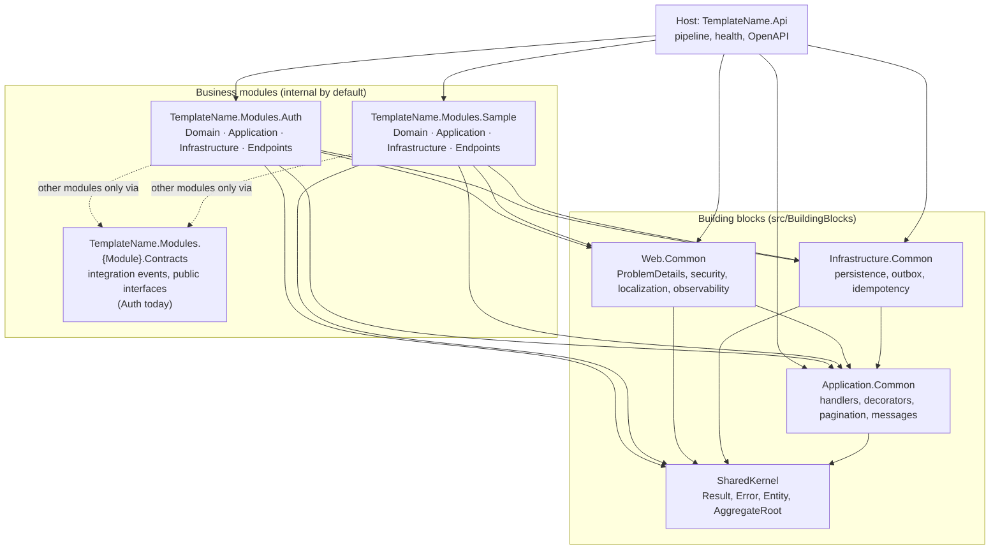

# Architecture overview

`TemplateName` is a modular monolith: one ASP.NET Core 10 process (`TemplateName.Api`) hosting business modules that each own their code, their SQL Server schema and their migrations. Modules share only the building blocks and talk to each other through `*.Contracts` projects. This page is the map; the details live in the linked documents.

## Module map

- **Host** (`src/Host/TemplateName.Api`, [`docs/services/api.md`](../services/api.md)) wires the building blocks and modules in `Program.cs`: services, the middleware pipeline, health checks, OpenAPI and the `/api/v1` route group.
- **Modules** (`src/Modules/{Module}`, one document per module under [`docs/modules/`](../modules/)) are two projects: `TemplateName.Modules.{Module}` with `Domain/`, `Application/`, `Infrastructure/`, `Endpoints/` and `Resources/` folders, and `TemplateName.Modules.{Module}.Contracts`, the only project another module may reference (ADR 0001). The entry point `{Module}Module` (`Add{Module}Module`, `Map{Module}Endpoints`) is the only public type.
- **Auth** ([`docs/modules/auth.md`](../modules/auth.md)) is the identity module: users, sessions, roles, permissions and the audit log in the `auth` schema, with the sign-in, token, password and administration endpoints. It implements `IPermissionChecker` for the whole host; no other module references it (its `TemplateName.Modules.Auth.Contracts` project holds its integration events and `IUserContactDirectory`, and no module consumes them yet).
- **Building blocks** ([`shared-kernel`](../building-blocks/shared-kernel.md), [`application-common`](../building-blocks/application-common.md), [`infrastructure-common`](../building-blocks/infrastructure-common.md), [`web-common`](../building-blocks/web-common.md)) hold everything every module needs.

The arrows are project references, and architecture tests (`tests/TemplateName.ArchitectureTests`) enforce them: SharedKernel has no dependencies; Application.Common does not depend on Infrastructure.Common or Web.Common; a module's `Domain` depends on nothing but SharedKernel; its `Application` does not depend on its `Infrastructure` or `Endpoints`; and no module references another module except its `.Contracts`.

## Request lifecycle

A request passes the middleware in the order `Program.cs` registers it ([`docs/services/api.md`](../services/api.md#pipeline) has the full table):

```mermaid
flowchart LR
    Client --> FH["1 Forwarded headers"] --> AuthN["1a Authentication"] --> Loc["1b Localization"] --> EH["2 Exception handler"]
    EH --> SCP["3 Status code pages"] --> Trace["4 X-Trace-Id"] --> Sec["5 Security headers"] --> Https["6 HSTS + HTTPS redirect<br/>(not in Development)"]
    Https --> Log["7 Request logging"] --> Route["8 Routing"] --> Cors["9 CORS"] --> RL["9a Rate limiter"] --> AuthZ["10 Authorization"]
    AuthZ --> Idem["11 Idempotency-Key"] --> EP["12 Endpoint"]
```

**Authentication and authorization.** Every endpoint requires a signed-in user unless it says `.AllowAnonymous()` (the fallback policy). Authentication (slot 1a) validates the `Authorization: Bearer` access token, an ES256 JWT the Auth module issued, with no database read; a missing or invalid token leaves the request anonymous and never fails there. It runs before localization so the token's saved `locale` claim picks the response language ahead of `Accept-Language` (ADR 0009). Authorization (slot 10) runs after routing and the rate limiter: an endpoint with `.RequirePermission(code)` asks `IPermissionChecker`, which the Auth module implements over a per-user set cached for 30 seconds, because permissions are never carried in the token (ADR 0016). Anonymous callers get 401 and signed-in callers without the permission 403, both as ProblemDetails, and both are counted by the rate limiter. Other modules declare their permissions with `IPermissionSource` and depend only on `Application.Common`'s `IPermissionChecker` and `ICurrentUser`, never on the Auth module; the Sample module's `LeaveRequestEndpoints` is the example. Details: [Auth module](../modules/auth.md#access-tokens) and [`docs/services/api.md`](../services/api.md#pipeline).

Inside an endpoint (the Sample module's `LeaveRequestEndpoints` is the worked example):

1. The endpoint binds the body or query (malformed input throws, and the exception handler answers `400 request.malformed`), builds a command or query record and calls the injected `ICommandHandler<…>` or `IQueryHandler<…>`.
2. The handler is wrapped by the decorators: logging (outermost) then validation. Validation failures return `400 validation.failed` with camel-cased field `errors` without reaching the handler (ADR 0005).
3. A command handler loads the aggregate through its repository, calls a domain method that returns a `Result` and raises domain events, and saves through the module's unit of work. In that one `SaveChanges` the interceptors stamp audit columns, turn deletes into soft deletes and write the domain events to the module's `OutboxMessages` table (ADR 0006, ADR 0007).
4. A query handler reads with Dapper through `IDbConnectionFactory` and filters `IsDeleted = 0` itself; list queries page by cursor (ADR 0010).
5. The endpoint maps the `Result`: success to `200`/`201`/`204`, failure to RFC 9457 ProblemDetails via `ToProblem()` (ADR 0002). Every problem response carries `code`, `traceId` (equal to the `X-Trace-Id` header) and, when the error has parameters, `params`; `detail` is localized from the signed-in user's saved `locale` claim, else from `Accept-Language` (ADR 0009).
6. After the response, the module's outbox background service dispatches the saved domain events to their `IDomainEventHandler<>`s, at least once per handler (ADR 0007).

## Data ownership

One SQL Server database, one schema per owner, each with its own `__EFMigrationsHistory` table and its own `ready` health check named after the schema (ADR 0003). No module reads or writes another schema; cross-module data flows through integration events or `*.Contracts` interfaces.

| Schema | Owner | Context | Tables | Migrations |
|---|---|---|---|---|
| `platform` | Infrastructure.Common (building block) | `PlatformDbContext` | `IdempotencyKeys` | `src/BuildingBlocks/TemplateName.Infrastructure.Common/Idempotency/Migrations/` |
| `auth` | Auth module | `AuthDbContext` | `Users`, `PasswordHistory`, `UserRoles`, `Roles`, `Permissions`, `RolePermissions`, `UserSessions`, `RefreshTokens`, `VerificationCodes`, `AuthAuditLogs`, `DataProtectionKeys`, `OutboxMessages`, `OutboxMessageConsumers` | `src/Modules/Auth/TemplateName.Modules.Auth/Infrastructure/Persistence/Migrations/` |
| `sample` | Sample module | `SampleDbContext` | `LeaveRequests`, `OutboxMessages`, `OutboxMessageConsumers` | `src/Modules/Sample/TemplateName.Modules.Sample/Infrastructure/Persistence/Migrations/` |

`MigrateModuleDatabasesAsync` applies every registered context's migrations in registration order (`platform` first, because `AddInfrastructureCommon` registers it before any module). The tables of each module are described in its document; `platform.IdempotencyKeys` in [`infrastructure-common`](../building-blocks/infrastructure-common.md#idempotency).

## Cross-module communication

There are two modules today (Sample and Auth), and neither uses the other, so nothing crosses a module boundary yet; Auth already declares what a consumer will use (`TemplateName.Modules.Auth.Contracts`: six integration events and `IUserContactDirectory`, see [`docs/modules/auth.md`](../modules/auth.md#events)). A contracts project references only `TemplateName.SharedKernel` and holds only public sealed records, enums and interfaces (`ContractsTests`). The rules for when a boundary is crossed:

- A module exposes integration events (`{Noun}{PastTenseVerb}IntegrationEvent`) and public interfaces only in its `.Contracts` project.
- Domain events stay inside the module. A domain event handler that must tell another module builds an integration event whose `Id` is the outbox message id (`IOutboxMessageContext.MessageId`) and calls `IIntegrationEventPublisher`, which runs every `IIntegrationEventHandler<T>` in the process, each in its own scope. A failing consumer makes the outbox retry the publish; each consumer records the event in its own module's inbox (`InboxMessages`) in the same save as its rows, so a repeat has no effect. Consumers only write rows. Cross-module effects are eventually consistent, never one transaction (ADR 0007, ADR 0018).

## Decisions

| ADR | Decision |
|---|---|
| [0001](../adr/0001-modular-monolith-two-projects-per-module.md) | Modular monolith with two projects per module |
| [0002](../adr/0002-result-pattern.md) | Result pattern for expected failures |
| [0003](../adr/0003-sql-server-only-v1.md) | SQL Server only for v1 |
| [0004](../adr/0004-sql-server-ordered-sequential-guids.md) | SQL Server-ordered sequential GUIDs |
| [0005](../adr/0005-injected-handlers-with-scrutor-decorators.md) | Injected handlers with Scrutor decorators instead of MediatR |
| [0006](../adr/0006-ef-core-writes-dapper-reads.md) | EF Core for writes, Dapper for reads |
| [0007](../adr/0007-per-module-outbox.md) | Per-module outbox with per-handler consumer tracking |
| [0008](../adr/0008-literal-v1-routes.md) | Literal `/api/v1` routes until a breaking change requires versioning |
| [0009](../adr/0009-internationalization.md) | Error codes as the contract, `detail` localized at the HTTP boundary from `.resx` |
| [0010](../adr/0010-cursor-pagination.md) | Cursor (keyset) pagination; Data API builder not used as the API layer |
| [0011](../adr/0011-in-repo-openapi-snapshot.md) | OpenAPI snapshot test with an in-repo comparer instead of a snapshot library |
| [0012](../adr/0012-sqlclient-native-runtime-licence-exemption.md) | Microsoft SqlClient native runtime components exempt from the licence allow-list |
| [0013](../adr/0013-prerelease-ef-core-opentelemetry-instrumentation.md) | Prerelease OpenTelemetry instrumentation for EF Core |
| [0014](../adr/0014-own-identity-model-with-identity-password-hasher.md) | Own identity model; ASP.NET Core Identity used only for password hashing |
| [0015](../adr/0015-es256-jwt-with-configured-signing-keys.md) | ES256 access tokens signed with keys from configuration |
| [0016](../adr/0016-server-side-permissions-with-per-user-cache.md) | Server-side permissions with a per-user cache |
| [0017](../adr/0017-outbox-secrets-protected-with-data-protection.md) | Single-use tokens in outbox events protected with Data Protection |
| [0018](../adr/0018-in-process-integration-events-with-inbox.md) | In-process integration events with a per-consumer inbox |
