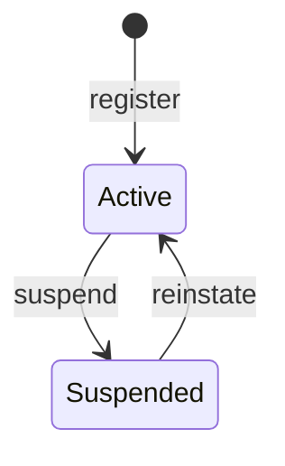

# Auth module

<!-- Copied from docs/modules/_template.md. Each Auth task updates the sections it changes; the module is built up over Plan 2. -->

## Purpose and boundaries

<!-- What the module owns, what it deliberately does not do, and which other modules it talks to (only through *.Contracts). -->

The sign-in and authorization module: registration with email confirmation, login, refresh-token rotation, logout, password reset and change, session management, and role-based permissions with administration of users, roles and the audit log. It is built up over Plan 2 (auth core); until its tasks land this page describes the skeleton only.

- Owns: users, roles, permissions, sessions, verification codes, the auth audit log and the `auth` schema (once the persistence task lands).
- Does not: send localized emails (English only until Plan 3), check access tokens against session revocation on every request (ADR 0015), or support usernames, tenants or progressive lockout.
- Talks to: no other module. It has no `TemplateName.Modules.Auth.Contracts` project yet, because nothing outside the module needs its data; Plan 3 adds the integration events.
- Decisions: [ADR 0014](../adr/0014-own-identity-model-with-identity-password-hasher.md) (own identity model), [ADR 0015](../adr/0015-es256-jwt-with-configured-signing-keys.md) (ES256 tokens, configured keys), [ADR 0016](../adr/0016-server-side-permissions-with-per-user-cache.md) (permissions resolved server-side), [ADR 0017](../adr/0017-outbox-secrets-protected-with-data-protection.md) (outbox secrets protected with Data Protection).

Code: `src/Modules/Auth/TemplateName.Modules.Auth/`. The host calls `AddAuthModule(configuration)` and maps `MapAuthEndpoints()` on the `/api/v1` group. Today the module registers its handlers and error messages only; `MapAuthEndpoints` maps nothing yet.

## Endpoints

<!-- Every endpoint, written as METHOD + full route (e.g. GET /api/v1/{module}/{resources}/{id:guid}), with its success status and error codes. -->

None yet. The routes planned for this module are `/api/v1/auth/...` (self-service), `/api/v1/admin/auth/...` (administration) and `/.well-known/jwks.json`.

| Method | Route | Purpose | Success | Errors |
|---|---|---|---|---|
| | None yet. | | | |

## Domain model

<!-- Aggregates, their invariants and life cycle. Draw state machines as a Mermaid stateDiagram-v2. -->

`User` (`Domain/Users/`) is the first aggregate; `Role`, `UserSession` and `VerificationCode` arrive in the following tasks. A user is identified by its email, kept trimmed (`Email`) and upper-case (`NormalizedEmail`, the form used for lookups and the unique index). It owns its password history (`PasswordHistoryEntry`) and its role assignments (`UserRole`), and it is audited and soft-deleted.

- **Registration:** `User.Register(email, displayName, locale, passwordHash, now)` creates an active, unconfirmed user with a new `SecurityStamp` and the time zone `UTC`. A user created by an administrator has no `PasswordHash` (valid; the history is then empty); a non-null hash is the first history entry.
- **Email confirmation:** `ConfirmEmail` is idempotent; only the first call raises `EmailConfirmedDomainEvent`. `EnsureCanSignIn` refuses a suspended user (`auth.account_inactive`) and an unconfirmed one (`auth.email_not_verified`).
- **Lockout:** `RecordFailedSignIn` counts failures; at the configured threshold it sets `LockoutEnd` to `now + duration` and raises `UserLockedOutDomainEvent`. The account is locked while `now < LockoutEnd`, so it is open again exactly at `LockoutEnd`. A failure after the lockout expired starts a new count; a failure while locked changes nothing. A successful sign-in, a password change and `Reinstate` clear the failures and the lockout.
- **Password:** `ChangePassword` rotates `SecurityStamp`, appends the new hash to the history and keeps at most `historyCount` entries including the current one (the oldest are dropped). The reuse check itself runs in the application layer against the history.
- **Suspension:** `Suspend` rotates `SecurityStamp` (so issued tokens stop matching) and is idempotent; `Reinstate` makes the account active again and is idempotent.
- **Registration attempts:** `NoteRegistrationAttempt` raises `RegistrationAttemptedDomainEvent` and changes no state, so the registration answer stays the same for known and unknown addresses.
- **Roles:** `AssignRole` and `RemoveRole` are idempotent. A role is referred to by id; the `Role` aggregate arrives in a later task.

`UserStatus` (`Domain/Users/`) is persisted by its numeric value, so a new state is appended and existing values are never renumbered.

The remaining aggregates (`Role`, `UserSession`, `VerificationCode`) arrive in the following tasks.

## Error codes

<!-- Every error code the module returns ({module}.snake_case), its HTTP status, its params and its English message. Messages live in Resources/{Module}ErrorMessages.resx with .ms.resx and .zh-Hans.resx (ADR 0009). -->

| Code | HTTP | `params` | Message (en) |
|---|---|---|---|
| `auth.invalid_credentials` | 401 | — | The email or password is incorrect. |
| `auth.email_not_verified` | 403 | — | The email address has not been verified. |
| `auth.account_inactive` | 403 | — | The account is not active. |
| `auth.user_not_found` | 404 | `id` | User '{id}' was not found. |
| `auth.password_reused` | 400 | — | The password was used recently. Choose a different one. |
| `auth.password_breached` | 400 | — | The password appears in a known data breach. Choose a different one. |
| `auth.current_password_incorrect` | 400 | — | The current password is incorrect. |

The user codes are declared in `Domain/Users/UserErrors.cs`. Their messages are in `Resources/AuthErrorMessages.resx` (English) with `AuthErrorMessages.ms.resx` and `AuthErrorMessages.zh-Hans.resx` (drafts awaiting native review); every further code is added to all three files in the same change that introduces it. A locked account answers with `auth.invalid_credentials`, never a distinct code (it would reveal that the email exists).

## Events

<!-- Domain events (internal, dispatched through the module outbox) and integration events (published in *.Contracts), with their handlers. -->

| Event | Kind | Raised when | Handlers |
|---|---|---|---|
| `UserRegisteredDomainEvent(UserId, Email, Locale)` | Domain | A user registers | None yet |
| `EmailConfirmedDomainEvent(UserId, Email)` | Domain | A user confirms their email address for the first time | None yet |
| `PasswordChangedDomainEvent(UserId, Email, Locale)` | Domain | A password is changed or reset | None yet |
| `UserLockedOutDomainEvent(UserId, LockoutEnd)` | Domain | A failed sign-in reaches the lockout threshold | None yet |
| `RegistrationAttemptedDomainEvent(UserId, Email, Locale)` | Domain | Someone registers an address that already has an account | None yet |

The events are declared in `Domain/Users/Events/`. Domain events are written to the module outbox in the same save as the aggregate (once the persistence task lands) and dispatched by the outbox (ADR 0007). The module publishes no integration events yet.

## Configuration

<!-- Configuration sections and keys the module reads, with defaults. -->

None yet. `AddAuthModule` receives the `IConfiguration` so the `Auth` section (JWT, refresh token, verification, password, lockout) can be bound as the tasks land.

| Key | Default | Purpose |
|---|---|---|
| | None yet. | |

## Data

<!-- The schema, its tables and indexes, and the migrations in order. -->

None yet. The `auth` schema, `AuthDbContext` and the initial migration arrive with the persistence task.

| Table | Purpose | Indexes |
|---|---|---|
| | None yet. | |

## Background processing

<!-- Hosted services, outbox handlers and scheduled jobs the module runs. -->

None yet.

## Observability

<!-- Log messages, ActivitySource and Meter names, and metrics the module emits. -->

None yet.

## Testing

<!-- Where the module's unit and integration tests live and what they cover. -->

The module is covered by the architecture tests (`tests/TemplateName.ArchitectureTests`): layering, module boundaries, naming, documentation and translations all include `TemplateName.Modules.Auth`. Unit tests will live under `tests/TemplateName.UnitTests/Auth/` and integration tests under `tests/TemplateName.IntegrationTests/Auth/`.

## Changelog

<!-- Link to the changelog entries for this module's commit scope. -->

Changes to this module are the [`CHANGELOG.md`](../../CHANGELOG.md) entries with scope `auth` (release-please prints them as **auth:**). To list them from git: `git log --oneline -E --grep='^[a-z]+\(auth\)!?:'`.
