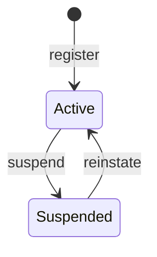
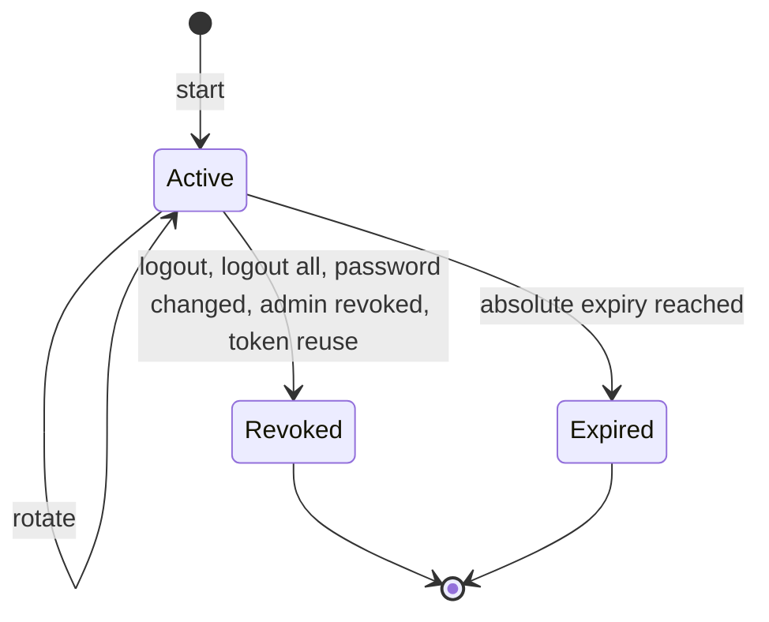
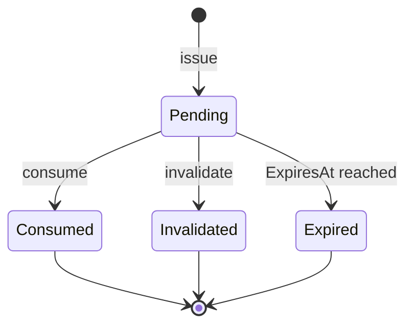

# Auth module

<!-- Copied from docs/modules/_template.md. Each Auth task updates the sections it changes; the module is built up over Plan 2. -->

## Purpose and boundaries

<!-- What the module owns, what it deliberately does not do, and which other modules it talks to (only through *.Contracts). -->

The sign-in and authorization module: registration with email confirmation, login, refresh-token rotation, logout, password reset and change, session management, and role-based permissions with administration of users, roles and the audit log. It is built up over Plan 2 (auth core); this page describes what has landed so far (the domain model and its persistence).

- Owns: users, roles, permissions, sessions, verification codes, the auth audit log, the Data Protection key ring and the `auth` schema.
- Does not: send localized emails (English only until Plan 3), check access tokens against session revocation on every request (ADR 0015), or support usernames, tenants or progressive lockout.
- Talks to: no other module. It has no `TemplateName.Modules.Auth.Contracts` project yet, because nothing outside the module needs its data; Plan 3 adds the integration events.
- Decisions: [ADR 0014](../adr/0014-own-identity-model-with-identity-password-hasher.md) (own identity model), [ADR 0015](../adr/0015-es256-jwt-with-configured-signing-keys.md) (ES256 tokens, configured keys), [ADR 0016](../adr/0016-server-side-permissions-with-per-user-cache.md) (permissions resolved server-side), [ADR 0017](../adr/0017-outbox-secrets-protected-with-data-protection.md) (outbox secrets protected with Data Protection).

Code: `src/Modules/Auth/TemplateName.Modules.Auth/`. The host calls `AddAuthModule(configuration)` and maps `MapAuthEndpoints()` on the `/api/v1` group. Today the module registers its persistence (context, outbox, repositories, audit writer, Data Protection key ring; see [Data](#data)), its handlers and its error messages; `MapAuthEndpoints` maps nothing yet.

## Endpoints

<!-- Every endpoint, written as METHOD + full route (e.g. GET /api/v1/{module}/{resources}/{id:guid}), with its success status and error codes. -->

None yet. The routes planned for this module are `/api/v1/auth/...` (self-service), `/api/v1/admin/auth/...` (administration) and `/.well-known/jwks.json`.

| Method | Route | Purpose | Success | Errors |
|---|---|---|---|---|
| | None yet. | | | |

## Domain model

<!-- Aggregates, their invariants and life cycle. Draw state machines as a Mermaid stateDiagram-v2. -->

`User` (`Domain/Users/`) is the first aggregate and `Role` (`Domain/Roles/`) the second; `UserSession` (`Domain/Sessions/`) the third and `VerificationCode` (`Domain/Verification/`) the fourth; the audit log entry `AuthAuditLog` (`Domain/Audit/`) is a plain entity. A user is identified by its email, kept trimmed (`Email`) and upper-case (`NormalizedEmail`, the form used for lookups and the unique index). It owns its password history (`PasswordHistoryEntry`) and its role assignments (`UserRole`), and it is audited and soft-deleted.

- **Registration:** `User.Register(email, displayName, locale, passwordHash, now)` creates an active, unconfirmed user with a new `SecurityStamp` and the time zone `UTC`. A user created by an administrator has no `PasswordHash` (valid; the history is then empty); a non-null hash is the first history entry.
- **Email confirmation:** `ConfirmEmail` is idempotent; only the first call raises `EmailConfirmedDomainEvent`. `EnsureCanSignIn` refuses a suspended user (`auth.account_inactive`) and an unconfirmed one (`auth.email_not_verified`).
- **Lockout:** `RecordFailedSignIn` counts failures; at the configured threshold it sets `LockoutEnd` to `now + duration` and raises `UserLockedOutDomainEvent`. The account is locked while `now < LockoutEnd`, so it is open again exactly at `LockoutEnd`. A failure after the lockout expired starts a new count; a failure while locked changes nothing. A successful sign-in, a password change and `Reinstate` clear the failures and the lockout.
- **Password:** `ChangePassword` rotates `SecurityStamp`, appends the new hash to the history and keeps at most `historyCount` entries including the current one (the oldest are dropped). The reuse check itself runs in the application layer against the history.
- **Suspension:** `Suspend` rotates `SecurityStamp` (so issued tokens stop matching) and is idempotent; `Reinstate` makes the account active again and is idempotent.
- **Registration attempts:** `NoteRegistrationAttempt` raises `RegistrationAttemptedDomainEvent` and changes no state, so the registration answer stays the same for known and unknown addresses.
- **Roles:** `AssignRole` and `RemoveRole` are idempotent. A user refers to a role by id (`UserRole`); the `Role` aggregate is described below.

`UserStatus` (`Domain/Users/`) is persisted by its numeric value, so a new state is appended and existing values are never renumbered.



`Role` (`Domain/Roles/`) is a named set of permissions, audited and soft-deleted, with a `RowVersion` for optimistic concurrency. `Permission` is a plain entity (`Code`, `Module`, `Name`, `Description`, `IsDeprecated`); `RolePermission(RoleId, PermissionId)` is a grant.

- **Names:** `Role.Create(name, description, now)` trims the name and stores `NormalizedName` (upper-case, the form for the unique index); a blank name is a programming error (`ArgumentException`), because the application validator rejects it first.
- **System roles:** `SystemRoles` names `SuperAdmin`, `Admin` and `User`. `Role.CreateSystem` builds them for the seeder. A system role cannot be renamed (`UpdateDetails`) or deleted (`MarkDeleted`): both answer `auth.system_role_protected`. `MarkDeleted` only checks the rule; the save interceptor performs the soft delete.
- **Permission set:** `SetPermissions` replaces the set, ignores duplicates and is idempotent; it is refused for `SuperAdmin` (`auth.system_role_protected`), whose set the seeder keeps equal to every declared permission through `SyncPermissions` (same replacement, no protection, internal use only).
- **Permissions:** a permission that is no longer declared is deprecated (`SetDeprecated`), never deleted, so existing grants stay readable.

### Permissions

Codes are `module.resource.action` in snake case. Each module declares its own through `IPermissionSource` (see [Application.Common](../building-blocks/application-common.md)); the Auth module declares these in `Application/AuthPermissions.cs` and `AuthPermissionSource` (module `auth`, English names). The source is registered, and the table synced, when the seeding task lands.

| Code | Allows |
|---|---|
| `auth.user.view` | List users and read their details. |
| `auth.user.create` | Create a user account on behalf of someone. |
| `auth.user.lock` | Suspend and reinstate user accounts. |
| `auth.user.reset_password` | Send a password reset to a user. |
| `auth.user.revoke_sessions` | End the sessions of a user. |
| `auth.user.assign_roles` | Add and remove the roles of a user. |
| `auth.role.view` | List roles and read their permissions. |
| `auth.role.manage` | Create, change and delete roles and set their permissions. |
| `auth.permission.view` | List the permissions that modules declare. |
| `auth.audit.view` | Read the authentication and administration audit log. |

`UserSession` (`Domain/Sessions/`) is one sign-in on one device, and also the refresh-token family (decision D2: there is no `FamilyId`). Its id is the `sid` claim of the access tokens. It owns its `RefreshToken` chain; a token stores only the SHA-256 hash (`TokenHash`), never the token.

- **Start:** `UserSession.Start(userId, authMethods, deviceName, userAgent, ipAddress, securityStamp, firstTokenHash, slidingLifetime, absoluteLifetime, now)` creates the session and its first token. `SecurityStamp` is a **snapshot** of the user's stamp at sign-in; `ExpiresAt` is absolute (`now + absoluteLifetime`) and sliding refresh never moves it. Tokens expire at `min(now + slidingLifetime, session.ExpiresAt)`, so no token outlives the session. `IsActive(now)` is true while the session is not revoked and `now < ExpiresAt`. The device name, user agent and address are client-supplied, so `Start` cuts them to their columns (`UserSession.MaxDeviceNameLength` 200, `MaxUserAgentLength` 512, `MaxIpAddressLength` 45) instead of letting a long header fail the sign-in.
- **Rotate:** `Rotate(presentedTokenHash, newTokenHash, currentSecurityStamp, slidingLifetime, now)` is checked in this order. The caller saves the aggregate on every outcome, because some failures revoke the session.

  | Presented token | Result | Effect on the session |
  |---|---|---|
  | Hash matches no token, or the session is already revoked | `auth.invalid_refresh_token` | None. |
  | Current security stamp differs from the snapshot | `auth.invalid_refresh_token` | Revoked with `PasswordChanged`. |
  | Token already used or revoked | `auth.refresh_token_reused` | Revoked with `TokenReuse` (every token revoked), `RefreshTokenReuseDetectedDomainEvent` raised. |
  | Token or session expired | `auth.refresh_token_expired` | None. |
  | Valid | The new `RefreshToken` | Old token gets `UsedAt` and `ReplacedByTokenId`, `LastSeenAt` moves to `now`. |

  Hashes are compared with `CryptographicOperations.FixedTimeEquals` against every token of the session (no early exit), so timing does not tell which token matched. An unknown token, a token of a revoked session and a stamp mismatch all give `auth.invalid_refresh_token`.
- **Revoke:** `Revoke(reason, now)` ends the session and revokes every token that is not yet revoked. It is idempotent: a second call keeps the first time and reason.

`SessionRevokedReason` is persisted by its numeric value (`Logout`, `LogoutAll`, `PasswordChanged`, `AdminRevoked`, `TokenReuse`, `Expired`), so a new reason is appended and existing values are never renumbered.



`VerificationCode` (`Domain/Verification/`) is a single-use code behind an emailed link. `VerificationPurpose` (`EmailVerify = 1`, `PasswordReset = 2`) is persisted by its numeric value, so a new purpose is appended and existing values are never renumbered. Only the SHA-256 hash of the token is stored (`TokenHash`); the repository finds a code by that unique hash, so the domain compares no hashes. The token itself travels only inside the issued event, as `ProtectedToken`: the application encrypts it with Data Protection (ADR 0017) and the event handler decrypts it to build the link. It is never a property of the aggregate.

- **Issue:** `VerificationCode.Issue(userId, purpose, target, tokenHash, protectedToken, lifetime, createdIp, now)` sets `ExpiresAt = now + lifetime` (a non-positive lifetime is a programming error) and raises `VerificationCodeIssuedDomainEvent`. `Target` is the normalized email address. `createdIp` is cut to `VerificationCode.MaxCreatedIpLength` (45).
- **Consume:** `Consume(expected, now)` succeeds once. It fails with `auth.invalid_token` when the purpose differs, or the code is consumed, invalidated or expired. A code is valid up to, not including, `ExpiresAt`. Every cause gives the same error so the answer does not tell which one applied.
- **Invalidate:** `Invalidate(now)` makes a pending code unusable (a newer code replaces it, or the account state makes it useless). It is idempotent and leaves a consumed code unchanged. `IsPending(now)` is true while the code is neither consumed, invalidated nor expired.



`AuthAuditLog` (`Domain/Audit/`) is one line of the append-only audit log. It is a plain entity with a `bigint` identity key, not an aggregate, and raises no domain events. `AuthAuditLog.Create(eventType, succeeded, now, userId, failureReason, attemptedIdentifier, sessionId, details)` leaves the client fields empty; the audit writer calls `SetClientInfo(ipAddress, userAgent, traceId)` from the request, which cuts the values to their columns (45, 512 and 64 characters). `AttemptedIdentifier` is cut to 256 characters. `Details` is JSON text that the domain neither validates nor bounds. `MaskIdentifier` makes an identifier safe to log: `alice@example.com` becomes `a****@example.com`, a value without `@` keeps its first character (`a****`), and null or blank gives null.

### Audit events

The event types are the constants of `AuthAuditEvents` (stored as text, never renamed):

- Registration and confirmation: `auth.registered`, `auth.register_duplicate`, `auth.email_confirmed`, `auth.email_confirm_failed`, `auth.confirmation_resent`.
- Sign-in and tokens: `auth.login_succeeded`, `auth.login_failed`, `auth.locked_out`, `auth.token_refreshed`, `auth.refresh_failed`, `auth.token_reuse_detected`.
- Sessions: `auth.logout`, `auth.logout_all`, `auth.session_revoked`.
- Passwords and profile: `auth.password_forgot_requested`, `auth.password_reset`, `auth.password_reset_failed`, `auth.password_changed`, `auth.password_change_failed`, `auth.profile_updated`.
- Administration: `auth.admin_user_created`, `auth.admin_user_locked`, `auth.admin_user_unlocked`, `auth.admin_password_reset_forced`, `auth.admin_sessions_revoked`, `auth.admin_roles_assigned`.
- Roles: `auth.role_created`, `auth.role_updated`, `auth.role_deleted`, `auth.role_permissions_changed`.

## Error codes

<!-- Every error code the module returns ({module}.snake_case), its HTTP status, its params and its English message. Messages live in Resources/{Module}ErrorMessages.resx with .ms.resx and .zh-Hans.resx (ADR 0009). -->

| Code | HTTP | `params` | Message (en) |
|---|---|---|---|
| `auth.invalid_credentials` | 401 | — | The email or password is incorrect. |
| `auth.email_not_verified` | 403 | — | The email address has not been verified. |
| `auth.account_inactive` | 403 | — | The account is not active. |
| `auth.user_not_found` | 404 | `id` | User '{id}' was not found. |
| `auth.password_reused` | 400 | — | The password was used recently. Choose a different one. |
| `auth.password_breached` | 400 | — | The password appears in a known data breach. Choose a different one. |
| `auth.current_password_incorrect` | 400 | — | The current password is incorrect. |
| `auth.role_not_found` | 404 | `id` | Role '{id}' was not found. |
| `auth.role_name_taken` | 409 | `name` | A role named '{name}' already exists. |
| `auth.system_role_protected` | 409 | — | This is a system role and cannot be changed this way. |
| `auth.permission_not_found` | 400 | — | One or more of the permissions do not exist. |
| `auth.invalid_refresh_token` | 401 | — | The refresh token is not valid. |
| `auth.refresh_token_expired` | 401 | — | The refresh token has expired. Sign in again. |
| `auth.refresh_token_reused` | 401 | — | The refresh token was already used. The session has been ended; sign in again. |
| `auth.session_not_found` | 404 | `id` | Session '{id}' was not found. |
| `auth.invalid_token` | 400 | — | The link is invalid or has expired. |

The user codes are declared in `Domain/Users/UserErrors.cs`, the role and permission codes in `Domain/Roles/RoleErrors.cs` and the session codes in `Domain/Sessions/SessionErrors.cs` and `auth.invalid_token` in `Domain/Verification/VerificationErrors.cs` (one answer for an unknown, used, replaced, expired or wrong-purpose token). Their messages are in `Resources/AuthErrorMessages.resx` (English) with `AuthErrorMessages.ms.resx` and `AuthErrorMessages.zh-Hans.resx` (drafts awaiting native review); every further code is added to all three files in the same change that introduces it. A locked account answers with `auth.invalid_credentials`, never a distinct code (it would reveal that the email exists).

## Events

<!-- Domain events (internal, dispatched through the module outbox) and integration events (published in *.Contracts), with their handlers. -->

| Event | Kind | Raised when | Handlers |
|---|---|---|---|
| `UserRegisteredDomainEvent(UserId, Email, Locale)` | Domain | A user registers | None yet |
| `EmailConfirmedDomainEvent(UserId, Email)` | Domain | A user confirms their email address for the first time | None yet |
| `PasswordChangedDomainEvent(UserId, Email, Locale)` | Domain | A password is changed or reset | None yet |
| `UserLockedOutDomainEvent(UserId, LockoutEnd)` | Domain | A failed sign-in reaches the lockout threshold | None yet |
| `RegistrationAttemptedDomainEvent(UserId, Email, Locale)` | Domain | Someone registers an address that already has an account | None yet |
| `RefreshTokenReuseDetectedDomainEvent(UserId, SessionId)` | Domain | A used or revoked refresh token is presented again and the session is revoked | None yet |
| `VerificationCodeIssuedDomainEvent(CodeId, UserId, Purpose, Target, ProtectedToken)` | Domain | A verification code is issued; `ProtectedToken` is the encrypted token for the email link | None yet |

The events are declared in `Domain/Users/Events/`, `Domain/Sessions/Events/` and `Domain/Verification/Events/`. Domain events are written to `auth.OutboxMessages` in the same save as the aggregate and dispatched by the module outbox (ADR 0007). The module publishes no integration events yet.

## Configuration

<!-- Configuration sections and keys the module reads, with defaults. -->

`AddAuthModule` receives the `IConfiguration`; the rest of the `Auth` section (JWT, refresh token, verification, password, lockout) is bound as the tasks land.

| Key | Default | Purpose |
|---|---|---|
| `ConnectionStrings:Database` | empty (user secrets or environment) | The database that holds the `auth` schema. |
| `Auth:DataProtection:ApplicationName` | `TemplateName` | The Data Protection application name. Every instance that must read the others' protected values (outbox tokens, ADR 0017) uses the same name and the same database. |

## Data

<!-- The schema, its tables and indexes, and the migrations in order. -->

Schema `auth`, owned by `AuthDbContext` (`Infrastructure/Persistence/`), which is also the module's `IUnitOfWork` and the Data Protection key store (`IDataProtectionKeyContext`). Writes go through EF Core and the repositories in `Application/Abstractions/` (`IUserRepository`, `IRoleRepository`, `IPermissionRepository`, `ISessionRepository`, `IVerificationCodeRepository`); later list queries read with Dapper and filter `IsDeleted = 0` themselves (ADR 0006). Keys are `SequentialGuid`s set by the domain (`ValueGeneratedNever`), except the audit log's `bigint` identity. Every timestamp, `DateTime` or `DateTimeOffset`, is `datetime2(3)` holding UTC (`ApplyDefaultConventions`); a `DateTimeOffset` comes back with offset zero. Hashes are `varbinary(32)` (SHA-256); enums are `int`.

| Table | Purpose | Indexes |
|---|---|---|
| `auth.Users` | The `User` aggregate. `Email`/`NormalizedEmail nvarchar(256)`, `PasswordHash nvarchar(256)` (null for an administrator-created user), `SecurityStamp nvarchar(64)`, `DisplayName nvarchar(200)`, `Locale nvarchar(16)`, `TimeZone nvarchar(64)`, `Status int`, `RowVersion rowversion`, audit and soft-delete columns. | `PK_Users`, `IX_Users_NormalizedEmail` (unique, filtered `[IsDeleted] = 0`) |
| `auth.PasswordHistory` | The user's current and previous password hashes (`PasswordHistoryEntry`), loaded oldest first. | `PK_PasswordHistory`, `IX_PasswordHistory_UserId` (FK to `Users`, cascade) |
| `auth.UserRoles` | Role assignments (`UserRole`): `AssignedBy`, `AssignedAt`. | `PK_UserRoles` (`UserId`, `RoleId`), `IX_UserRoles_RoleId` (FK to `Roles`, restrict; FK to `Users`, cascade) |
| `auth.Roles` | The `Role` aggregate. `Name`/`NormalizedName nvarchar(100)`, `Description nvarchar(500)`, `IsSystem`, `RowVersion rowversion`, audit and soft-delete columns. | `PK_Roles`, `IX_Roles_NormalizedName` (unique, filtered `[IsDeleted] = 0`) |
| `auth.Permissions` | Declared permissions. `Code nvarchar(128)`, `Module nvarchar(64)`, `Name nvarchar(200)`, `Description nvarchar(500)`, `IsDeprecated`. | `PK_Permissions`, `IX_Permissions_Code` (unique) |
| `auth.RolePermissions` | Grants (`RolePermission`). | `PK_RolePermissions` (`RoleId`, `PermissionId`), `IX_RolePermissions_PermissionId` (FK to `Permissions`, restrict; FK to `Roles`, cascade) |
| `auth.UserSessions` | The `UserSession` aggregate. `AuthMethods nvarchar(64)`, `DeviceName nvarchar(200)`, `UserAgent nvarchar(512)`, `IpAddress nvarchar(45)`, `SecurityStamp nvarchar(64)`, `RevokedReason int`. | `PK_UserSessions`, `IX_UserSessions_UserId` (FK to `Users`, restrict) |
| `auth.RefreshTokens` | The session's token chain (`RefreshToken`): `TokenHash varbinary(32)`, `UsedAt`, `ReplacedByTokenId`, `RevokedAt`. | `PK_RefreshTokens`, `IX_RefreshTokens_TokenHash` (unique), `IX_RefreshTokens_SessionId` (FK to `UserSessions`, cascade) |
| `auth.VerificationCodes` | The `VerificationCode` aggregate. `Purpose int`, `Target nvarchar(256)`, `TokenHash varbinary(32)`, `CreatedIp nvarchar(45)`. | `PK_VerificationCodes`, `IX_VerificationCodes_TokenHash` (unique), `IX_VerificationCodes_UserId_Purpose_CreatedAt` (also serves the FK to `Users`, restrict) |
| `auth.AuthAuditLogs` | The audit log (`AuthAuditLog`). `Id bigint identity`, `EventType nvarchar(64)`, `FailureReason nvarchar(128)`, `AttemptedIdentifier nvarchar(256)`, `IpAddress nvarchar(45)`, `UserAgent nvarchar(512)`, `TraceId nvarchar(64)`, `Details nvarchar(max)`. No foreign keys, so entries outlive what they describe. | `PK_AuthAuditLogs`, `IX_AuthAuditLogs_UserId_OccurredAt`, `IX_AuthAuditLogs_EventType_OccurredAt`, `IX_AuthAuditLogs_IpAddress_OccurredAt` (each `OccurredAt DESC`) |
| `auth.DataProtectionKeys` | The Data Protection key ring (ADR 0017), shared by every instance; not encrypted at rest yet. | `PK_DataProtectionKeys` |
| `auth.OutboxMessages` | Domain events waiting for dispatch. | `PK_OutboxMessages`, `IX_OutboxMessages_OccurredAt` (filtered: `ProcessedAt IS NULL`) |
| `auth.OutboxMessageConsumers` | Which handler has processed which message. | `PK_OutboxMessageConsumers` (`OutboxMessageId`, `Name`) |
| `auth.__EFMigrationsHistory` | Applied migrations of this module. | — |

Rules the repositories and the context keep:

- **Whole aggregates.** A user is loaded with its password history (oldest first, which `ChangePassword` relies on to drop the oldest) and its roles; a role with its grants; a session with **every** refresh token, used or not, because `Rotate` and `Revoke` are only correct over the whole chain (Ruling R7). `GetByRefreshTokenHashAsync` uses the token only to pick the session; the include is never filtered.
- **Claiming a refresh token.** `TryClaimRefreshTokenAsync` is one `UPDATE ... SET UsedAt = @now WHERE Id = @id AND UsedAt IS NULL AND RevokedAt IS NULL` (`ExecuteUpdateAsync`), true only for the caller whose statement changed the row. It bypasses the change tracker, so the refresh handler loads the session, claims, then rotates the instance it already holds; it never reloads after the claim.
- **Soft delete keeps children.** Users and roles are soft-deleted by `SoftDeleteInterceptor`. The context cascades deletes at save time (`CascadeDeleteTiming = OnSaveChanges`), after the interceptor has turned the delete into an update, so a soft-deleted user keeps its history and assignments. Removing an item from a collection (`RemoveRole`, history trimming) still deletes that row.
- **Column lengths.** Every client-supplied value is cut before it reaches a bounded column, so a long `User-Agent` or an IPv6 address with a zone id never fails a save: `HttpClientContext` cuts to the `AuthAuditLog` limits, and `UserSession.Start`, `VerificationCode.Issue` and `AuthAuditLog.SetClientInfo` cut again to their own. The configurations take the lengths from these domain constants.
- **Audit entries.** `IAuthAuditWriter.Record` fills `IpAddress`, `UserAgent` and `TraceId` from `IClientContext` (`HttpClientContext`: the address after the forwarded-headers middleware, the `User-Agent` header, and the trace id that `X-Trace-Id` also carries, each already cut to its audit column) and stages the entry; the handler's `SaveChangesAsync` saves it with the rest.

Migrations (`Infrastructure/Persistence/Migrations/`), in order:

1. `InitialAuth`: creates the schema and every table above.

Add one with:

```bash
dotnet ef migrations add {Verb}{What} \
  --project src/Modules/Auth/TemplateName.Modules.Auth \
  --startup-project src/Host/TemplateName.Api \
  --context AuthDbContext \
  --output-dir Infrastructure/Persistence/Migrations
```

## Background processing

<!-- Hosted services, outbox handlers and scheduled jobs the module runs. -->

None yet.

## Observability

<!-- Log messages, ActivitySource and Meter names, and metrics the module emits. -->

None yet.

## Testing

<!-- Where the module's unit and integration tests live and what they cover. -->

The module is covered by the architecture tests (`tests/TemplateName.ArchitectureTests`): layering, module boundaries, naming, documentation and translations all include `TemplateName.Modules.Auth`. Unit tests of the domain live under `tests/TemplateName.UnitTests/Auth/`. Integration tests live under `tests/TemplateName.IntegrationTests/Auth/`: `AuthPersistenceTests` covers aggregate round trips, the unique and filtered indexes, soft delete, UTC timestamps, the outbox row written with a new user, the concurrent refresh-token claim and the key ring in `auth.DataProtectionKeys`.

## Changelog

<!-- Link to the changelog entries for this module's commit scope. -->

Changes to this module are the [`CHANGELOG.md`](../../CHANGELOG.md) entries with scope `auth` (release-please prints them as **auth:**). To list them from git: `git log --oneline -E --grep='^[a-z]+\(auth\)!?:'`.
