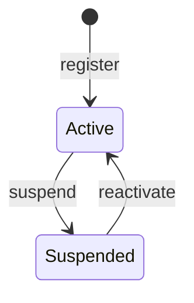

# Auth module

<!-- Copied from docs/modules/_template.md. Each Auth task updates the sections it changes; the module is built up over Plan 2. -->

## Purpose and boundaries

<!-- What the module owns, what it deliberately does not do, and which other modules it talks to (only through *.Contracts). -->

The sign-in and authorization module: registration with email confirmation, login, refresh-token rotation, logout, password reset and change, session management, and role-based permissions with administration of users, roles and the audit log. It is built up over Plan 2 (auth core); until its tasks land this page describes the skeleton only.

- Owns: users, roles, permissions, sessions, verification codes, the auth audit log and the `auth` schema (once the persistence task lands).
- Does not: send localized emails (English only until Plan 3), check access tokens against session revocation on every request (ADR 0015), or support usernames, tenants or progressive lockout.
- Talks to: no other module. It has no `TemplateName.Modules.Auth.Contracts` project yet, because nothing outside the module needs its data; Plan 3 adds the integration events.
- Decisions: [ADR 0014](../adr/0014-own-identity-model-with-identity-password-hasher.md) (own identity model), [ADR 0015](../adr/0015-es256-jwt-with-configured-signing-keys.md) (ES256 tokens, configured keys), [ADR 0016](../adr/0016-server-side-permissions-with-per-user-cache.md) (permissions resolved server-side), [ADR 0017](../adr/0017-outbox-secrets-protected-with-data-protection.md) (outbox secrets protected with Data Protection).

Code: `src/Modules/Auth/TemplateName.Modules.Auth/`. The host calls `AddAuthModule(configuration)` and maps `MapAuthEndpoints()` on the `/api/v1` group. Today the module registers its handlers and error messages only; `MapAuthEndpoints` maps nothing yet.

## Endpoints

<!-- Every endpoint, written as METHOD + full route (e.g. GET /api/v1/{module}/{resources}/{id:guid}), with its success status and error codes. -->

None yet. The routes planned for this module are `/api/v1/auth/...` (self-service), `/api/v1/admin/auth/...` (administration) and `/.well-known/jwks.json`.

| Method | Route | Purpose | Success | Errors |
|---|---|---|---|---|
| | None yet. | | | |

## Domain model

<!-- Aggregates, their invariants and life cycle. Draw state machines as a Mermaid stateDiagram-v2. -->

Only the user status exists so far. `UserStatus` (`Domain/Users/`) is persisted by its numeric value, so a new state is appended and existing values are never renumbered.

The aggregates (`User`, `Role`, `UserSession`, `VerificationCode`) arrive in the following tasks.

## Error codes

<!-- Every error code the module returns ({module}.snake_case), its HTTP status, its params and its English message. Messages live in Resources/{Module}ErrorMessages.resx with .ms.resx and .zh-Hans.resx (ADR 0009). -->

None yet. `Resources/AuthErrorMessages.resx` and its `.ms` and `.zh-Hans` translations exist and are empty; every code is added to all three files in the same change that introduces it.

| Code | HTTP | `params` | Message (en) |
|---|---|---|---|
| | | | None yet. |

## Events

<!-- Domain events (internal, dispatched through the module outbox) and integration events (published in *.Contracts), with their handlers. -->

None yet.

| Event | Kind | Raised when | Handlers |
|---|---|---|---|
| | | | None yet. |

## Configuration

<!-- Configuration sections and keys the module reads, with defaults. -->

None yet. `AddAuthModule` receives the `IConfiguration` so the `Auth` section (JWT, refresh token, verification, password, lockout) can be bound as the tasks land.

| Key | Default | Purpose |
|---|---|---|
| | None yet. | |

## Data

<!-- The schema, its tables and indexes, and the migrations in order. -->

None yet. The `auth` schema, `AuthDbContext` and the initial migration arrive with the persistence task.

| Table | Purpose | Indexes |
|---|---|---|
| | None yet. | |

## Background processing

<!-- Hosted services, outbox handlers and scheduled jobs the module runs. -->

None yet.

## Observability

<!-- Log messages, ActivitySource and Meter names, and metrics the module emits. -->

None yet.

## Testing

<!-- Where the module's unit and integration tests live and what they cover. -->

The module is covered by the architecture tests (`tests/TemplateName.ArchitectureTests`): layering, module boundaries, naming, documentation and translations all include `TemplateName.Modules.Auth`. Unit tests will live under `tests/TemplateName.UnitTests/Auth/` and integration tests under `tests/TemplateName.IntegrationTests/Auth/`.

## Changelog

<!-- Link to the changelog entries for this module's commit scope. -->

Changes to this module are the [`CHANGELOG.md`](../../CHANGELOG.md) entries with scope `auth` (release-please prints them as **auth:**). To list them from git: `git log --oneline -E --grep='^[a-z]+\(auth\)!?:'`.
