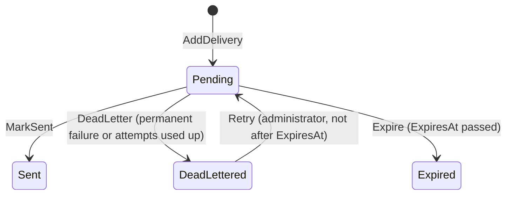

# Notifications module

<!-- Copied from docs/modules/_template.md. Each Notifications task updates the sections it changes; the module is built up over Plan 3. -->

## Purpose and boundaries

<!-- What the module owns, what it deliberately does not do, and which other modules it talks to (only through *.Contracts). -->

Every message the template sends goes through this module: it consumes the integration events other modules publish, renders a localized message in the **recipient's** language and delivers it by email and in-app. Plan 3 builds it task by task; this page describes what exists today (the skeleton, the notification type catalog, the recipient culture and time zone rules, the domain model, persistence and template rendering) and lists the rest under the sections that will hold it.

- Owns: the notification type catalog, the notification, delivery and in-app rows, user preferences and quiet hours, the inbox that makes its consumers idempotent, and the `notify` schema (see [Data](#data)).
- Does not: send anything on its own initiative (it reacts to integration events), store a notification type table (D7: types are declared in code), or offer scheduling, cancellation, digests, push, SMS, webhooks, bulk sends, provider callbacks, attachments or fallback channels (D17).
- Talks to: `TemplateName.Modules.Auth.Contracts` only, never `TemplateName.Modules.Auth` (D1; `ModuleBoundaryTests` enforces it). It consumes Auth's integration events and, once when a notification is created, asks `IUserContactDirectory` for the recipient's address, name, language and time zone, which it snapshots on its own rows (D5). No other module references Notifications, so it has no `TemplateName.Modules.Notifications.Contracts` project yet; `INotificationTypeSource` and `NotificationTypeDefinition` move there when a module wants to declare its own types (D1).
- Consumers only write rows. A consumer records the event in `notify.InboxMessages` in the same save as the notification and its deliveries, so a repeated event has no effect (D3, [ADR 0018](../adr/0018-in-process-integration-events-with-inbox.md)); a separate delivery worker sends. Single-use links reach it as `ISecretProtector` ciphertext and are decrypted only in memory while an email is rendered ([ADR 0020](../adr/0020-secrets-in-cross-module-events.md)).

Code: `src/Modules/Notifications/TemplateName.Modules.Notifications/`. The host calls `AddNotificationsModule(configuration)` after `AddAuthModule`, maps `MapNotificationsEndpoints()` on the `/api/v1` group and `MapNotificationsHub()` on the application root; both map methods are empty until the endpoints and the SignalR hub are added. `AddNotificationsModule` registers the handlers and validators, the error messages (`NotificationsErrorMessages`), the `NotificationCatalog` singleton and the hosted service that validates it at start, and the template renderer (`INotificationRenderer`, see [Templates and rendering](#templates-and-rendering)).

## Endpoints

<!-- Every endpoint, written as METHOD + full route (e.g. GET /api/v1/{module}/{resources}/{id:guid}), with its success status and error codes. -->

None.

`MapNotificationsEndpoints` and `MapNotificationsHub` exist so the host's wiring does not change when the inbox, preference and administration endpoints and the hub at `/hubs/notifications` arrive.

## Domain model

<!-- Aggregates, their invariants and life cycle. Draw state machines as a Mermaid stateDiagram-v2. -->

The domain is pure: no persistence (`Infrastructure/Persistence/` maps it, see [Data](#data)) and no handlers yet, no clock (every method takes `now`) and no encryption. Timestamps are UTC. Types with a `DateTime` property (`Notification`, `Delivery`, `InAppNotification`) store `now.UtcDateTime`; settings, preferences and hub tickets keep `DateTimeOffset`. Text from outside is cut to its column by one helper, `BoundedText.Cut` (`Domain/`), which never leaves half of a surrogate pair.

| Type | What it is |
|---|---|
| `Notification` (aggregate root) | One message to one recipient: `TypeCode`, `RecipientUserId`, `Priority`, the snapshotted `Culture`, `Data` (JSON of non-secret variables), `ProtectedData` (JSON of secret variable to `ISecretProtector` ciphertext, stored as given and never decrypted or printed by the domain), `CorrelationId` (cut to 32), `SourceMessageId` (the integration event id), `CreatedAt`, `ExpiresAt`. `AddDelivery(channel, destination, firstAttemptAt, now)` adds at most one `Delivery` per channel (a second one for the same channel throws `InvalidOperationException`) and copies the expiry onto it. |
| `Delivery` (entity) | One channel's attempt series: `Channel`, `Destination` (email address; null for in-app), `Status`, `AttemptCount`, `NextAttemptAt` (null unless `Pending`), `LockedUntil` (the worker's lease), `LastError` (a reason code such as `smtp_550` or `render_failed`, never free text; cut to 200), `RenderedSubject` (cut to 300), `CreatedAt`, `SentAt`, `DeadLetteredAt`, `ExpiresAt`. |
| `InAppNotification` (entity) | The inbox row of an in-app delivery. Its id **is** the delivery id, so a retried delivery cannot insert a second row. `Title` is cut to 200 and `Body` to 2000. `MarkRead(now)` is idempotent and keeps the first time. |
| `UserPreference` | A per type and channel choice (`IsEnabled`), key `(UserId, TypeCode, Channel)`; stored only when it differs from the type's default (D10). |
| `UserNotificationProfile` (entity, key `UserId`) | The user's settings that are not per type: `QuietHours` (or none), `UpdatedAt` and a `RowVersion`. The plan calls it `UserSettings`, a name the naming rule G5 forbids. |
| `QuietHours` (record) | A daily local window `[Start, End)`; crosses midnight when `End < Start`. `Create` refuses `Start == End`. |
| `HubTicket` (key `TokenHash`, 32 bytes) | A single-use credential for the SignalR hub: `Issue(userId, hash, lifetime, now)`, `CanConsume(now)` (unconsumed and `now < ExpiresAt`) and `TryConsume(now)`. The database claims it with one conditional update; the method states the same rule. |
| `DeliveryRetryPolicy` | `NextAttemptAt(failedAttempts, utcNow, maxAttempts)`: 1 minute, 5 minutes, 15 minutes, 1 hour and 6 hours after failed attempts 1 to 5, 6 hours after any later one; `null` once `failedAttempts >= maxAttempts`. It is `internal` like every module type (the architecture tests allow no other public type than the module entry point). |

### Delivery life cycle

`Sent` and `Expired` are final. `Retry` works only from `DeadLettered` and only before `ExpiresAt` (`now < ExpiresAt`); it sets `AttemptCount = 0` and `NextAttemptAt = now` and clears `LastError`, `DeadLetteredAt` and the lease. A transient failure keeps the delivery `Pending` with a later `NextAttemptAt` from `DeliveryRetryPolicy`; that reschedule, the attempt count and the lease belong to the delivery worker's lease-guarded SQL (D14), so `MarkSent`, `DeadLetter` and `Expire` only settle a pending delivery and clear `NextAttemptAt` and `LockedUntil`. They throw `InvalidOperationException` from any other status.

### Quiet hours

`QuietHours.NextAllowedAt(now, zone)` returns `now` when the local time is outside the window, else the next local `End` converted to UTC. Daylight saving is handled by the zone rules, not by arithmetic on offsets:

- An `End` that does not exist (spring forward) becomes the first valid instant after the gap. For the window 01:00 to 02:30 in `America/New_York` on 2026-03-08, 02:30 does not exist and the result is 03:00 EDT (07:00 UTC).
- An `End` that happens twice (clocks go back) takes the earlier offset, unless that instant is not after `now` (the user is already in the second occurrence); then the later one, so the result is never in the past. For 22:00 to 01:30 on 2026-11-01 the result is 01:30 EDT (05:30 UTC).
- Kuala Lumpur has no daylight saving: 23:30 MYT on 2026-03-01 with the window 22:00 to 07:00 gives 07:00 MYT the next day, 2026-03-01T23:00Z.

The enums below are stored as `tinyint`, so their numbers never change or get reused (`Domain/Notifications/`, `Domain/Deliveries/`).

| Enum | Values |
|---|---|
| `NotificationChannel` | `Email = 1`, `InApp = 2` |
| `NotificationCategory` | `Security = 1`, `Account = 2`, `System = 3` |
| `NotificationPriority` | `Low = 1`, `Normal = 2`, `High = 3`, `Critical = 4` |
| `DeliveryStatus` | `Pending = 0`, `Sent = 1`, `DeadLettered = 2`, `Expired = 3` |

`Critical` ignores quiet hours (D11).

## Notification types

A notification type is declared in code as a `NotificationTypeDefinition` (`Application/Catalog/`): a `Code`, a category, a priority, the default channels, the mandatory channels (the recipient cannot switch these off), the template variables and the secret variables (a single-use link; never shown in a subject or an in-app text). `IsMandatory(channel)` and `IsConfigurable` (some default channel is not mandatory) are derived. A type's templates are embedded in the assembly that declares it (D8), so a type source says nothing about them.

An `INotificationTypeSource` returns the types it declares. `NotificationCatalog` (singleton) reads every registered source and validates it the first time it is used and again when the host starts (`NotificationCatalogStartupCheck`, a hosted service), so an invalid declaration stops the start. A failure throws `InvalidOperationException` naming the code and the source type. The rules:

| Rule | Detail |
|---|---|
| Code | Matches `^[a-z]+\.[a-z_]+\z` (`auth.password_changed`) and is at most 100 characters. |
| Unique | No code is declared twice, within one source or across sources; the message names both source types. |
| Channels | At least one default channel; every mandatory channel is also a default channel. |
| Variables | Variable and secret variable names match `^[a-z][a-z0-9_]*\z`, and no name is both. |

`Find(code)` returns a type or `null`, `All` lists them and `TemplateAssemblyOf(code)` returns the assembly of the source that declared the type, where its templates live. No source is registered yet, so the catalog is empty; Auth's types come with their templates in a later task.

## Recipient culture and time zone

Notifications use the recipient's saved settings, never the request culture or the operating system's (`CultureInfo.CurrentUICulture` is not read).

- `RecipientCulture.Resolve(locale)` returns the first of `en`, `ms`, `zh-Hans` found by walking the locale and its parents with `CultureInfo.GetCultureInfo(locale, predefinedOnly: true)`: `zh-CN` and `zh-SG` give `zh-Hans`, `ms-MY` gives `ms`, `en-GB` gives `en`. A null, blank, invalid or unsupported locale (`fr-FR`, `zh-Hant`) gives `en`.
- `TimeZoneResolver.Resolve(ianaId)` returns the zone `TimeZoneInfo.TryFindSystemTimeZoneById` finds (an IANA id such as `Asia/Kuala_Lumpur`; a runtime with ICU also maps Windows ids), else `UTC` with `IsFallback = true` so the caller can log that the id was unusable. Quiet hours use it (D11).

## Templates and rendering

Every message is rendered from Scriban templates embedded in the assembly of the source that declares its type ([ADR 0019](../adr/0019-embedded-scriban-notification-templates.md), D8). The code is in `Infrastructure/Templates/`; callers use `INotificationRenderer` (`Application/Abstractions/`).

**Files.** One file per type, channel, culture and part, in a `Templates` folder at the root of the declaring project, embedded with `<EmbeddedResource Include="Templates\**\*.scriban" />`:

| Channel | Files | `RenderedMessage` |
|---|---|---|
| Email | `Templates/Email/{type}.{culture}.subject.scriban`, `.text.scriban`, `.html.scriban` | `Subject`, `TextBody`, `HtmlBody` (the `html` part inside the culture's layout) |
| In-app | `Templates/InApp/{type}.{culture}.title.scriban`, `.body.scriban` | `Subject` (the title), `TextBody` (the body); `HtmlBody` is `null` |

The email layouts are `Templates/Email/_layout.{en,ms,zh-Hans}.html.scriban` in this module: a minimal responsive HTML email (one table at most 600 pixels wide, inline styles only, no images, scripts or remote resources, `lang` set to the culture, the subject as `<title>`) whose footer shows the product name and says why the recipient got the email. The `ms` and `zh-Hans` layouts are drafts for a native speaker to review. MSBuild names a resource `{assemblyName}.Templates.{Email|InApp}.{file name}`; the dots of a type code (`auth.password_changed`), the hyphen of `zh-Hans` and the underscore of `_layout` are kept as they are (`TemplateCompletenessTests` lists the real names).

**Placeholders.** A template sees only strings: the variables the type declares (`{{ display_name }}`), its secret variables, and `{{ product_name }}` from `Notifications:Templates:ProductName` (reserved: a supplied variable of that name is ignored). There are no built-in functions, so callers pass numbers and dates already formatted for the recipient (for example `occurred_at` in the recipient's time zone); literal arithmetic in a template formats with the invariant culture. `if`, `else` and `for` work as in Scriban, but a template's own names must be `$` locals (`for $item in ...`, `$total = ...`): any other name it reads, assigns, loops over, captures or declares counts as a variable it uses, because Scriban looks such a name up in the model whenever the definition has not run. `this` (the whole model, in any form: `this.x`, `this["x"]`, `with this`, `for ... in this`, `import this`) is refused, since it would read every variable, secrets included, without naming one. A layout sees only `content`, `subject` and `product_name`.

**Encoding.** Values are data: they are inserted as text and never parsed as templates, so a display name of `{{ 1+1 }}` prints as written.

- `html` parts: every value is HTML-encoded (`WebUtility.HtmlEncode`) before it reaches the template, so `<script>` becomes `&lt;script&gt;` without the template doing anything. The layout receives the rendered `html` part as `content` without encoding, and `subject` and `product_name` encoded. Put values only in element text or in **quoted** attribute values (`href="{{ action_url }}"`), never in an unquoted attribute, a `<script>` or a `style`; link variables come from trusted code (Auth builds its links).
- `subject`, `text`, `title` and `body` parts get the values unchanged; they are plain text (an in-app client must display them as text). The subject and the in-app title become one line (line breaks, tabs and other control characters turn into spaces) and are cut to 300 characters; every part is trimmed.
- Secret variables (a single-use link) may appear only in the email `text` and `html` parts (D4); a completeness test fails if a subject, a title or an in-app body uses one.

**Fallback.** `EmbeddedTemplateStore` looks a part up in the requested culture, then in `en`; an unsupported culture goes straight to `en`. The culture is the one snapshotted on the notification (`RecipientCulture`), never `CultureInfo.CurrentUICulture`. A template that exists but does not parse fails instead of falling back. Each resource is read and parsed once and cached for the life of the process.

**Sandbox.** Templates are trusted code, reviewed in pull requests; values are not. Each part renders with a fresh model and a `TemplateContext` that has no built-in functions (so no `include`, `date.now` or `object.eval_template`), no template loader, no access to .NET members of a value, `StrictVariables`, at most 1,000 loop iterations, 20 nested calls and 200,000 characters of output, and the invariant culture. Before rendering, the variables the template reads (collected from its Scriban syntax tree by `TemplateVariables`) are compared with those supplied, so a template cannot call anything that is not a supplied value; `this` never counts as supplied. Functions therefore cannot be declared (their names are not supplied), and the recursion limit is a second line of defence.

**Errors.** Every failure throws `TemplateRenderException` with `TypeCode`, `Channel`, `Culture` and `Reason`: an undeclared type, a part missing in both cultures, a parse error (the parser's message, which quotes only the template), a variable that was not supplied (by name) or a run-time failure (position and exception type only, because the engine's message can quote a value). The message never contains a variable value; the delivery worker treats it as a permanent failure.

**Adding a type's templates.** Declare the type and its variables in an `INotificationTypeSource`; add every part for every default channel in `en`, `ms` and `zh-Hans` under `Templates/` of the same project (this module's `.csproj` already embeds `Templates\**\*.scriban`; another project needs that line); use the same placeholders in every culture; keep secret variables out of subjects and in-app parts; then run the unit tests. `TemplateCompletenessTests` checks each registered type: every part exists and parses (`Every_type_has_every_part_for_every_default_channel_and_culture`), the cultures use the placeholders of `en` (`Every_culture_uses_the_same_placeholders_as_en`), only declared variables and `product_name` are used (`Templates_use_only_declared_variables_and_product_name`), secrets stay out of subjects and in-app parts, with `this` counted as every secret (`Subjects_titles_and_in_app_bodies_never_use_secret_variables`), and no embedded template lacks a type or layout (`No_orphan_template_resources`).

## Error codes

<!-- Every error code the module returns ({module}.snake_case), its HTTP status, its params and its English message. Messages live in Resources/{Module}ErrorMessages.resx with .ms.resx and .zh-Hans.resx (ADR 0009). -->

Declared in the domain (`Domain/Deliveries/DeliveryErrors.cs`, `Domain/InApp/InAppNotificationErrors.cs`, `Domain/Preferences/PreferenceErrors.cs`); the endpoints that return them arrive with the inbox, preference and administration tasks.

| Code | Status | Params | English message |
|---|---|---|---|
| `notifications.delivery_not_retryable` | 409 | none | Only a dead-lettered delivery can be retried. |
| `notifications.delivery_expired` | 409 | none | The delivery has expired and cannot be retried. |
| `notifications.delivery_not_found` | 404 | `id` | Delivery '{id}' was not found. |
| `notifications.notification_not_found` | 404 | `id` | Notification '{id}' was not found. |
| `notifications.invalid_quiet_hours` | 400 | none | The quiet hours must start and end at different times. |
| `notifications.unknown_type` | 400 | `typeCode` | Notification type '{typeCode}' does not exist. |
| `notifications.channel_not_supported` | 400 | `typeCode`, `channel` | Notification type '{typeCode}' is not delivered through the '{channel}' channel. |
| `notifications.channel_mandatory` | 400 | `typeCode`, `channel` | The '{channel}' channel cannot be switched off for notification type '{typeCode}'. |

`Resources/NotificationsErrorMessages` and its `.ms` and `.zh-Hans` files hold every message under its code; the Malay and Simplified Chinese texts are drafts for a native speaker to review. Every `notifications.*` code added later goes into all three (architecture tests check the keys and the placeholders).

## Events

<!-- Domain events (internal, dispatched through the module outbox) and integration events (published in *.Contracts), with their handlers. -->

None.

The module raises no events and has no outbox. It will consume Auth's integration events (`TemplateName.Modules.Auth.Contracts`) through `IIntegrationEventHandler<T>` consumers that write to the inbox (D2, D3).

## Configuration

<!-- Configuration sections and keys the module reads, with defaults. -->

| Key | Default | Meaning |
|---|---|---|
| `Notifications:Templates:ProductName` | `TemplateName` | The product's name as recipients know it: `{{ product_name }}` in every template and the email footer. Required, at most 100 characters; validated at start. |

Later tasks add `Notifications:Email`, `Notifications:Delivery` and `Notifications:Hub`.

## Data

<!-- The schema, its tables and indexes, and the migrations in order. -->

Schema `notify`, owned by `NotificationsDbContext` (`Infrastructure/Persistence/`), which is also the module's `IUnitOfWork` and the host of its inbox (`ApplyInbox()`). There is **no outbox** table: nothing in this module raises a domain event, so the context does not call `ApplyOutbox()`. Writes go through EF Core and the repositories in `Application/Abstractions/` (`INotificationRepository`, `IInAppNotificationRepository`, `IPreferenceRepository`, `IHubTicketRepository`, plus `IInbox`); Dapper reads for the list endpoints arrive with those endpoints. None of the tables is soft-deleted (they are logs and per-user settings), so no query needs an `IsDeleted` filter. The module reads no `auth.*` table: user ids are plain columns, with no foreign key across the schema boundary. Keys are `SequentialGuid`s set by the domain (`ValueGeneratedNever`), except the hub ticket's hash and the composite keys. Every timestamp, `DateTime` or `DateTimeOffset`, is `datetime2(3)` holding UTC (`ApplyDefaultConventions`); a `DateTime` comes back with kind `Utc`, a `DateTimeOffset` with offset zero. Enums are `tinyint` (the values are persisted and never renumbered).

| Table | Purpose | Indexes |
|---|---|---|
| `notify.Notifications` | The `Notification` aggregate. `TypeCode nvarchar(100)`, `Culture nvarchar(16)`, `Priority tinyint`, `Data nvarchar(max)` (JSON of non-secret variables), `ProtectedData nvarchar(max)` (JSON of variable name to Data Protection ciphertext, never decrypted here), `CorrelationId nvarchar(32)`, `SourceMessageId`, `RecipientUserId`, `CreatedAt`, `ExpiresAt`. | `PK_Notifications`, `IX_Notifications_SourceMessageId_TypeCode_RecipientUserId` (**unique**: one notification per event, type and recipient) |
| `notify.Deliveries` | One channel's attempt series (`Delivery`). `Channel tinyint`, `Status tinyint`, `Destination nvarchar(320)`, `AttemptCount`, `NextAttemptAt`, `LockedUntil`, `LastError nvarchar(200)`, `RenderedSubject nvarchar(300)`, `CreatedAt`, `SentAt`, `DeadLetteredAt`, `ExpiresAt`. | `PK_Deliveries`, `IX_Deliveries_NotificationId` (FK to `Notifications`, cascade), `IX_Deliveries_Status_NextAttemptAt` (the worker's claim: key `(Status, NextAttemptAt)`, `INCLUDE (Channel, LockedUntil)`, filtered `[Status] = 0`, so only pending rows are indexed), `IX_Deliveries_CreatedAt_Id` (`CreatedAt DESC, Id DESC`; the administrator's list) |
| `notify.InAppNotifications` | What a user sees in the inbox (`InAppNotification`). The key **is** the delivery id, so a retried delivery cannot insert a second row. `TypeCode nvarchar(100)`, `Category tinyint`, `Title nvarchar(200)`, `Body nvarchar(2000)`, `CreatedAt`, `ReadAt`. No foreign keys (the user is another module's; the notification is reached through the delivery). | `PK_InAppNotifications`, `IX_InAppNotifications_UserId_CreatedAt_Id` (`UserId, CreatedAt DESC, Id DESC`; the inbox list), `IX_InAppNotifications_UserId` (filtered `[ReadAt] IS NULL`; unread count and mark-all-read) |
| `notify.UserPreferences` | A per type and channel choice (`UserPreference`), stored only when it differs from the type's default. `TypeCode nvarchar(100)`, `Channel tinyint`, `IsEnabled`, `UpdatedAt`. | `PK_UserPreferences` (`UserId`, `TypeCode`, `Channel`) |
| `notify.UserSettings` | The `UserNotificationProfile` entity (the table keeps the plan's name). `UserId` is the key; the quiet hours are the nullable `time` columns `QuietHoursStart` and `QuietHoursEnd` (both null for none); `UpdatedAt`; `RowVersion rowversion`. | `PK_UserSettings` (`UserId`) |
| `notify.HubTickets` | Single-use SignalR tickets (`HubTicket`). The key is `TokenHash varbinary(32)` (SHA-256 of the ticket; the ticket itself is never stored), `UserId`, `CreatedAt`, `ExpiresAt`, `ConsumedAt`. Rows are short-lived; a cleanup job is not part of this task. | `PK_HubTickets` (`TokenHash`) |
| `notify.InboxMessages` | Which consumer has processed which integration event (`InboxMessage`, a building block): `MessageId`, `Consumer nvarchar(400)`, `ProcessedAt`. | `PK_InboxMessages` (`MessageId`, `Consumer`) |
| `notify.__EFMigrationsHistory` | Applied migrations of this module. | none |

Rules the repositories and the context keep:

- **Whole aggregates.** `INotificationRepository.GetDeliveryAsync` returns the tracked delivery and loads its notification with all its deliveries into the same context, so a settle or retry saves through the unit of work. The `Notification` maps its deliveries through the `_deliveries` backing field.
- **The inbox and the notification save together.** A consumer checks `IInbox.HasProcessedAsync`, stages the notification and its deliveries, calls `IInbox.Record` and saves once with `IUnitOfWork.SaveChangesUnlessInboxDuplicateAsync`. It answers `false` (the pending changes are discarded, nothing was written) **only** when the failure is the inbox primary key `PK_InboxMessages`, which is how a concurrent second delivery of the same event loses the race (`Inbox<NotificationsDbContext>.IsDuplicate`). A violation of any other unique key, in particular `IX_Notifications_SourceMessageId_TypeCode_RecipientUserId`, is still thrown, so it cannot be mistaken for "already processed"; the outbox retry then finds the inbox row and does nothing. EF inserts the inbox row before the notification, so two consumers racing on the same event fail on the inbox key.
- **Consuming a hub ticket.** `IHubTicketRepository.TryConsumeAsync` is one `UPDATE notify.HubTickets SET ConsumedAt = @now OUTPUT inserted.UserId WHERE TokenHash = @hash AND ConsumedAt IS NULL AND ExpiresAt > @now` (raw SQL, parameterized, `datetime2` parameters), the rule of `HubTicket.CanConsume`: of two concurrent callers exactly one gets the user id and the other `null`. A ticket is spent at its expiry instant. It bypasses the change tracker.
- **Marking all read.** `IInAppNotificationRepository.MarkAllReadAsync` is one `ExecuteUpdateAsync` over the user's unread rows created at or before `now`; rows created later stay unread. It bypasses the change tracker.
- **Concurrency of the profile.** `UserSettings.RowVersion` makes two simultaneous quiet-hours updates conflict (`DbUpdateConcurrencyException`) instead of the last one winning silently; the endpoint that writes it will map that to 409.

Migrations (`Infrastructure/Persistence/Migrations/`), in order:

1. `InitialNotifications`: creates the schema and every table above.

Add one with the command in [`CLAUDE.md`](../../CLAUDE.md#commands), using `--context NotificationsDbContext`. `MigrateModuleDatabasesAsync` applies this context after Auth's, because `AddNotificationsModule` registers it with `AddModuleDbContext`; the integration test factory migrates it once and Respawn clears every schema between tests.

## Background processing

<!-- Hosted services, outbox handlers and scheduled jobs the module runs. -->

`NotificationCatalogStartupCheck` (`Infrastructure/Catalog/`) touches the catalog once when the host starts, so an invalid type declaration fails the start. The delivery worker arrives with the delivery task.

## Observability

<!-- Log messages, ActivitySource and Meter names, and metrics the module emits. -->

None.

## Testing

<!-- Where the module's unit and integration tests live and what they cover. -->

Unit tests: `tests/TemplateName.UnitTests/Notifications/`. `NotificationTests`, `DeliveryTests`, `DeliveryRetryPolicyTests`, `InAppNotificationTests`, `UserNotificationProfileTests`, `UserPreferenceTests` (also the preference errors), `QuietHoursTests` and `HubTicketTests` cover the domain; the quiet-hours tests look up the IANA id `America/New_York` with `TimeZoneInfo.FindSystemTimeZoneById`, so a runtime without the zone fails them instead of skipping. `NotificationCatalogTests` covers the catalog rules and the start-up check; `ScribanNotificationRendererTests` the renderer (layout, HTML encoding, values never parsed as templates, a missing variable reported without any value, the `en` fallback, the current UI culture ignored, invariant numbers, the one-line subject, the sandbox, parse errors and concurrent renders); `TemplateVariablesTests` the syntax-tree collector (`this` in every form, and definitions that never run, cannot hide a read); `TemplateCompletenessTests` the template rules over the production catalog, and the checker that enforces them (`TemplateCompletenessChecker`) against `TestNotificationTypeSource`, where it must pass a complete type and report every planted problem. That source's templates under `Notifications/Templates/` are embedded in the test assembly with the names a module's `Templates` folder gets. The per-type completeness theories are skipped while no production type exists. `RecipientCultureTests` covers the locale mapping (including that the current UI culture is ignored) and `TimeZoneResolverTests` the IANA lookup and the UTC fallback. The Windows-id case accepts whatever the runtime resolves, so the tests give the same result on Windows and on Linux with ICU. Architecture tests include the module in `Assemblies.Modules` and `Assemblies.ErrorMessageResources`: module boundary, layering, naming, translation completeness and this document's outline.

Integration tests: `tests/TemplateName.IntegrationTests/Notifications/NotificationsPersistenceTests.cs` runs against the real SQL Server container and covers the round trip of a notification with its deliveries, UTC `datetime2(3)` values (kind `Utc`), the unique notification index, the inbox race of two contexts saving the same event (one `true`, one `false`, one notification row; a duplicate on the notification index still throws), hub ticket consumption by two concurrent callers and at expiry, mark-all-read, preferences with the quiet-hours columns, and the schema itself (column types, keys and index definitions read back from `sys.*`).

## Changelog

<!-- Link to the changelog entries for this module's commit scope. -->

Changes to this module are the [`CHANGELOG.md`](../../CHANGELOG.md) entries with scope `notifications` (release-please prints them as **notifications:**). To list them from git: `git log --oneline -E --grep='^[a-z]+\(notifications\)!?:'`.
