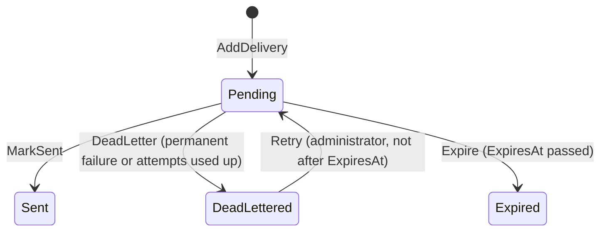

# Notifications module

<!-- Copied from docs/modules/_template.md. Each Notifications task updates the sections it changes; the module is built up over Plan 3. -->

## Purpose and boundaries

<!-- What the module owns, what it deliberately does not do, and which other modules it talks to (only through *.Contracts). -->

Every message the template sends goes through this module: it consumes the integration events other modules publish, renders a localized message in the **recipient's** language and delivers it by email and in-app. Plan 3 builds it task by task; this page describes what exists today (the skeleton, the notification type catalog, the recipient culture and time zone rules and the domain model) and lists the rest under the sections that will hold it.

- Owns: the notification type catalog, the notification, delivery and in-app rows, user preferences and quiet hours, the inbox that makes its consumers idempotent, and the `notify` schema (not created yet; the first migration comes with the persistence task).
- Does not: send anything on its own initiative (it reacts to integration events), store a notification type table (D7: types are declared in code), or offer scheduling, cancellation, digests, push, SMS, webhooks, bulk sends, provider callbacks, attachments or fallback channels (D17).
- Talks to: `TemplateName.Modules.Auth.Contracts` only, never `TemplateName.Modules.Auth` (D1; `ModuleBoundaryTests` enforces it). It consumes Auth's integration events and, once when a notification is created, asks `IUserContactDirectory` for the recipient's address, name, language and time zone, which it snapshots on its own rows (D5). No other module references Notifications, so it has no `TemplateName.Modules.Notifications.Contracts` project yet; `INotificationTypeSource` and `NotificationTypeDefinition` move there when a module wants to declare its own types (D1).
- Consumers only write rows. A consumer records the event in `notify.InboxMessages` in the same save as the notification and its deliveries, so a repeated event has no effect (D3, [ADR 0018](../adr/0018-in-process-integration-events-with-inbox.md)); a separate delivery worker sends. Single-use links reach it as `ISecretProtector` ciphertext and are decrypted only in memory while an email is rendered ([ADR 0020](../adr/0020-secrets-in-cross-module-events.md)).

Code: `src/Modules/Notifications/TemplateName.Modules.Notifications/`. The host calls `AddNotificationsModule(configuration)` after `AddAuthModule`, maps `MapNotificationsEndpoints()` on the `/api/v1` group and `MapNotificationsHub()` on the application root; both map methods are empty until the endpoints and the SignalR hub are added. `AddNotificationsModule` registers the handlers and validators, the error messages (`NotificationsErrorMessages`), the `NotificationCatalog` singleton and the hosted service that validates it at start.

## Endpoints

<!-- Every endpoint, written as METHOD + full route (e.g. GET /api/v1/{module}/{resources}/{id:guid}), with its success status and error codes. -->

None.

`MapNotificationsEndpoints` and `MapNotificationsHub` exist so the host's wiring does not change when the inbox, preference and administration endpoints and the hub at `/hubs/notifications` arrive.

## Domain model

<!-- Aggregates, their invariants and life cycle. Draw state machines as a Mermaid stateDiagram-v2. -->

The domain is pure: no persistence and no handlers yet (the persistence task maps it), no clock (every method takes `now`) and no encryption. Timestamps are UTC. Types with a `DateTime` property (`Notification`, `Delivery`, `InAppNotification`) store `now.UtcDateTime`; settings, preferences and hub tickets keep `DateTimeOffset`. Text from outside is cut to its column by one helper, `BoundedText.Cut` (`Domain/`), which never leaves half of a surrogate pair.

| Type | What it is |
|---|---|
| `Notification` (aggregate root) | One message to one recipient: `TypeCode`, `RecipientUserId`, `Priority`, the snapshotted `Culture`, `Data` (JSON of non-secret variables), `ProtectedData` (JSON of secret variable to `ISecretProtector` ciphertext, stored as given and never decrypted or printed by the domain), `CorrelationId` (cut to 32), `SourceMessageId` (the integration event id), `CreatedAt`, `ExpiresAt`. `AddDelivery(channel, destination, firstAttemptAt, now)` adds at most one `Delivery` per channel (a second one for the same channel throws `InvalidOperationException`) and copies the expiry onto it. |
| `Delivery` (entity) | One channel's attempt series: `Channel`, `Destination` (email address; null for in-app), `Status`, `AttemptCount`, `NextAttemptAt` (null unless `Pending`), `LockedUntil` (the worker's lease), `LastError` (a reason code such as `smtp_550` or `render_failed`, never free text; cut to 200), `RenderedSubject` (cut to 300), `CreatedAt`, `SentAt`, `DeadLetteredAt`, `ExpiresAt`. |
| `InAppNotification` (entity) | The inbox row of an in-app delivery. Its id **is** the delivery id, so a retried delivery cannot insert a second row. `Title` is cut to 200 and `Body` to 2000. `MarkRead(now)` is idempotent and keeps the first time. |
| `UserPreference` | A per type and channel choice (`IsEnabled`), key `(UserId, TypeCode, Channel)`; stored only when it differs from the type's default (D10). |
| `UserNotificationProfile` (entity, key `UserId`) | The user's settings that are not per type: `QuietHours` (or none), `UpdatedAt` and a `RowVersion`. The plan calls it `UserSettings`, a name the naming rule G5 forbids. |
| `QuietHours` (record) | A daily local window `[Start, End)`; crosses midnight when `End < Start`. `Create` refuses `Start == End`. |
| `HubTicket` (key `TokenHash`, 32 bytes) | A single-use credential for the SignalR hub: `Issue(userId, hash, lifetime, now)`, `CanConsume(now)` (unconsumed and `now < ExpiresAt`) and `TryConsume(now)`. The database claims it with one conditional update; the method states the same rule. |
| `DeliveryRetryPolicy` | `NextAttemptAt(failedAttempts, utcNow, maxAttempts)`: 1 minute, 5 minutes, 15 minutes, 1 hour and 6 hours after failed attempts 1 to 5, 6 hours after any later one; `null` once `failedAttempts >= maxAttempts`. It is `internal` like every module type (the architecture tests allow no other public type than the module entry point). |

### Delivery life cycle

`Sent` and `Expired` are final. `Retry` works only from `DeadLettered` and only before `ExpiresAt` (`now < ExpiresAt`); it sets `AttemptCount = 0` and `NextAttemptAt = now` and clears `LastError`, `DeadLetteredAt` and the lease. A transient failure keeps the delivery `Pending` with a later `NextAttemptAt` from `DeliveryRetryPolicy`; that reschedule, the attempt count and the lease belong to the delivery worker's lease-guarded SQL (D14), so `MarkSent`, `DeadLetter` and `Expire` only settle a pending delivery and clear `NextAttemptAt` and `LockedUntil`. They throw `InvalidOperationException` from any other status.

### Quiet hours

`QuietHours.NextAllowedAt(now, zone)` returns `now` when the local time is outside the window, else the next local `End` converted to UTC. Daylight saving is handled by the zone rules, not by arithmetic on offsets:

- An `End` that does not exist (spring forward) becomes the first valid instant after the gap. For the window 01:00 to 02:30 in `America/New_York` on 2026-03-08, 02:30 does not exist and the result is 03:00 EDT (07:00 UTC).
- An `End` that happens twice (clocks go back) takes the earlier offset, unless that instant is not after `now` (the user is already in the second occurrence); then the later one, so the result is never in the past. For 22:00 to 01:30 on 2026-11-01 the result is 01:30 EDT (05:30 UTC).
- Kuala Lumpur has no daylight saving: 23:30 MYT on 2026-03-01 with the window 22:00 to 07:00 gives 07:00 MYT the next day, 2026-03-01T23:00Z.

The enums below are stored as `tinyint`, so their numbers never change or get reused (`Domain/Notifications/`, `Domain/Deliveries/`).

| Enum | Values |
|---|---|
| `NotificationChannel` | `Email = 1`, `InApp = 2` |
| `NotificationCategory` | `Security = 1`, `Account = 2`, `System = 3` |
| `NotificationPriority` | `Low = 1`, `Normal = 2`, `High = 3`, `Critical = 4` |
| `DeliveryStatus` | `Pending = 0`, `Sent = 1`, `DeadLettered = 2`, `Expired = 3` |

`Critical` ignores quiet hours (D11).

## Notification types

A notification type is declared in code as a `NotificationTypeDefinition` (`Application/Catalog/`): a `Code`, a category, a priority, the default channels, the mandatory channels (the recipient cannot switch these off), the template variables and the secret variables (a single-use link; never shown in a subject or an in-app text). `IsMandatory(channel)` and `IsConfigurable` (some default channel is not mandatory) are derived. A type's templates are embedded in the assembly that declares it (D8), so a type source says nothing about them.

An `INotificationTypeSource` returns the types it declares. `NotificationCatalog` (singleton) reads every registered source and validates it the first time it is used and again when the host starts (`NotificationCatalogStartupCheck`, a hosted service), so an invalid declaration stops the start. A failure throws `InvalidOperationException` naming the code and the source type. The rules:

| Rule | Detail |
|---|---|
| Code | Matches `^[a-z]+\.[a-z_]+\z` (`auth.password_changed`) and is at most 100 characters. |
| Unique | No code is declared twice, within one source or across sources; the message names both source types. |
| Channels | At least one default channel; every mandatory channel is also a default channel. |
| Variables | Variable and secret variable names match `^[a-z][a-z0-9_]*\z`, and no name is both. |

`Find(code)` returns a type or `null`, `All` lists them and `TemplateAssemblyOf(code)` returns the assembly of the source that declared the type. No source is registered yet, so the catalog is empty; Auth's types come with the templates in a later task.

## Recipient culture and time zone

Notifications use the recipient's saved settings, never the request culture or the operating system's (`CultureInfo.CurrentUICulture` is not read).

- `RecipientCulture.Resolve(locale)` returns the first of `en`, `ms`, `zh-Hans` found by walking the locale and its parents with `CultureInfo.GetCultureInfo(locale, predefinedOnly: true)`: `zh-CN` and `zh-SG` give `zh-Hans`, `ms-MY` gives `ms`, `en-GB` gives `en`. A null, blank, invalid or unsupported locale (`fr-FR`, `zh-Hant`) gives `en`.
- `TimeZoneResolver.Resolve(ianaId)` returns the zone `TimeZoneInfo.TryFindSystemTimeZoneById` finds (an IANA id such as `Asia/Kuala_Lumpur`; a runtime with ICU also maps Windows ids), else `UTC` with `IsFallback = true` so the caller can log that the id was unusable. Quiet hours use it (D11).

## Error codes

<!-- Every error code the module returns ({module}.snake_case), its HTTP status, its params and its English message. Messages live in Resources/{Module}ErrorMessages.resx with .ms.resx and .zh-Hans.resx (ADR 0009). -->

Declared in the domain (`Domain/Deliveries/DeliveryErrors.cs`, `Domain/InApp/InAppNotificationErrors.cs`, `Domain/Preferences/PreferenceErrors.cs`); the endpoints that return them arrive with the inbox, preference and administration tasks.

| Code | Status | Params | English message |
|---|---|---|---|
| `notifications.delivery_not_retryable` | 409 | none | Only a dead-lettered delivery can be retried. |
| `notifications.delivery_expired` | 409 | none | The delivery has expired and cannot be retried. |
| `notifications.delivery_not_found` | 404 | `id` | Delivery '{id}' was not found. |
| `notifications.notification_not_found` | 404 | `id` | Notification '{id}' was not found. |
| `notifications.invalid_quiet_hours` | 400 | none | The quiet hours must start and end at different times. |
| `notifications.unknown_type` | 400 | `typeCode` | Notification type '{typeCode}' does not exist. |
| `notifications.channel_not_supported` | 400 | `typeCode`, `channel` | Notification type '{typeCode}' is not delivered through the '{channel}' channel. |
| `notifications.channel_mandatory` | 400 | `typeCode`, `channel` | The '{channel}' channel cannot be switched off for notification type '{typeCode}'. |

`Resources/NotificationsErrorMessages` and its `.ms` and `.zh-Hans` files hold every message under its code; the Malay and Simplified Chinese texts are drafts for a native speaker to review. Every `notifications.*` code added later goes into all three (architecture tests check the keys and the placeholders).

## Events

<!-- Domain events (internal, dispatched through the module outbox) and integration events (published in *.Contracts), with their handlers. -->

None.

The module raises no events and has no outbox. It will consume Auth's integration events (`TemplateName.Modules.Auth.Contracts`) through `IIntegrationEventHandler<T>` consumers that write to the inbox (D2, D3).

## Configuration

<!-- Configuration sections and keys the module reads, with defaults. -->

None.

`AddNotificationsModule` takes the configuration for the sections later tasks add (`Notifications:Email`, `Notifications:Delivery`, `Notifications:Hub`).

## Data

<!-- The schema, its tables and indexes, and the migrations in order. -->

None.

The module will own the `notify` schema with its own `NotificationsDbContext`; see the data ownership table in [`docs/architecture/overview.md`](../architecture/overview.md#data-ownership). `Application/Abstractions/IUnitOfWork.cs` is the module's save abstraction, ready for the context.

## Background processing

<!-- Hosted services, outbox handlers and scheduled jobs the module runs. -->

`NotificationCatalogStartupCheck` (`Infrastructure/Catalog/`) touches the catalog once when the host starts, so an invalid type declaration fails the start. The delivery worker arrives with the delivery task.

## Observability

<!-- Log messages, ActivitySource and Meter names, and metrics the module emits. -->

None.

## Testing

<!-- Where the module's unit and integration tests live and what they cover. -->

Unit tests: `tests/TemplateName.UnitTests/Notifications/`. `NotificationTests`, `DeliveryTests`, `DeliveryRetryPolicyTests`, `InAppNotificationTests`, `UserNotificationProfileTests`, `UserPreferenceTests` (also the preference errors), `QuietHoursTests` and `HubTicketTests` cover the domain; the quiet-hours tests look up the IANA id `America/New_York` with `TimeZoneInfo.FindSystemTimeZoneById`, so a runtime without the zone fails them instead of skipping. `NotificationCatalogTests` covers the catalog rules and the start-up check, `RecipientCultureTests` the locale mapping (including that the current UI culture is ignored) and `TimeZoneResolverTests` the IANA lookup and the UTC fallback. The Windows-id case accepts whatever the runtime resolves, so the tests give the same result on Windows and on Linux with ICU. Architecture tests include the module in `Assemblies.Modules` and `Assemblies.ErrorMessageResources`: module boundary, layering, naming, translation completeness and this document's outline.

## Changelog

<!-- Link to the changelog entries for this module's commit scope. -->

Changes to this module are the [`CHANGELOG.md`](../../CHANGELOG.md) entries with scope `notifications` (release-please prints them as **notifications:**). To list them from git: `git log --oneline -E --grep='^[a-z]+\(notifications\)!?:'`.
