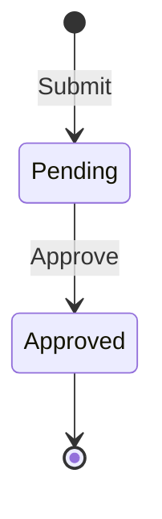

# Sample module

<!-- Copied from docs/modules/_template.md. Tasks that touch the Sample module keep this file current. -->

## Purpose and boundaries

<!-- What the module owns, what it deliberately does not do, and which other modules it talks to (only through *.Contracts). -->

A small leave-request workflow that shows every template pattern end to end: an aggregate with domain events, commands and a query through the injected handlers and decorators, EF Core writes, Dapper reads, the per-module outbox and ProblemDetails errors.

- Owns: leave requests and the `sample` schema.
- Does not: authenticate anyone. Until the Auth plan replaces it with `ICurrentUser`, the approver id comes from the request body.
- Talks to: no other module. It has no `TemplateName.Modules.Sample.Contracts` project yet, because nothing outside the module needs its data.

Code: `src/Modules/Sample/TemplateName.Modules.Sample/`. The host calls `AddSampleModule()` and maps `MapSampleEndpoints()` on the `/api/v1` group.

## Endpoints

<!-- Every endpoint, written as METHOD + full route (e.g. GET /api/v1/{module}/{resources}/{id:guid}), with its success status and error codes. -->

All endpoints carry the OpenAPI tag `Sample`.

| Method | Route | Purpose | Success | Errors |
|---|---|---|---|---|
| POST | `POST /api/v1/sample/leave-requests` | Submit a leave request. Body `{ "employeeId", "startDate", "endDate", "reason" }` (dates `yyyy-MM-dd`). Accepts an optional `Idempotency-Key` header. | `201 Created`, `Location: /api/v1/sample/leave-requests/{id}`, body `{ "id": "<guid>" }` | 400 `validation.failed` (with `errors`), 400 `request.malformed`, 400 `idempotency.invalid_key`, 409 `idempotency.in_progress`, 422 `idempotency.key_reused` |
| GET | `GET /api/v1/sample/leave-requests/{id:guid}` | Read one leave request. | `200 OK`, `LeaveRequestResponse` | 404 `leave.not_found` |
| POST | `POST /api/v1/sample/leave-requests/{id:guid}/approve` | Approve a pending request. Body `{ "approverId" }`. | `204 No Content` | 400 `request.malformed`, 404 `leave.not_found`, 409 `leave.not_pending`, 409 `concurrency.conflict` |

Submit is idempotent when the client sends `Idempotency-Key` (1 to 100 characters, scoped to the signed-in user or `anonymous`): a retry with the same key and body within `Idempotency:TimeToLive` (one day by default) gets the first response again, with `Idempotency-Replayed: true`, instead of creating a second request. The same key with a different body gets 422, and a retry while the first request is still running gets 409. A 5xx response is not stored, so the client can retry it.

`LeaveRequestResponse` is `{ id, employeeId, startDate, endDate, reason, status, approverId, createdAt }`; `status` is the enum name (`"Pending"`), `createdAt` is UTC with a trailing `Z`. Every error is RFC 9457 ProblemDetails with `code` and `traceId`.

## Domain model

<!-- Aggregates, their invariants and life cycle. Draw state machines as a Mermaid stateDiagram-v2. -->

`LeaveRequest` (aggregate root, `Domain/LeaveRequests/`) is auditable (`CreatedAt/By`, `UpdatedAt/By`), soft-deletable (`IsDeleted`, `DeletedAt/By`) and guarded by a `RowVersion` concurrency token.

- `LeaveRequest.Submit(...)` creates it as `Pending`; the end date must not be before the start date.
- `Approve(approverId)` moves `Pending` to `Approved` and records the approver; any other status fails with `leave.not_pending`.



`LeaveRequestStatus` is stored as `tinyint`: `Pending = 1`, `Approved = 2`, `Rejected = 3`, `Canceled = 4`. `Rejected` and `Canceled` are reserved values with no transition yet; the numbers never change or get reused.

## Error codes

<!-- Every error code the module returns ({module}.snake_case), its HTTP status and its English message. -->

| Code | HTTP | Message (en) |
|---|---|---|
| `leave.invalid_date_range` | 400 | The end date must not be before the start date. |
| `leave.not_pending` | 409 | Only a pending leave request can be approved. |
| `leave.not_found` | 404 | Leave request '{id}' was not found. |

The submit validator rejects an end date before the start date first (`validation.failed`, field `endDate`); `leave.invalid_date_range` is the aggregate's own guard. Shared codes from the building blocks also apply: `validation.failed`, `request.malformed`, `concurrency.conflict`, `server.unexpected_error`.

## Events

<!-- Domain events (internal, dispatched through the module outbox) and integration events (published in *.Contracts), with their handlers. -->

| Event | Kind | Raised when | Handlers |
|---|---|---|---|
| `LeaveRequestSubmittedDomainEvent(LeaveRequestId, EmployeeId)` | Domain | A request is submitted | `LeaveRequestSubmittedDomainEventHandler` (logs; the Notifications plan replaces it with a notification) |
| `LeaveRequestApprovedDomainEvent(LeaveRequestId, ApproverId)` | Domain | A request is approved | None yet |

Domain events are written to `sample.OutboxMessages` in the same save as the aggregate and dispatched by the outbox (ADR 0007). The module publishes no integration events.

## Configuration

<!-- Configuration sections and keys the module reads, with defaults. -->

The module has no configuration section of its own. It uses the shared keys:

| Key | Default | Purpose |
|---|---|---|
| `ConnectionStrings:Database` | empty (user secrets or environment) | The database that holds the `sample` schema. |
| `Outbox:*` | see `appsettings.json` | Polling, batch size, retries and lease of the Sample outbox dispatcher. |

## Data

<!-- The schema, its tables and indexes, and the migrations in order. -->

Schema `sample`, owned by `SampleDbContext` (`Infrastructure/Persistence/`). Writes go through EF Core; the GET query reads with Dapper and filters `IsDeleted = 0` itself, because Dapper bypasses the EF soft-delete filter (ADR 0006).

| Table | Purpose | Indexes |
|---|---|---|
| `sample.LeaveRequests` | The `LeaveRequest` aggregate. `Reason nvarchar(500)`, `Status tinyint`, `StartDate`/`EndDate date`, `RowVersion rowversion`, timestamps `datetime2(3)` UTC. | `PK_LeaveRequests`, `IX_LeaveRequests_EmployeeId` |
| `sample.OutboxMessages` | Domain events waiting for dispatch. | `PK_OutboxMessages`, `IX_OutboxMessages_OccurredAt` (filtered: `ProcessedAt IS NULL`) |
| `sample.OutboxMessageConsumers` | Which handler has processed which message. | `PK_OutboxMessageConsumers` (`OutboxMessageId`, `Name`) |
| `sample.__EFMigrationsHistory` | Applied migrations of this module. | — |

Migrations (`Infrastructure/Persistence/Migrations/`), in order:

1. `InitialSample`: creates the schema and the three tables above.

Add one with:

```bash
dotnet ef migrations add {Verb}{What} \
  --project src/Modules/Sample/TemplateName.Modules.Sample \
  --startup-project src/Host/TemplateName.Api \
  --context SampleDbContext \
  --output-dir Infrastructure/Persistence/Migrations
```

## Background processing

<!-- Hosted services, outbox handlers and scheduled jobs the module runs. -->

`OutboxBackgroundService<SampleDbContext>` (registered by `AddOutbox<SampleDbContext>`) polls `sample.OutboxMessages` while `Outbox:Enabled` is set and hands each event to its `IDomainEventHandler<>`s. Today that is `LeaveRequestSubmittedDomainEventHandler`.

## Observability

<!-- Log messages, ActivitySource and Meter names, and metrics the module emits. -->

- `LeaveRequestSubmittedDomainEventHandler` logs `Leave request {LeaveRequestId} submitted` (Information).
- The logging decorator logs every command and query: `Processing {RequestName}`, `Completed {RequestName} in {ElapsedMs} ms`, `Failed {RequestName} with {ErrorCode} in {ElapsedMs} ms`.
- Database calls are traced by the EF Core and SqlClient instrumentation. The module has no `ActivitySource`, `Meter` or metrics of its own yet.

## Testing

<!-- Where the module's unit and integration tests live and what they cover. -->

- Unit tests, `tests/TemplateName.UnitTests/Sample/`: `LeaveRequestTests` (aggregate rules), `SubmitLeaveRequestCommandValidatorTests`, `SubmitLeaveRequestCommandHandlerTests`, `ApproveLeaveRequestCommandHandlerTests`, `LeaveRequestSubmittedDomainEventHandlerTests`.
- Integration tests, `tests/TemplateName.IntegrationTests/Sample/`: `LeaveRequestEndpointTests` runs the real API against SQL Server: submit, read, approve twice, validation and malformed-body errors, the 500 contract, soft-deleted rows hidden from the Dapper query, and the submitted event dispatched through the outbox (recorded by `RecordingLeaveSubmittedHandler`).
- Integration tests, `tests/TemplateName.IntegrationTests/Idempotency/`: `IdempotencyTests` drives `Idempotency-Key` through the submit endpoint: replay, key reuse with another body, invalid and expired keys, a key still in progress, concurrent duplicates running once, and 5xx responses not being stored.

## Changelog

<!-- Link to the changelog entries for this module's commit scope. -->

Changes to this module are the [`CHANGELOG.md`](../../CHANGELOG.md) entries with scope `sample` (release-please prints them as **sample:**). To list them from git: `git log --oneline -E --grep='^[a-z]+\(sample\)!?:'`.
