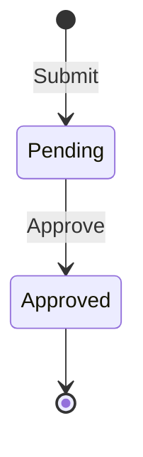

# Sample module

<!-- Copied from docs/modules/_template.md. Tasks that touch the Sample module keep this file current. -->

## Purpose and boundaries

<!-- What the module owns, what it deliberately does not do, and which other modules it talks to (only through *.Contracts). -->

A small leave-request workflow that shows every template pattern end to end: an aggregate with domain events, commands and queries through the injected handlers and decorators, EF Core writes, Dapper reads, a cursor-paginated list, the per-module outbox and ProblemDetails errors.

- Owns: leave requests and the `sample` schema.
- Does not: authenticate anyone or store permissions. The Auth module signs callers in and checks the permissions this module declares; the approver is the signed-in caller (`ICurrentUser`).
- Talks to: no other module (it does not reference the Auth module; its permissions go through `IPermissionSource` in Application.Common). It has no `TemplateName.Modules.Sample.Contracts` project yet, because nothing outside the module needs its data.

Code: `src/Modules/Sample/TemplateName.Modules.Sample/`. The host calls `AddSampleModule()` and maps `MapSampleEndpoints()` on the `/api/v1` group.

## Endpoints

<!-- Every endpoint, written as METHOD + full route (e.g. GET /api/v1/{module}/{resources}/{id:guid}), with its success status and error codes. -->

All endpoints carry the OpenAPI tag `Sample` and need a signed-in caller (`Authorization: Bearer {access token}`) who holds the route's permission (`RequirePermission`, see [Permissions](#permissions)). A request without a valid token gets 401 `http.401` (with `WWW-Authenticate: Bearer`), a signed-in caller without the permission 403 `http.403`; both are ProblemDetails with `traceId`, and neither reaches the handler. The OpenAPI document marks every route with the `Bearer` security requirement and lists the 401 and 403 responses.

| Method | Route | Purpose | Success | Errors |
|---|---|---|---|---|
| POST | `POST /api/v1/sample/leave-requests` | Submit a leave request. Body `{ "employeeId", "startDate", "endDate", "reason" }` (dates `yyyy-MM-dd`). Accepts an optional `Idempotency-Key` header. | `201 Created`, `Location: /api/v1/sample/leave-requests/{id}`, body `{ "id": "<guid>" }` | 400 `validation.failed` (with `errors`), 400 `request.malformed`, 400 `idempotency.invalid_key`, 409 `idempotency.in_progress`, 422 `idempotency.key_reused` |
| GET | `GET /api/v1/sample/leave-requests` | List leave requests, newest first by default, one cursor page at a time (query parameters below). | `200 OK`, `CursorPage<LeaveRequestListItemResponse>` | 400 `validation.failed` (with `errors.pageSize`), 400 `pagination.invalid_sort`, 400 `pagination.invalid_cursor`, 400 `pagination.cursor_mismatch`, 400 `request.malformed` |
| GET | `GET /api/v1/sample/leave-requests/{id:guid}` | Read one leave request. | `200 OK`, `LeaveRequestResponse` | 404 `leave.not_found` |
| POST | `POST /api/v1/sample/leave-requests/{id:guid}/approve` | Approve a pending request as the signed-in caller. No body: the approver is `ICurrentUser.UserId` (the token's `sub`); an `approverId` sent anyway is ignored. | `204 No Content` | 404 `leave.not_found`, 409 `leave.not_pending`, 409 `concurrency.conflict` |

### Permissions

The module declares its permissions in `Application/SamplePermissions.cs` and `SamplePermissionSource` (module `sample`), which `AddSampleModule` registers as a singleton `IPermissionSource`; the Auth module's seeder syncs them into `auth.Permissions` at start-up, and `SuperAdmin` receives them there. Grant them to other roles through the Auth module.

| Code | Required by | Allows |
|---|---|---|
| `sample.leave_request.view` | `GET /api/v1/sample/leave-requests`, `GET /api/v1/sample/leave-requests/{id:guid}` | List leave requests and read their details. |
| `sample.leave_request.create` | `POST /api/v1/sample/leave-requests` | Submit a leave request. |
| `sample.leave_request.approve` | `POST /api/v1/sample/leave-requests/{id:guid}/approve` | Approve a pending leave request as the approver. |

Submit is idempotent when the client sends `Idempotency-Key` (1 to 100 characters, scoped to the signed-in user): a retry with the same key and body within `Idempotency:TimeToLive` (one day by default) gets the first response again, with `Idempotency-Replayed: true`, instead of creating a second request. The same key with a different body gets 422, and a retry while the first request is still running gets 409 (for at most `Idempotency:InProgressTimeout`, five minutes by default, after which the key is treated as abandoned). A 5xx response is not stored, so the client can retry it. The OpenAPI document does not yet list the `Idempotency-Key` header or the 409/422 responses; the idempotency limitations are in [`infrastructure-common`](../building-blocks/infrastructure-common.md#idempotency).

The list is cursor-paginated (ADR 0010); it has no page numbers or offsets. Query parameters:

| Parameter | Default | Meaning |
|---|---|---|
| `employeeId` | none | Only this employee's requests. |
| `status` | none | Only requests in this status (`Pending`, `Approved`, …). |
| `pageSize` | `20` | Items per page, 1 to 100; anything else is `400 validation.failed` with `errors.pageSize`. |
| `cursor` | none | The `nextCursor` or `previousCursor` of a previous page, sent back unchanged. Opaque; at most 1 024 characters. A malformed or altered one is `400 pagination.invalid_cursor`; one issued for a different `sort`, `employeeId` or `status` is `400 pagination.cursor_mismatch`. |
| `sort` | `-createdAt` | Comma-separated fields, `-` for descending. Allowed (case-sensitive): `createdAt`, `startDate`; each at most once. `id` is always appended as the tie-breaker in the direction of the last field, so `-createdAt` means `-createdAt,-id`. Anything else is `400 pagination.invalid_sort` with `params.allowed` = `createdAt,startDate`. |
| `includeTotalCount` | `false` | Adds `totalCount` (all matching requests, ignoring the cursor) at the cost of a `COUNT_BIG(*)`. |

The response is `{ items, pageSize, nextCursor, previousCursor, totalCount? }`. A cursor is `null` when there is no page in that direction (`previousCursor` is `null` on the first page); `totalCount` is present only when requested. An item (`LeaveRequestListItemResponse`) is `{ id, employeeId, startDate, endDate, status, createdAt }`. Paging is stable: requests submitted or deleted between two calls never cause a skipped or repeated item, and requests with the same sort value are ordered by `id`. Soft-deleted requests never appear. If the rows beyond a cursor disappear before it is used (deleted, or no longer matching `status`), the page is empty but still carries the cursor back the way it came (`previousCursor` going forward, `nextCursor` going backward), starting after the position the client came from.

`LeaveRequestResponse` is `{ id, employeeId, startDate, endDate, reason, status, approverId, createdAt }`; `status` is the enum name (`"Pending"`, never localized), `createdAt` is UTC with a trailing `Z`. Every error is RFC 9457 ProblemDetails with `code` and `traceId`, plus `params` when the error has parameters; `detail` (and validation messages) follow the signed-in user's saved locale, else `Accept-Language` (`en`, `ms`, `zh-Hans`, else English; ADR 0009).

## Domain model

<!-- Aggregates, their invariants and life cycle. Draw state machines as a Mermaid stateDiagram-v2. -->

`LeaveRequest` (aggregate root, `Domain/LeaveRequests/`) is auditable (`CreatedAt/By`, `UpdatedAt/By`), soft-deletable (`IsDeleted`, `DeletedAt/By`) and guarded by a `RowVersion` concurrency token.

- `LeaveRequest.Submit(...)` creates it as `Pending`; the end date must not be before the start date.
- `Approve(approverId)` moves `Pending` to `Approved` and records the approver (the endpoint passes the signed-in caller's id); any other status fails with `leave.not_pending`.



`LeaveRequestStatus` is stored as `tinyint`: `Pending = 1`, `Approved = 2`, `Rejected = 3`, `Canceled = 4`. `Rejected` and `Canceled` are reserved values with no transition yet; the numbers never change or get reused.

## Error codes

<!-- Every error code the module returns ({module}.snake_case), its HTTP status, its params and its English message. Messages live in Resources/{Module}ErrorMessages.resx with .ms.resx and .zh-Hans.resx (ADR 0009). -->

| Code | HTTP | `params` | Message (en) |
|---|---|---|---|
| `leave.invalid_date_range` | 400 | — | The end date must not be before the start date. |
| `leave.not_pending` | 409 | — | Only a pending leave request can be approved. |
| `leave.not_found` | 404 | `id` | Leave request '{id}' was not found. |

The codes are declared in `Domain/LeaveRequests/LeaveRequestErrors.cs`. Their messages are in `Resources/SampleErrorMessages.resx` (English) with `SampleErrorMessages.ms.resx` and `SampleErrorMessages.zh-Hans.resx` (drafts awaiting native review); `AddSampleModule` registers them, and `detail` is the message in the caller's language with `{id}` filled in.

The submit validator rejects an end date before the start date first (`validation.failed`, field `endDate`); `leave.invalid_date_range` is the aggregate's own guard. Shared codes from the building blocks also apply, with their messages in `CommonErrorMessages` (Web.Common) and `InfrastructureErrorMessages` (Infrastructure.Common): `validation.failed`, `request.malformed`, `http.401`, `http.403`, `concurrency.conflict`, `idempotency.*`, `rate_limit.exceeded`, `server.unexpected_error`.

The list endpoint returns the cursor-pagination codes (declared in `PaginationErrors`, Application.Common; messages in `CommonErrorMessages`):

| Code | HTTP | `params` | Message (en) |
|---|---|---|---|
| `pagination.invalid_sort` | 400 | `allowed` (comma-separated sortable fields) | The sort is not valid. Sortable fields: {allowed}. |
| `pagination.invalid_cursor` | 400 | — | The cursor is not valid. Start again from the first page. |
| `pagination.cursor_mismatch` | 400 | — | The cursor was issued for a different sort or filter. Start again from the first page. |

## Events

<!-- Domain events (internal, dispatched through the module outbox) and integration events (published in *.Contracts), with their handlers. -->

| Event | Kind | Raised when | Handlers |
|---|---|---|---|
| `LeaveRequestSubmittedDomainEvent(LeaveRequestId, EmployeeId)` | Domain | A request is submitted | `LeaveRequestSubmittedDomainEventHandler` (logs; the Notifications plan replaces it with a notification) |
| `LeaveRequestApprovedDomainEvent(LeaveRequestId, ApproverId)` | Domain | A request is approved | None yet |

Domain events are written to `sample.OutboxMessages` in the same save as the aggregate and dispatched by the outbox (ADR 0007). The module publishes no integration events.

## Configuration

<!-- Configuration sections and keys the module reads, with defaults. -->

The module has no configuration section of its own. It uses the shared keys:

| Key | Default | Purpose |
|---|---|---|
| `ConnectionStrings:Database` | empty (user secrets or environment) | The database that holds the `sample` schema. |
| `Outbox:*` | see [`docs/services/api.md`](../services/api.md#outbox) | Polling, batch size, retries and lease of the Sample outbox dispatcher. |
| `Idempotency:TimeToLive` | one day | How long submit responses are kept for replay. |
| `Idempotency:InProgressTimeout` | five minutes | How long a submit still running holds its key; after that a retry with the key submits again. |

## Data

<!-- The schema, its tables and indexes, and the migrations in order. -->

Schema `sample`, owned by `SampleDbContext` (`Infrastructure/Persistence/`). Writes go through EF Core; the GET and list queries read with Dapper and filter `IsDeleted = 0` themselves, because Dapper bypasses the EF soft-delete filter (ADR 0006).

| Table | Purpose | Indexes |
|---|---|---|
| `sample.LeaveRequests` | The `LeaveRequest` aggregate. `Reason nvarchar(500)`, `Status tinyint`, `StartDate`/`EndDate date`, `RowVersion rowversion`, timestamps `datetime2(3)` UTC. | `PK_LeaveRequests`, `IX_LeaveRequests_EmployeeId_CreatedAt_Id`, `IX_LeaveRequests_CreatedAt_Id`, `IX_LeaveRequests_StartDate_Id` |
| `sample.OutboxMessages` | Domain events waiting for dispatch. | `PK_OutboxMessages`, `IX_OutboxMessages_OccurredAt` (filtered: `ProcessedAt IS NULL`) |
| `sample.OutboxMessageConsumers` | Which handler has processed which message. | `PK_OutboxMessageConsumers` (`OutboxMessageId`, `Name`) |
| `sample.__EFMigrationsHistory` | Applied migrations of this module. | — |

Migrations (`Infrastructure/Persistence/Migrations/`), in order:

1. `InitialSample`: creates the schema and the three tables above.
2. `AddLeaveRequestListIndexes`: replaces `IX_LeaveRequests_EmployeeId` with `(EmployeeId, CreatedAt, Id)` and adds `(CreatedAt, Id)` and `(StartDate, Id)`, one index per list sort (review P7). Indexes only; no data changes.

Every sort field of the list (`LeaveRequestSortFields`) needs an index ending in `(…, SortColumn, Id)`; a new sortable field comes with its index in the same migration. The `employeeId` filter leads its index for the default sort; `status` is applied as a residual predicate.

Add one with:

```bash
dotnet ef migrations add {Verb}{What} \
  --project src/Modules/Sample/TemplateName.Modules.Sample \
  --startup-project src/Host/TemplateName.Api \
  --context SampleDbContext \
  --output-dir Infrastructure/Persistence/Migrations
```

## Background processing

<!-- Hosted services, outbox handlers and scheduled jobs the module runs. -->

`OutboxBackgroundService<SampleDbContext>` (registered by `AddOutbox<SampleDbContext>`) polls `sample.OutboxMessages` while `Outbox:Enabled` is set and hands each event to its `IDomainEventHandler<>`s. Today that is `LeaveRequestSubmittedDomainEventHandler`.

## Observability

<!-- Log messages, ActivitySource and Meter names, and metrics the module emits. -->

- `LeaveRequestSubmittedDomainEventHandler` logs `Leave request {LeaveRequestId} submitted` (Information).
- The logging decorator logs every command and query: `Processing {RequestName}`, `Completed {RequestName} in {ElapsedMs} ms`, `Failed {RequestName} with {ErrorCode} in {ElapsedMs} ms`.
- Database calls are traced by the EF Core and SqlClient instrumentation. The module has no `ActivitySource`, `Meter` or metrics of its own yet.

## Testing

<!-- Where the module's unit and integration tests live and what they cover. -->

- Unit tests, `tests/TemplateName.UnitTests/Sample/`: `LeaveRequestTests` (aggregate rules), `SamplePermissionSourceTests` (the three codes, module `sample`, every `SamplePermissions` constant declared, the singleton registration), `SubmitLeaveRequestCommandValidatorTests`, `SubmitLeaveRequestCommandHandlerTests`, `ApproveLeaveRequestCommandHandlerTests`, `LeaveRequestSubmittedDomainEventHandlerTests`, `ListLeaveRequestsQueryValidatorTests`. The pagination building blocks have their own unit tests in `tests/TemplateName.UnitTests/Pagination/`.
- Integration tests, `tests/TemplateName.IntegrationTests/Sample/`: `SampleAuthorizationTests` covers the permissions: anonymous callers get 401 and signed-in callers without a permission 403 on every route (ProblemDetails with `code` and `traceId`, nothing changed), submit needs `create`, list and get need `view`, approve records the signed-in caller and ignores an `approverId` in a body, and removing a grant from the caller's role takes effect on the next request once `IPermissionCache.InvalidateUsersAsync` ran. The other Sample, localization and idempotency tests sign in first with the permissions they need (`SignInAsync` on `IntegrationTestBase`, see the [Auth module's testing notes](auth.md#testing)). `LeaveRequestEndpointTests` runs the real API against SQL Server: submit, read, approve twice, validation and malformed-body errors, the 500 contract, soft-deleted rows hidden from the Dapper query, and the submitted event dispatched through the outbox (recorded by `RecordingLeaveSubmittedHandler`). `ListLeaveRequestsTests` covers the list: first page and defaults, walking forward and backward, no duplicates when requests are inserted between pages, ties on `createdAt` broken by `id`, `createdAt` values a millisecond apart, the `employeeId`, `status` and `sort` options, total count, soft-deleted rows excluded, the `pagination.*` and `pageSize` errors, and the query parameters in the OpenAPI document.
- Integration tests, `tests/TemplateName.IntegrationTests/Localization/`: `LocalizationTests` (signed in with a saved locale the API does not support, so `Accept-Language` decides) reads Sample errors in Malay, Simplified Chinese (from `zh-CN`) and English fallback, and checks that `code`, `params` and enum values stay unlocalized and that validation messages are translated.
- Architecture tests, `TranslationTests`: every `LeaveRequestErrors` code has an English message, and the translations have the same keys and placeholders.
- Integration tests, `tests/TemplateName.IntegrationTests/Idempotency/`: `IdempotencyTests` drives `Idempotency-Key` through the submit endpoint: replay (including a stored 400), key reuse with another body, invalid, empty, repeated and expired keys, a key still in progress, concurrent duplicates running once, 5xx responses (thrown or returned) not being stored, an abandoned key reusable after its in-progress lease, and a superseded request unable to store over or release the new owner's key.
- Documentation and contract: `DocumentationTests` (architecture tests) check that this page exists, keeps the required sections and lists every `LeaveRequestErrors` code; `EndpointDocumentationTests` check that every mapped `/api/v1/sample/…` route appears above as `METHOD /route`; `OpenApiSnapshotTests` pin the endpoints' OpenAPI description (ADR 0011).

## Changelog

<!-- Link to the changelog entries for this module's commit scope. -->

Changes to this module are the [`CHANGELOG.md`](../../CHANGELOG.md) entries with scope `sample` (release-please prints them as **sample:**). To list them from git: `git log --oneline -E --grep='^[a-z]+\(sample\)!?:'`.
